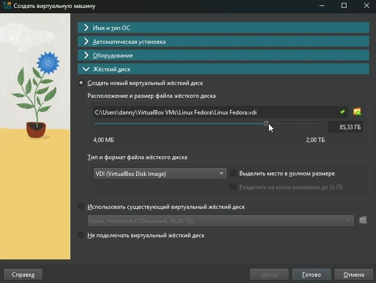
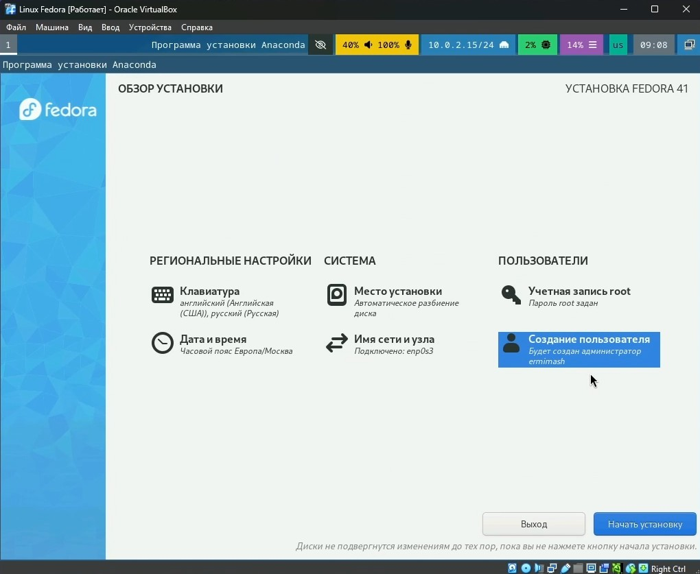
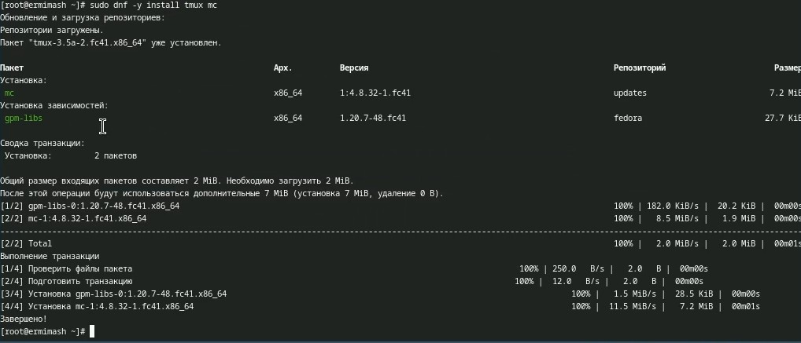
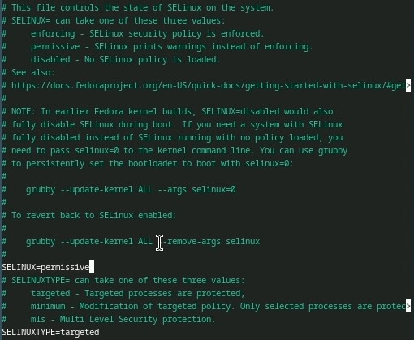
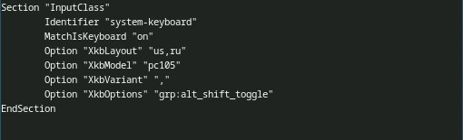
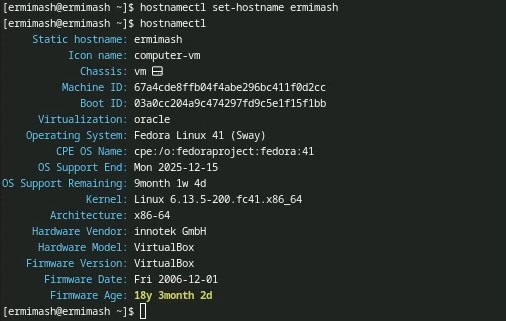
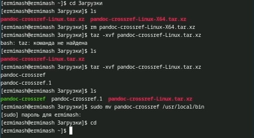
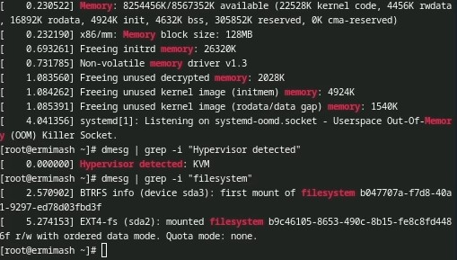

---
## Front matter
lang: ru-RU
title: Лабораторная работа №1
subtitle: Презентация
author:
  - Ермишина М. К.
institute:
  - Российский университет дружбы народов, Москва, Россия
date: 07 марта 2025

## i18n babel
babel-lang: russian
babel-otherlangs: english

## Formatting pdf
toc: false
toc-title: Содержание
slide_level: 2
aspectratio: 169
section-titles: true
theme: metropolis
header-includes:
 - \metroset{progressbar=frametitle,sectionpage=progressbar,numbering=fraction}

## Fonts
mainfont: PT Serif
romanfont: PT Serif
sansfont: PT Sans
monofont: PT Mono
mainfontoptions: Ligatures=TeX
romanfontoptions: Ligatures=TeX
sansfontoptions: Ligatures=TeX,Scale=MatchLowercase
monofontoptions: Scale=MatchLowercase,Scale=0.9
---

# Информация

## Докладчик

:::::::::::::: {.columns align=center}
::: {.column width="70%"}

  * Ермишина Мария Кирилловна
  * студент группы НПИбд-01-24
  * Российский университет дружбы народов
  * [1132230166@pfur.ru](mailto:1132230166@pfur.ru)
  * <https://github.com/ErmiMash>

:::
::: {.column width="30%"}

:::
::::::::::::::

# Создание презентации

## Процессор `pandoc`

- Pandoc: преобразователь текстовых файлов
- Сайт: <https://pandoc.org/>
- Репозиторий: <https://github.com/jgm/pandoc>

## Формат `pdf`

- Использование LaTeX
- Пакет для презентации: [beamer](https://ctan.org/pkg/beamer)
- Тема оформления: `metropolis`

## Код для формата `pdf`

```yaml
slide_level: 2
aspectratio: 169
section-titles: true
theme: metropolis
```

## Формат `html`

- Используется фреймворк [reveal.js](https://revealjs.com/)
- Используется [тема](https://revealjs.com/themes/) `beige`

## Код для формата `html`

- Тема задаётся в файле `Makefile`

```make
REVEALJS_THEME = beige 
```

# Результаты

# Элементы презентации

## Цели и задачи

Целью данной работы является приобретение практических навыков установки операционной системы на виртуальную машину, настройки минимально необходимых для дальнейшей работы сервисов.

# Выполнение лабораторной работы

## Создание виртуальной машины.
Для начала запускаем программу VirtualBox. 
В открывшемся окне мы видим интерфейс приложения. Выбираем кнопку "Создать". 
В новом окне нам необходимо указать имя для виртуальной машины, а также выбрать образ ISO.
Далее необходимо указать размер основной памяти, а также процессоры, необходимые для работы виртуальной машины.
Создаём виртуальный жёсткий диск (не меньше 80 ГБ) и создаём машину.
{#fig:004 width=70%}

## Установка операционной системы.
  1. Запуск приложения для установки системы. 
  После запуска виртуальной машины необходимо нажать сочетание клавиш Win + D, а после вводим Liveinst и начинаем загрузку.
  2. Переходим к настройкам до установки: 
  - В появившемся окне необходимо выбрать язык интерфейса и (при необходимости) скорректировать часовой пояс, раскладку.
  - Место установки ОС оставляем без изменения.
  - Устанавливаем имена и пароли для пользователя, пользователя root и сетевое имя компьютера. 
{#fig:006 width=70%}

## После установки. 
Входим в ОС под записью, созданной при установке.
Запускаем терминал с помощью комбинации Win + Enter и переключаемся на роль супер-пользователя с помощью команды sudo -i.
  1. Обновления 
  Установливаем средства разработки.
  Обновляем все пакеты.
  2. Повышение комфорта работы 
  Программы для удобства работы в консоли.
{#fig:008 width=70%}
 
  3. Автоматическое обновление
  Установка программного обеспечения:
  - sudo dnf -y install dnf-automatic
  Запустите таймер:
  - sudo systemctl enable --now dnf-automatic.timer
  4. Отключение SELinux 
  В данном курсе мы не будем рассматривать работу с системой безопасности SELinux. Поэтому отключим его.
  С помощью nano в файле /etc/selinux/config замените значение "SELINUX=enforcing" на "SELINUX=permissive". 
{#fig:010 width=70%}

## Настройка раскладки клавиатуры. 
Запускаем терминал с помощью Win + Enter. 
Запускаем мультиплексор tmux.
Создаём и редактируем созданный нами конфигурационный файл.
Переключаемся на роль супер-пользователя.
Редактируем второй конфигурационный файл, заменяя текст в нём на указанный ниже текст: 
	Identifier "system-keyboard"
	MatchIsKeyboard "on"
	Option "XkbLayout" "us,ru"
	Option "XkbVariant" ",winkeys"
	Option "XkbOptions" "grp:rctrl_toggle,compose:ralt,terminate:ctrl_alt_bksp"
EndSection
{#fig:013 width=70%}

## Установка имени пользователя и названия хоста.
Если при установке виртуальной машины вы задали имя пользователя или имя хоста, не удовлетворяющее соглашению об именовании, то вам необходимо исправить это. 
В терминале запускаем терминальный мультиплексор с помощью команды tmux и переключаемся на супер-пользователя. 
Установите имя хоста с помощью следующей команды и проверяем изменения.
{#fig:014 width=70%}

## Установка программного обеспечения для создания документации. 
В терминале запускаем терминальный мультиплексор с помощью команды tmux и переключаемся на супер-пользователя. 
  1. Работа с языком разметки Markdown 
  Для работы с языком разметки Markdown. Устанавливаем его.
  Для работы с перекрёстными ссылками мы используем пакет pandoc-crossref. 
  Скачиваем необходимую версию pandoc-crossref (https://github.com/lierdakil/pandoc-crossref/releases).
  Распакуйте архивы и помещаем их в каталог /usr/local/bin.
{#fig:015 width=70%}
  2. Texlive
  Устанавливаем дистрибутив с помощью следующей команды: 
  - sudo dnf -y install texlive-scheme-full 
  
## Домашнее задание

В окне терминала проанализируем последовательность загрузки системы, выполнив команду dmesg. 
Получаем следующую информацию.
  - Версия ядра Linux (Linux version). 
  - Частота процессора (Detected Mhz processor).
  - Модель процессора (CPU0).
  - Объём доступной оперативной памяти (Memory available).
  - Тип обнаруженного гипервизора (Hypervisor detected). 
  - Тип файловой системы корневого раздела.
  - Последовательность монтирования файловых систем.
{#fig:018 width=70%}

## Результаты

В ходе работы приобретены практических навыков установки операционной системы на виртуальную машину, настройки минимально необходимых для дальнейшей работы сервисов.
