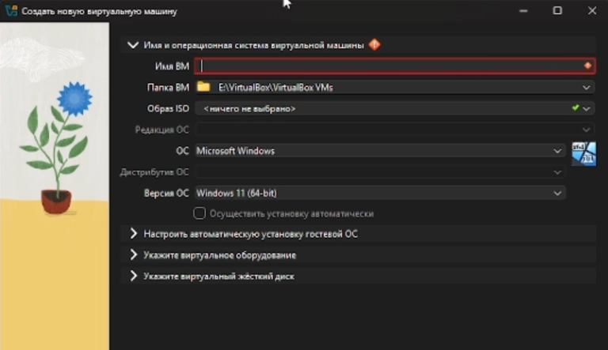
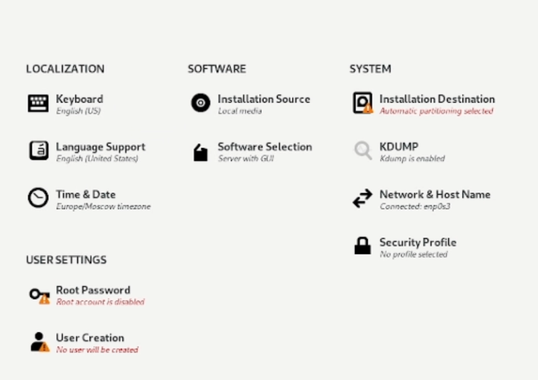
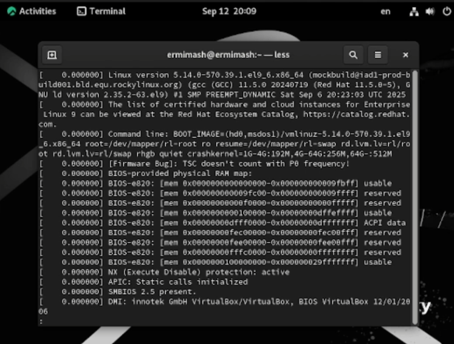

---
## Front matter
lang: ru-RU
title: Лабораторная работа №1
subtitle: Презентация
author:
  - Ермишина М. К.
institute:
  - Российский университет дружбы народов, Москва, Россия
date: 07 марта 2025

## i18n babel
babel-lang: russian
babel-otherlangs: english

## Formatting pdf
toc: false
toc-title: Содержание
slide_level: 2
aspectratio: 169
section-titles: true
theme: metropolis
header-includes:
 - \metroset{progressbar=frametitle,sectionpage=progressbar,numbering=fraction}

## Fonts
mainfont: PT Serif
romanfont: PT Serif
sansfont: PT Sans
monofont: PT Mono
mainfontoptions: Ligatures=TeX
romanfontoptions: Ligatures=TeX
sansfontoptions: Ligatures=TeX,Scale=MatchLowercase
monofontoptions: Scale=MatchLowercase,Scale=0.9
---

# Информация

## Докладчик

:::::::::::::: {.columns align=center}
::: {.column width="70%"}

  * Ермишина Мария Кирилловна
  * студент группы НПИбд-01-24
  * Российский университет дружбы народов
  * [1132230166@pfur.ru](mailto:1132230166@pfur.ru)
  * <https://github.com/ErmiMash>

:::
::: {.column width="30%"}

:::
::::::::::::::

# Создание презентации

## Процессор `pandoc`

- Pandoc: преобразователь текстовых файлов
- Сайт: <https://pandoc.org/>
- Репозиторий: <https://github.com/jgm/pandoc>

## Формат `pdf`

- Использование LaTeX
- Пакет для презентации: [beamer](https://ctan.org/pkg/beamer)
- Тема оформления: `metropolis`

## Код для формата `pdf`

```yaml
slide_level: 2
aspectratio: 169
section-titles: true
theme: metropolis
```

## Формат `html`

- Используется фреймворк [reveal.js](https://revealjs.com/)
- Используется [тема](https://revealjs.com/themes/) `beige`

## Код для формата `html`

- Тема задаётся в файле `Makefile`

```make
REVEALJS_THEME = beige 
```

# Результаты

# Элементы презентации

## Цели и задачи

Целью данной работы является приобретение практических навыков установки операционной системы на виртуальную машину, настройки минимально необходимых для дальнейшей работы сервисов.

# Выполнение лабораторной работы

## Создание виртуальной машины.
Для начала запускаем программу VirtualBox. 
В открывшемся окне мы видим интерфейс приложения. Выбираем кнопку "Создать". 
{#fig:002 width=70%}

## Настройка Rocky Linux
В окне «Добро пожаловать в Rocky Linux...» выберите English в качестве языка интерфейса.
В открывшемся окне мы можем окончательно настроить операционную систему.
Корректируем раскладку клавиатуры, настраиваем базовое и доп. окружение. Отключаем KDUMP. Место установки ОС оставляем без изменения.Включаем сетевое соединение. Устанавливаем пароль для root. Задаем лок. пользователя.
{#fig:004 width=70%}

## Домашнее задание

В окне терминала проанализируем последовательность загрузки системы, выполнив команду dmesg. 
Получаем следующую информацию.
  - Версия ядра Linux (Linux version). 
  - Частота процессора (Detected Mhz processor).
  - Модель процессора (CPU0).
  - Объём доступной оперативной памяти (Memory available).
  - Тип обнаруженного гипервизора (Hypervisor detected). 
  - Тип файловой системы корневого раздела.
  - Последовательность монтирования файловых систем.
{#fig:010 width=70%}

## Результаты

В ходе работы приобретены практических навыков установки операционной системы на виртуальную машину, настройки минимально необходимых для дальнейшей работы сервисов.
