---
## Front matter
title: "Лабораторная работа №1"
subtitle: "Отчёт"
author: "Ермишина Мария Кирилловна"

## Generic otions
lang: ru-RU
toc-title: "Содержание"

## Bibliography
bibliography: bib/cite.bib
csl: pandoc/csl/gost-r-7-0-5-2008-numeric.csl

## Pdf output format
toc: true # Table of contents
toc-depth: 2
lof: true # List of figures
lot: true # List of tables
fontsize: 12pt
linestretch: 1.5
papersize: a4
documentclass: scrreprt
## I18n polyglossia
polyglossia-lang:
  name: russian
  options:
	- spelling=modern
	- babelshorthands=true
polyglossia-otherlangs:
  name: english
## I18n babel
babel-lang: russian
babel-otherlangs: english
## Fonts
mainfont: IBM Plex Serif
romanfont: IBM Plex Serif
sansfont: IBM Plex Sans
monofont: IBM Plex Mono
mathfont: STIX Two Math
mainfontoptions: Ligatures=Common,Ligatures=TeX,Scale=0.94
romanfontoptions: Ligatures=Common,Ligatures=TeX,Scale=0.94
sansfontoptions: Ligatures=Common,Ligatures=TeX,Scale=MatchLowercase,Scale=0.94
monofontoptions: Scale=MatchLowercase,Scale=0.94,FakeStretch=0.9
mathfontoptions:
## Biblatex
biblatex: true
biblio-style: "gost-numeric"
biblatexoptions:
  - parentracker=true
  - backend=biber
  - hyperref=auto
  - language=auto
  - autolang=other*
  - citestyle=gost-numeric
## Pandoc-crossref LaTeX customization
figureTitle: "Рис."
tableTitle: "Таблица"
listingTitle: "Листинг"
lofTitle: "Список иллюстраций"
lotTitle: "Список таблиц"
lolTitle: "Листинги"
## Misc options
indent: true
header-includes:
  - \usepackage{indentfirst}
  - \usepackage{float} # keep figures where there are in the text
  - \floatplacement{figure}{H} # keep figures where there are in the text
---

# Цель работы

Целью данной работы является приобретение практических навыков установки операционной системы на виртуальную машину, настройки минимально необходимых для дальнейшей работы сервисов. [@tuis1]

# Выполнение лабораторной работы

1. Создание виртуальной машины.
Для начала запускаем программу VirtualBox. 
В открывшемся окне мы видим интерфейс приложения. Выбираем кнопку "Создать". (рис. [-@fig:001])

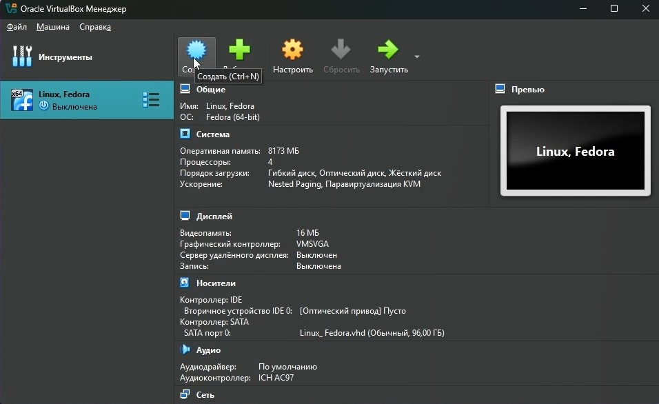{#fig:001 width=70%}

В новом окне нам необходимо указать имя для виртуальной машины, а также выбрать образ ISO. (рис. [-@fig:002])

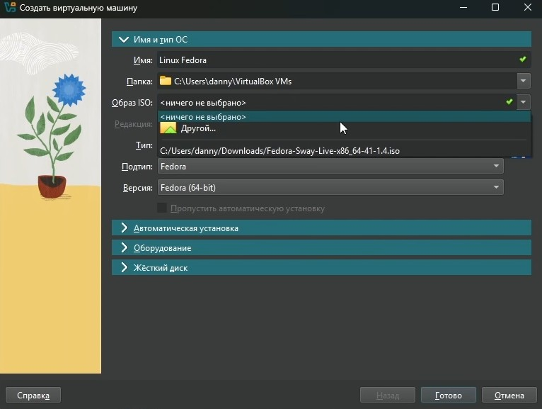{#fig:002 width=70%}

Далее необходимо указать размер основной памяти, а также процессоры, необходимые для работы виртуальной машины. (рис. [-@fig:003]).

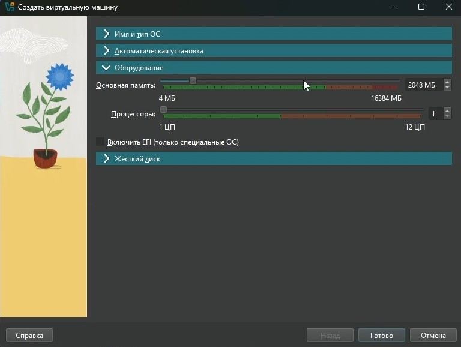{#fig:003 width=70%}

Создаём виртуальный жёсткий диск (не меньше 80 ГБ) и создаём машину. (рис. [-@fig:004])

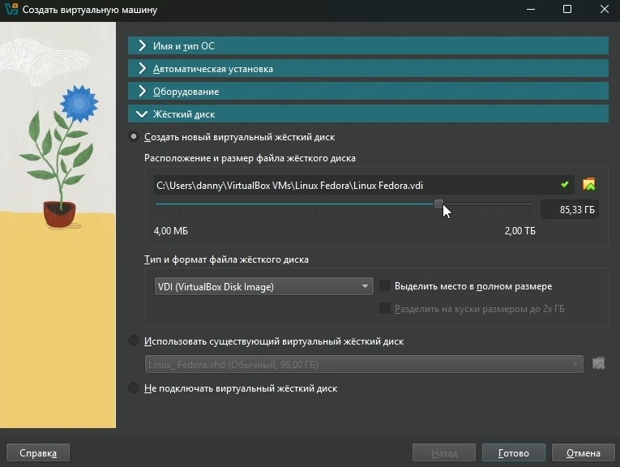{#fig:004 width=70%}

2. Установка операционной системы.
  1. Запуск приложения для установки системы. 
  После запуска виртуальной машины необходимо нажать сочетание клавиш Win + D, а после вводим Liveinst и начинаем загрузку. (рис. [-@fig:005])
  
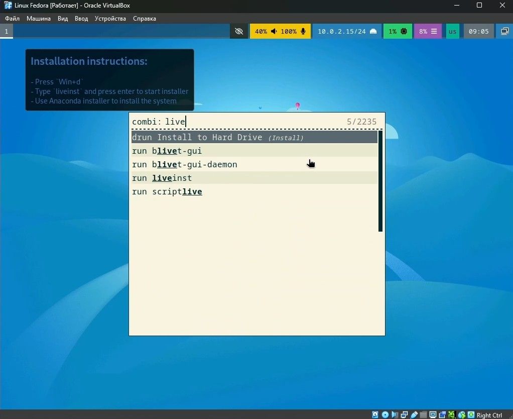{#fig:005 width=70%}

  2. Переходим к настройкам до установки: (рис. [-@fig:006])
  - В появившемся окне необходимо выбрать язык интерфейса и (при необходимости) скорректировать часовой пояс, раскладку.
  - Место установки ОС оставляем без изменения.
  - Устанавливаем имена и пароли для пользователя, пользователя root и сетевое имя компьютера. 
  
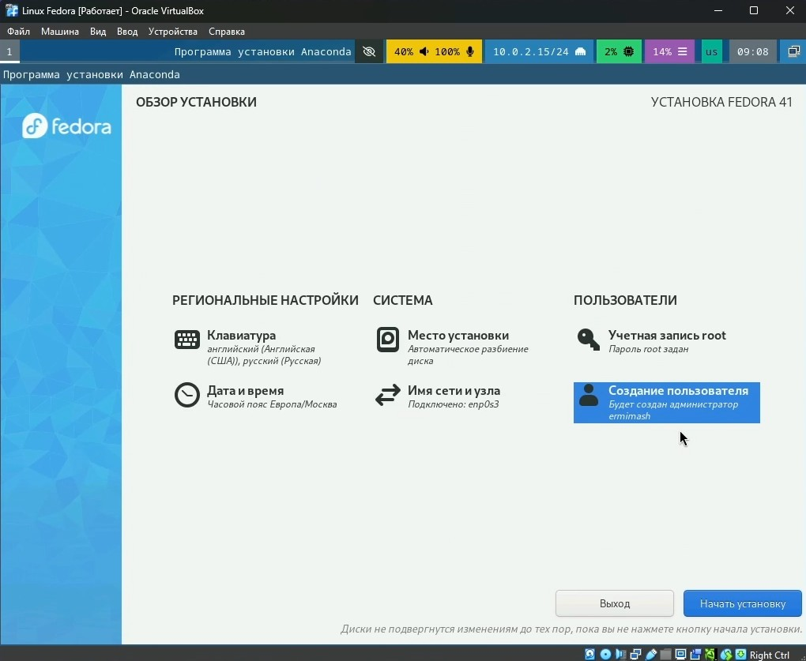{#fig:006 width=70%}

После  корректно перезапускаем виртуальную машину.
Если оптический диск не отключилдся автоматически - отключаем его самостоятельно. 

3. После установки. 
Входим в ОС под записью, созданной при установке.
Запускаем терминал с помощью комбинации Win + Enter и переключаемся на роль супер-пользователя с помощью команды sudo -i.

  1. Обновления (рис. [-@fig:007])
  Установливаем средства разработки с помощью следующей команды:
  - sudo dnf -y group install development-tools
  
  Обновляем все пакеты: 
  - sudo dnf -y update
  
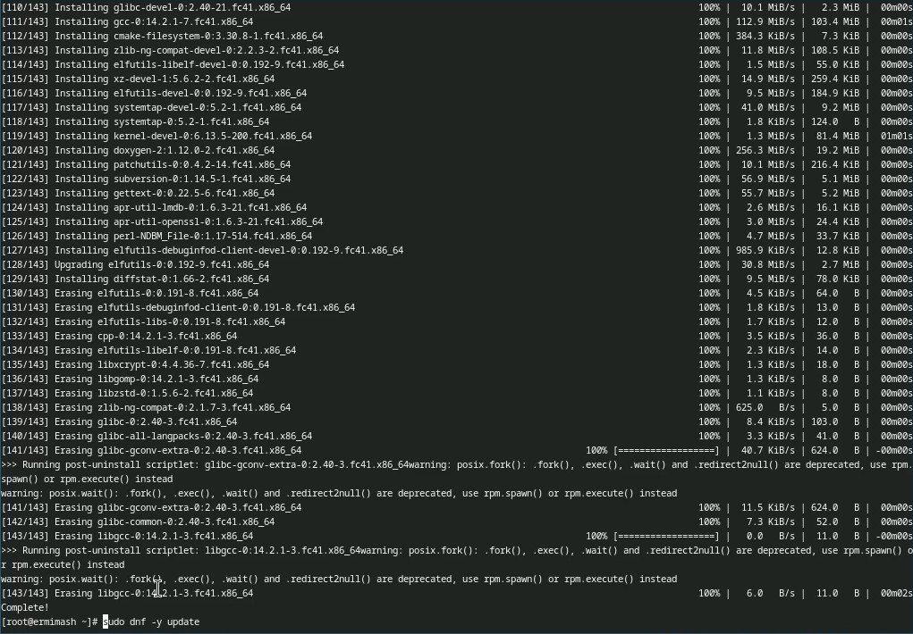{#fig:007 width=70%}

  2. Повышение комфорта работы (рис. [-@fig:008])
  Программы для удобства работы в консоли:
  - sudo dnf -y install tmux mc
  
  Другой вариант консоли:
  - sudo dnf -y install kitty

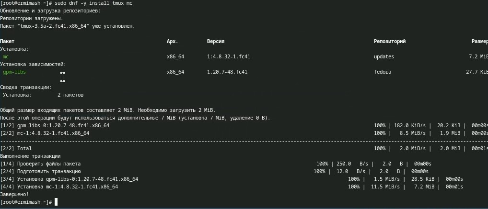{#fig:008 width=70%}
 
  3. Автоматическое обновление (рис. [-@fig:009])
  Установка программного обеспечения:
  - sudo dnf -y install dnf-automatic
  
  Запустите таймер:
  - sudo systemctl enable --now dnf-automatic.timer
  
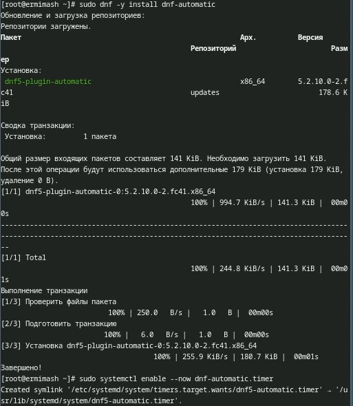{#fig:009 width=70%}
  
  4. Отключение SELinux (рис. [-@fig:010])
  В данном курсе мы не будем рассматривать работу с системой безопасности SELinux. Поэтому отключим его.
  С помощью nano в файле /etc/selinux/config замените значение "SELINUX=enforcing" на "SELINUX=permissive".
  
  После перезапускаем виртуальную машину: 
  - sudo systemctl reboot
  
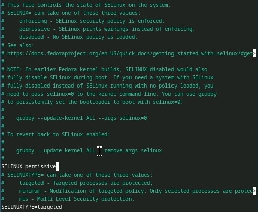{#fig:010 width=70%}

4. Настройка раскладки клавиатуры. 
Запускаем терминал с помощью Win + Enter. 
Запускаем мультиплексор tmux. (рис. [-@fig:011])

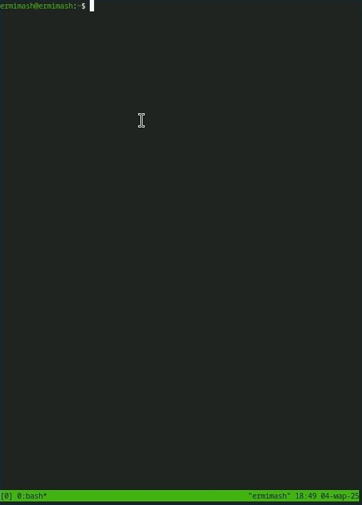{#fig:011 width=70%}

Создайте конфигурационный файл: (рис. [-@fig:012])
  - mkdir -p ~/.config/sway
  - touch ~/.config/sway/config.d/95-system-keyboard-config.conf

Далее редактируем созданный нами файл: (рис. [-@fig:012])
  - exec_always /usr/libexec/sway-systemd/locale1-xkb-config --oneshot

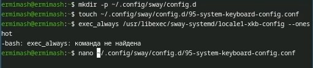{#fig:012 width=70%}

Переключаемся на роль супер-пользователя:
  - sudo -i

Редактируем второй конфигурационный файл, заменяя текст в нём на указанный ниже текст: (рис. [-@fig:013])
Section "InputClass"
	Identifier "system-keyboard"
	MatchIsKeyboard "on"
	Option "XkbLayout" "us,ru"
	Option "XkbVariant" ",winkeys"
	Option "XkbOptions" "grp:rctrl_toggle,compose:ralt,terminate:ctrl_alt_bksp"
EndSection

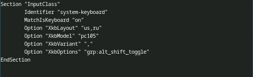{#fig:013 width=70%}

Перезагружаем виртуальную машину.

5. Установка имени пользователя и названия хоста. (рис. [-@fig:014])
Если при установке виртуальной машины вы задали имя пользователя или имя хоста, не удовлетворяющее соглашению об именовании, то вам необходимо исправить это. 

В терминале запускаем терминальный мультиплексор с помощью команды tmux и переключаемся на супер-пользователя. 
Установите имя хоста с помощью следующей команды: 
  - hostnamectl set-hostname username
  
Проверяем, что имя хоста установлено верно:
  - hostnamectl 
  
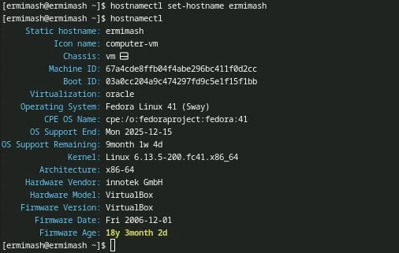{#fig:014 width=70%}

6. Установка программного обеспечения для создания документации. 
В терминале запускаем терминальный мультиплексор с помощью команды tmux и переключаемся на супер-пользователя. 

  1. Работа с языком разметки Markdown 
  Для работы с языком разметки Markdown. Устанавливаем его: 
  - sudo dnf -y install pandoc
  
  Для работы с перекрёстными ссылками мы используем пакет pandoc-crossref. 
  Скачиваем необходимую версию pandoc-crossref (https://github.com/lierdakil/pandoc-crossref/releases).
  
  Распакуйте архивы и помещаем их в каталог /usr/local/bin. (рис. [-@fig:015])
  
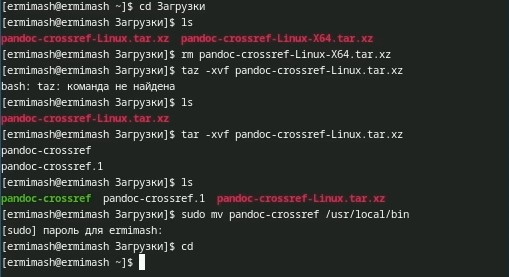{#fig:015 width=70%}

  2. Texlive (рис. [-@fig:016])
  Устанавливаем дистрибутив с помощью следующей команды: 
  - sudo dnf -y install texlive-scheme-full 
  
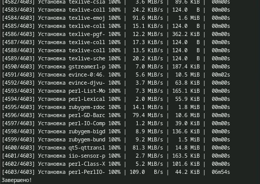{#fig:016 width=70%}

# Домашнее задание

В окне терминала проанализируем последовательность загрузки системы, выполнив команду dmesg. Используем следующую команду: 
  - dmesg | less

А после используем команду для поиска: 
  - dmesg | grep -i "то, что ищем"
  
Получаем следующую информацию.

  - Версия ядра Linux (Linux version). 
  - Частота процессора (Detected Mhz processor).
  - Модель процессора (CPU0).
  - Объём доступной оперативной памяти (Memory available).
  - Тип обнаруженного гипервизора (Hypervisor detected). 
  - Тип файловой системы корневого раздела.
  - Последовательность монтирования файловых систем.
  
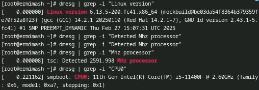{#fig:017 width=70%}

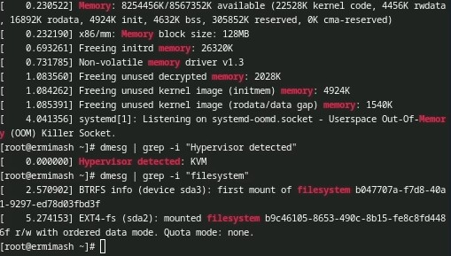{#fig:018 width=70%}

# Выводы

В ходе работы приобретены практических навыков установки операционной системы на виртуальную машину, настройки минимально необходимых для дальнейшей работы сервисов.

# Контрольные вопросы

1. Системное имя, идентификатор пользователя, идентификатор группы, полное имя, домашний каталог, начальная оболочка.
2. 1) man <команда> (прим. man ls); 2) cd <каталог>; 3) ls (если необходимо - уточ. <каталог>); 4) du -s <каталог>$ 5) rm <ключ> <файл/каталог>; 6) chmod <ххх> <имя> (прим. chmod 777 filename.txt); 7) history.
3. Порядок, опред. способ организации, хранения и именования данных на носителях информации. Прим.: ext2, макс. размер 16гб-2гб, макс. размер тома 2гб-32гб, сущ. ед. корневой каталог, макс. длина имени файла - 266 байт.
4. mount.
5. Kill <РID> (PID - получаем с помощью ps axu | grep)

# Список литературы{.unnumbered}

::: {#refs}
:::
