---
## Front matter
title: "Лабораторная работа №1"
subtitle: "Отчёт"
author: "Ермишина Мария Кирилловна"

## Generic otions
lang: ru-RU
toc-title: "Содержание"

## Bibliography
bibliography: bib/cite.bib
csl: pandoc/csl/gost-r-7-0-5-2008-numeric.csl

## Pdf output format
toc: true # Table of contents
toc-depth: 2
lof: true # List of figures
lot: true # List of tables
fontsize: 12pt
linestretch: 1.5
papersize: a4
documentclass: scrreprt
## I18n polyglossia
polyglossia-lang:
  name: russian
  options:
	- spelling=modern
	- babelshorthands=true
polyglossia-otherlangs:
  name: english
## I18n babel
babel-lang: russian
babel-otherlangs: english
## Fonts
mainfont: IBM Plex Serif
romanfont: IBM Plex Serif
sansfont: IBM Plex Sans
monofont: IBM Plex Mono
mathfont: STIX Two Math
mainfontoptions: Ligatures=Common,Ligatures=TeX,Scale=0.94
romanfontoptions: Ligatures=Common,Ligatures=TeX,Scale=0.94
sansfontoptions: Ligatures=Common,Ligatures=TeX,Scale=MatchLowercase,Scale=0.94
monofontoptions: Scale=MatchLowercase,Scale=0.94,FakeStretch=0.9
mathfontoptions:
## Biblatex
biblatex: true
biblio-style: "gost-numeric"
biblatexoptions:
  - parentracker=true
  - backend=biber
  - hyperref=auto
  - language=auto
  - autolang=other*
  - citestyle=gost-numeric
## Pandoc-crossref LaTeX customization
figureTitle: "Рис."
tableTitle: "Таблица"
listingTitle: "Листинг"
lofTitle: "Список иллюстраций"
lotTitle: "Список таблиц"
lolTitle: "Листинги"
## Misc options
indent: true
header-includes:
  - \usepackage{indentfirst}
  - \usepackage{float} # keep figures where there are in the text
  - \floatplacement{figure}{H} # keep figures where there are in the text
---

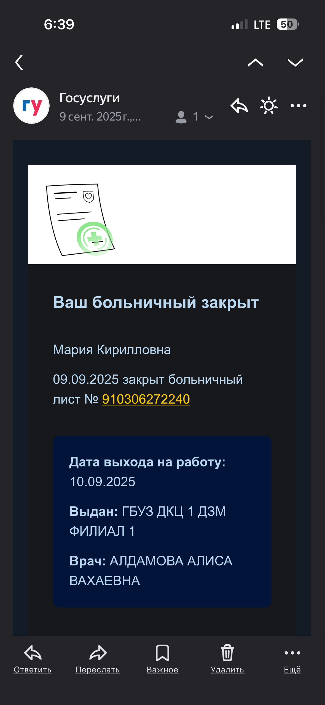{#fig:017 width=70%}

# Цель работы

Целью данной работы является приобретение практических навыков установки операционной системы на виртуальную машину, настройки минимально необходимых для дальнейшей работы сервисов.

# Выполнение лабораторной работы

1. Создание виртуальной машины
Для начала запускаем программу VirtualBox. 
В открывшемся окне мы видим интерфейс приложения. Выбираем кнопку "Создать". (рис. [-@fig:001])

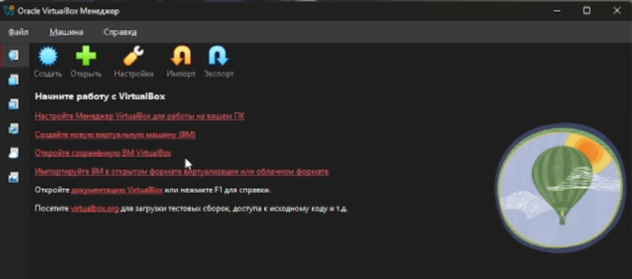{#fig:001 width=70%}

В новом окне нам необходимо указать имя для виртуальной машины, а также выбрать образ ISO.
Далее необходимо указать размер основной памяти,  а также процессоры, необходимые для работы виртуальной машины.
Создаём виртуальный жёсткий диск (не меньше 40 ГБ) и создаём машину. (рис. [-@fig:002])

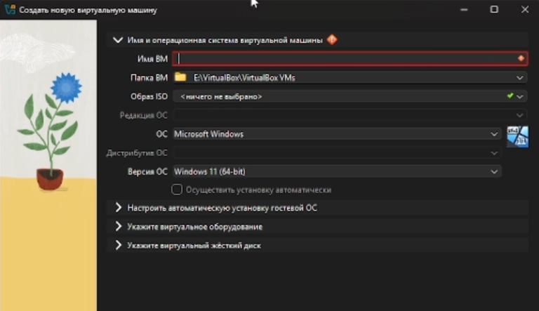{#fig:002 width=70%}

2. Настройка Rocky Linux
В окне «Добро пожаловать в Rocky Linux...» выберите English в качестве языка интерфейса.(рис. [-@fig:003])

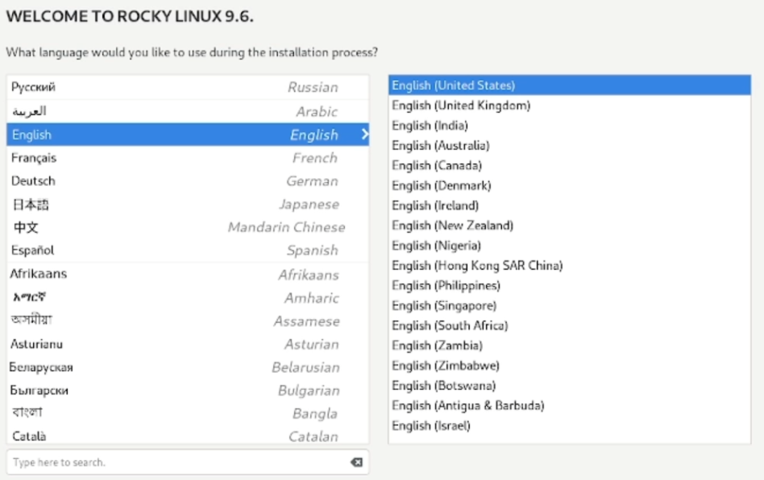{#fig:003 width=70%}

В открывшемся окне мы можем окончательно настроить операционную систему. (рис. [-@fig:004])

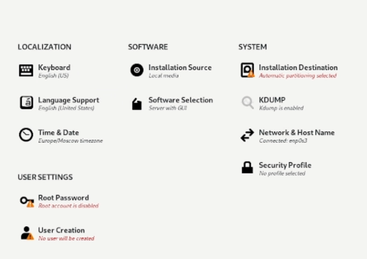{#fig:004 width=70%}

Корректируем раскладку клавиатуры - добавляем русский язык, оставляем английский. (рис. [-@fig:005])

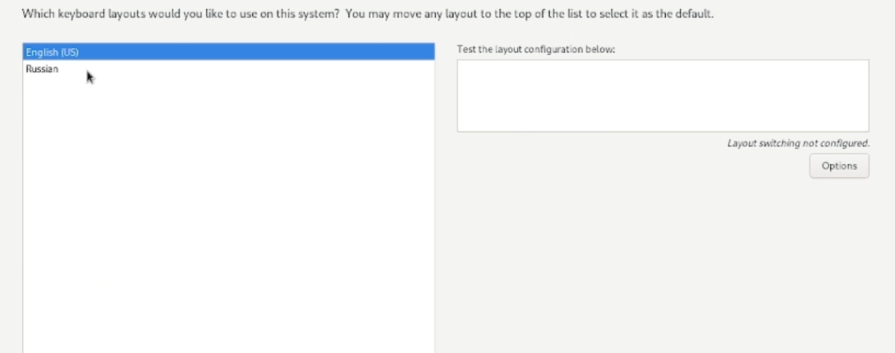{#fig:005 width=70%}

В разделе выбора программ укажите в качестве базового окружения Server with GUI, а в качестве дополнения — Development Tools. (рис. [-@fig:006])

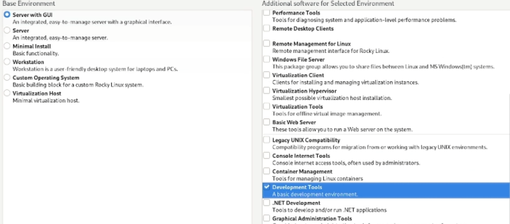{#fig:006 width=70%}

Отключаем KDUMP. Место установки ОС оставляем без изменения.
Включаем сетевое соединение и в качестве имени узла укажите user.localdomain, где вместо user указываем имя своего пользователя. (рис. [-@fig:007])

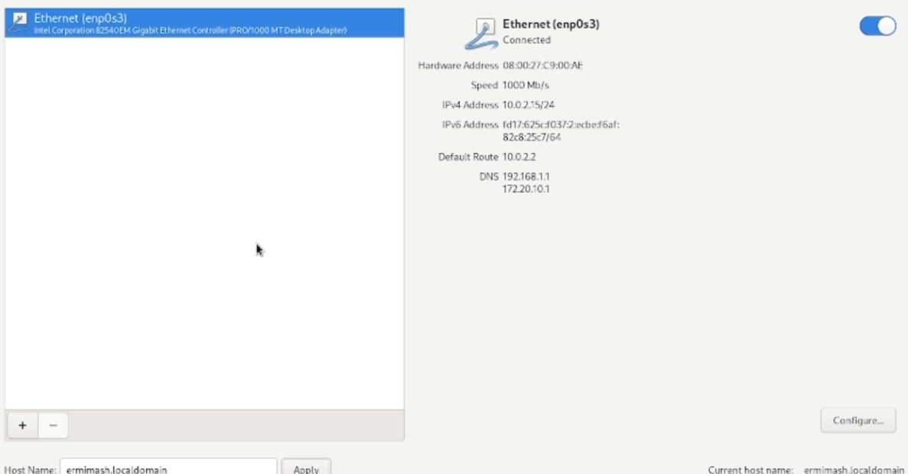{#fig:007 width=70%}

Устанавливаем пароль для root, разрешение на ввод пароля для root при использовании SSH. (рис. [-@fig:008])

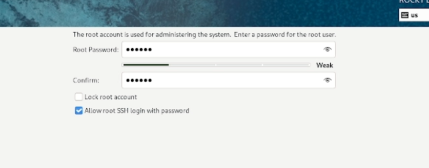{#fig:008 width=70%}

Затем задаем локального пользователя с правами администратора и пароль для него. (рис. [-@fig:009])

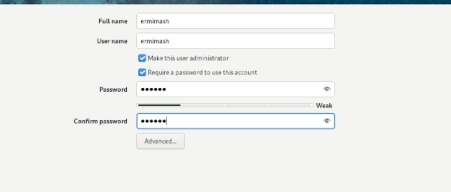{#fig:009 width=70%}

После завершения настройки корректно перезапускаем машину. Далее входим под заданной нами уч. записью. 
В меню Устройства виртуальной машины подключите образ диска дополнений гостевой ОС. После загрузки дополнений перезагружаем виртуальную машину.

# Домашнее задание

В окне терминала проанализируем последовательность загрузки системы, выполнив команду dmesg. Используем следующую команду: (рис. [-@fig:010])
  - dmesg | less 

А после используем команду для поиска: 
  - dmesg | grep -i "то, что ищем"
  
Получаем следующую информацию.

  - Версия ядра Linux (Linux version). (рис. [-@fig:011])
  - Частота процессора (Detected Mhz processor). (рис. [-@fig:012])
  - Модель процессора (CPU0). (рис. [-@fig:013])
  - Объём доступной оперативной памяти (Memory available). (рис. [-@fig:014])
  - Тип обнаруженного гипервизора (Hypervisor detected). (рис. [-@fig:015])
  - Тип файловой системы корневого раздела. (рис. [-@fig:016])
  - Последовательность монтирования файловых систем. (рис. [-@fig:016])

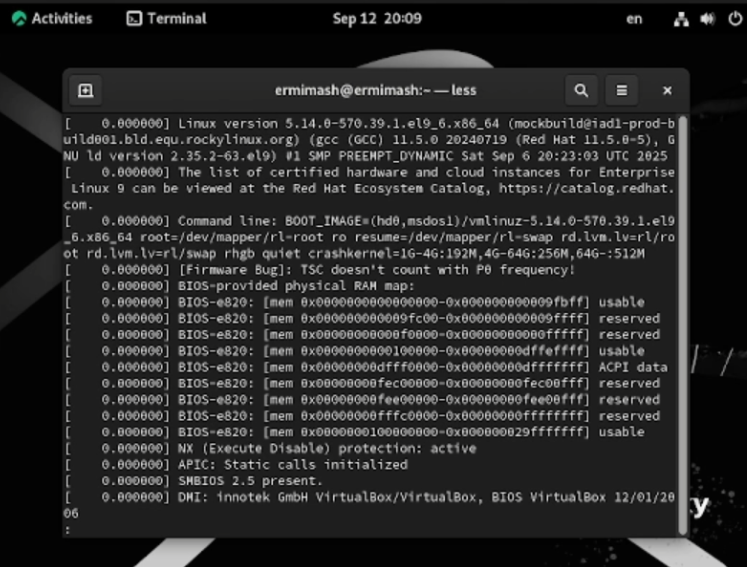{#fig:010 width=70%}
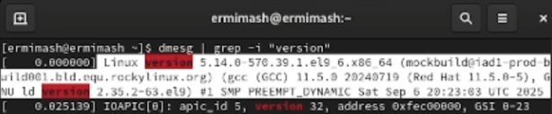{#fig:011 width=70%}
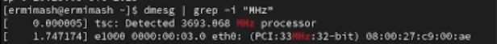{#fig:012 width=70%}
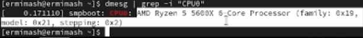{#fig:013 width=70%}
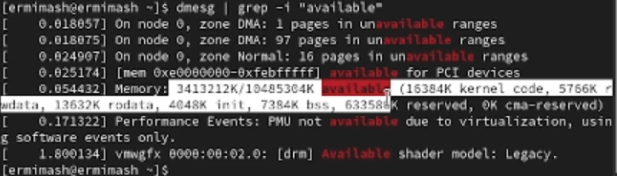{#fig:014 width=70%}
{#fig:015 width=70%}
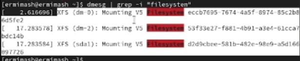{#fig:016 width=70%}

# Выводы

В ходе работы приобретены практических навыков установки операционной системы на виртуальную машину, настройки минимально необходимых для дальнейшей работы сервисов.

# Контрольные вопросы

1. Команды:
  - для получения справки по команде – info "название команды" или "название команды" --help
  - для перемещения по файловой системе – cd "путь"
  - для просмотра содержимого каталога – dir либо ls
  - для определения объема каталога – du -sh "путь"
  - для создания каталога - mkdir "название" 
  - для удаления – rmdir "название"
  - для создания файла touch "название" или cat > "название" 
  - для удаления rm "название"
  - для создания каталога с правами mkdir –mode="идентификатор" "название каталога" 
  - для правки прав доступа для файла chmo
  - для просмотра истории команд - history
2. Содержит информацию об идентификаторе учетной записи пользователя и ее имени, идентификаторе основной группы пользователя и ее названии. Команда: id "имя пользователя"
3. Файловая система определяет способ хранения, организации данных/информации на определенных носителях. Пример: NTFS - Макс. размер файла 264 байт, максимум файлов 232-1, макс. размер тома 256 ТБ
4. dmesg | grep “filesystem”
5. pkill «название процесса»

# Список литературы{.unnumbered}

::: {#refs}
:::
