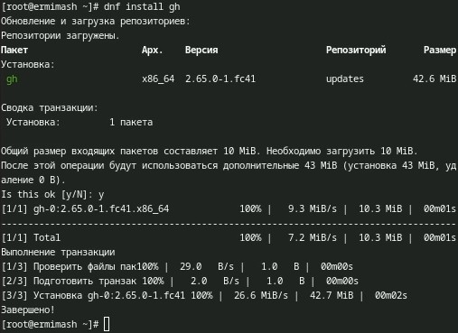
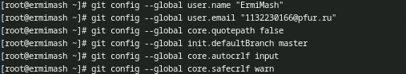
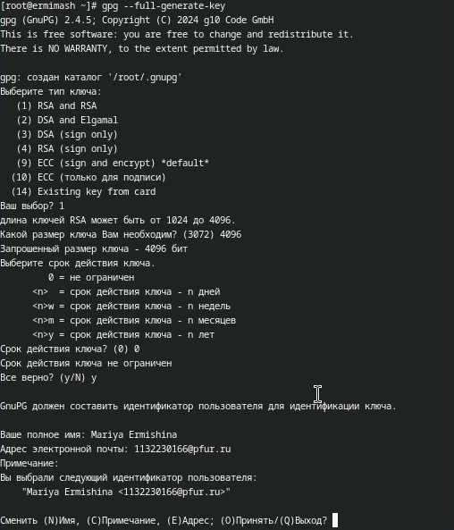
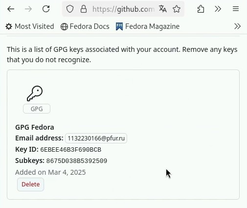
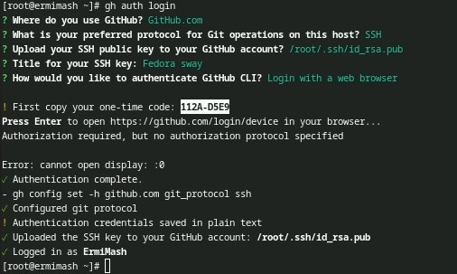
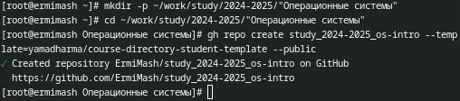
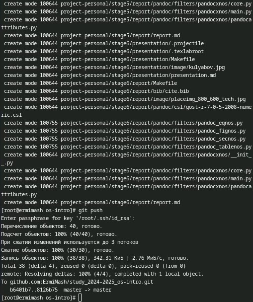

---
## Front matter
lang: ru-RU
title: Лабораторная работа №2
subtitle: Презентация
author:
  - Ермишина М. К.
institute:
  - Российский университет дружбы народов, Москва, Россия
date: 07 марта 2025

## i18n babel
babel-lang: russian
babel-otherlangs: english

## Formatting pdf
toc: false
toc-title: Содержание
slide_level: 2
aspectratio: 169
section-titles: true
theme: metropolis
header-includes:
 - \metroset{progressbar=frametitle,sectionpage=progressbar,numbering=fraction}

## Fonts
mainfont: PT Serif
romanfont: PT Serif
sansfont: PT Sans
monofont: PT Mono
mainfontoptions: Ligatures=TeX
romanfontoptions: Ligatures=TeX
sansfontoptions: Ligatures=TeX,Scale=MatchLowercase
monofontoptions: Scale=MatchLowercase,Scale=0.9
---

# Информация

## Докладчик

:::::::::::::: {.columns align=center}
::: {.column width="70%"}

  * Ермишина Мария Кирилловна
  * студент группы НПИбд-01-24
  * Российский университет дружбы народов
  * [1132230166@pfur.ru](mailto:1132230166@pfur.ru)
  * <https://github.com/ErmiMash>

:::
::: {.column width="30%"}

:::
::::::::::::::

# Элементы презентации

## Цели и задачи

Целью данной лабораторной работы являются: изучение идеологии и применение средств контроля версий; освоение умения по работе с git.

Задачи:
- Создать базовую конфигурацию для работы с git.
- Создать ключ SSH.
- Создать ключ PGP.
- Настроить подписи git.
- Зарегистрироваться на Github.
- Создать локальный каталог для выполнения заданий по предмету.

# Выполнение лабораторной работы

## Установа git и gh.
Их мы устанавливаем с помощью команд:
{#fig:002 width=70%}

## После установки. 
Базовая настройка git. 
  1. Зададим имя и email владельца репозитория с помощью команд.
  2. Настроим utf-8 в выводе сообщений git.
  3. Зададим имя начальной ветки (будем называть её master).
  4. Параметры autocrlf и safecrlf.
{#fig:003 width=70%}

## Создаём ключи SSH и PGP.
Ключи SSH создаются с помощью простых команд.
Создаём ключ PGP.
  Данный ключ мы создаём со следующими опциями:
  1. тип RSA and RSA
  2. размер 4096
  3. 0 (срок действия не истекает никогда)
  Также указфываем свои данные (Имя, Почту (которая соответствует почте на GitHub), комментарий), которые будут храниться в ключе.
{#fig:005 width=70%}

## Добавление PGP ключа в GitHub.
Выводим список ключей и копируем отпечаток приватного ключа.
Копируем сгенерированный ключ PGP в буфер обмена.
Вставляем наш ключ на сайте GitHub и даём ему название.
Проверяем наличие ключа, обновив страницу.
{#fig:009 width=70%}

## Настройка автоматических подписей коммитов git. 
Используя введёный email, укажите Git применять его при подписи коммитов с помощью следующих команд: 
  - git config --global user.signingkey <PGP Fingerprint>
  - git config --global commit.gpgsign true
  - git config --global gpg.program $(which gpg2)
  {#fig:010 width=70%}
  
## Настройка gh.
Мы авторизуемся с помощью команды.
После ввода команды мы отвечаем на несколько вопросов и авторизуемся через браузер. При успешной авторизации получаем данную информацию в терминале и на сайте.
{#fig:011 width=70%}

## Создание репозитория курса на основе шаблона.
Для начала мы создаём каталог для создания шаблона.
Далее мы переходим в созданный каталог и создаём шаблон рабочего пространства, указывая актуальный учебный год и название предмета. А после проверяем его создание на сайте.
{#fig:013 width=70%} 

## Настройка каталога курса.

Далее создаём необходимые каталоги:
  - echo os-intro > COURSE
  - make prepare
  
После создания каталогов отправляем файлы на сервер.

{#fig:018 width=70%}
  
## Контрольные вопросы

1. Что такое системы контроля версий (VCS) и для решения каких задач они предназначаются?
2. Объясните следующие понятия VCS и их отношения: хранилище, commit, история, рабочая копия.
3. Что представляют собой и чем отличаются централизованные и децентрализованные VCS? Приведите примеры VCS каждого вида.
4. Опишите действия с VCS при единоличной работе с хранилищем.
5. Опишите порядок работы с общим хранилищем VCS.
6. Каковы основные задачи, решаемые инструментальным средством git?
7. Назовите и дайте краткую характеристику командам git.
8. Приведите примеры использования при работе с локальным и удалённым репозиториями.
9. Что такое и зачем могут быть нужны ветви (branches)?
10. Как и зачем можно игнорировать некоторые файлы при commit?

## Результаты

В ходе работы были изучены идеологии и применение средств контроля версий; освоила умения по работе с git.
