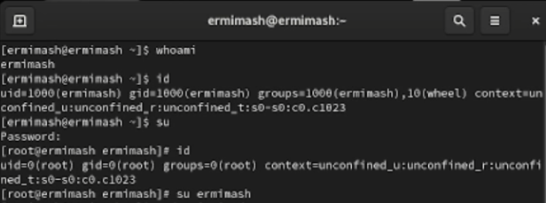
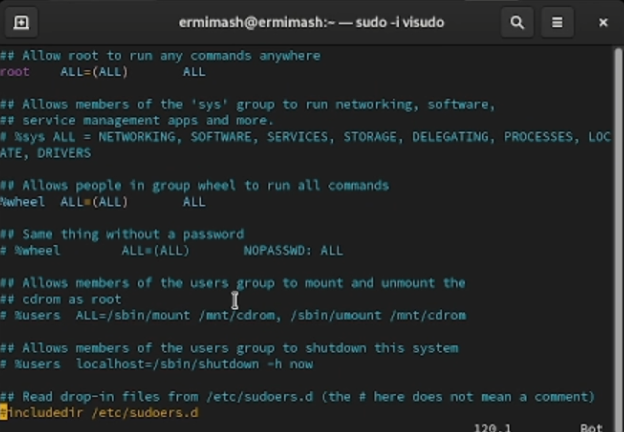
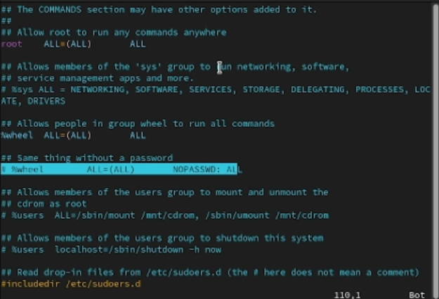
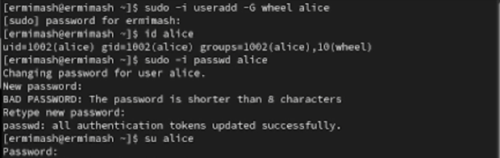
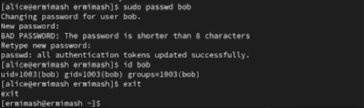
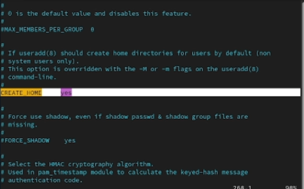
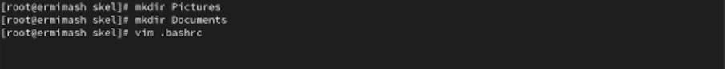
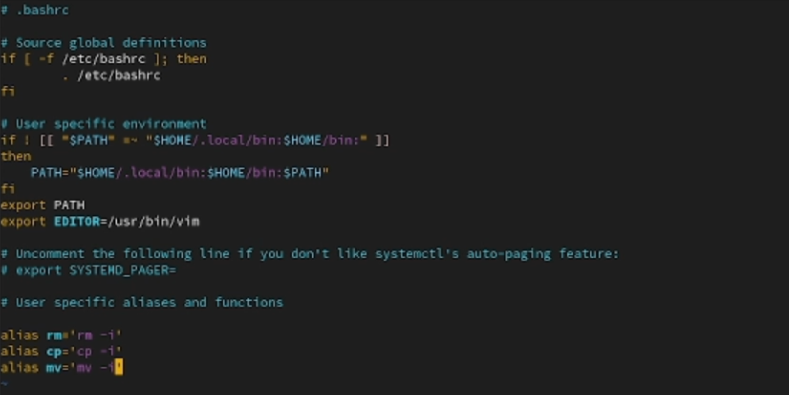
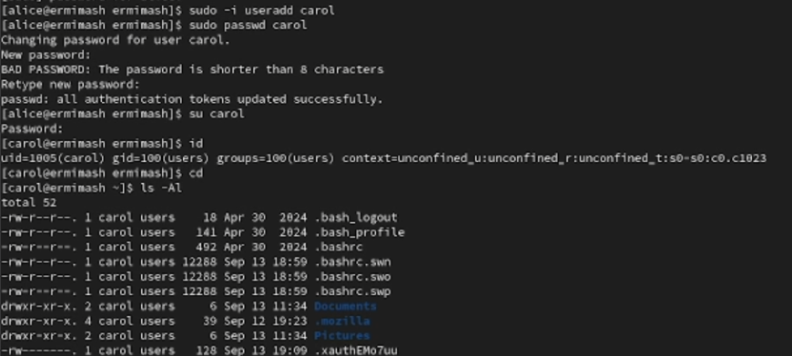
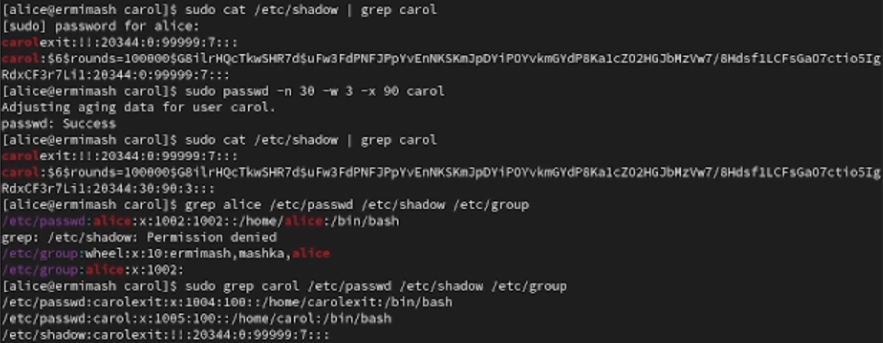

---
## Front matter
lang: ru-RU
title: Лабораторная работа №2
subtitle: Презентация
author:
  - Ермишина М. К.
institute:
  - Российский университет дружбы народов, Москва, Россия
date: 13 сентября 2025

## i18n babel
babel-lang: russian
babel-otherlangs: english

## Formatting pdf
toc: false
toc-title: Содержание
slide_level: 2
aspectratio: 169
section-titles: true
theme: metropolis
header-includes:
 - \metroset{progressbar=frametitle,sectionpage=progressbar,numbering=fraction}

## Fonts
mainfont: PT Serif
romanfont: PT Serif
sansfont: PT Sans
monofont: PT Mono
mainfontoptions: Ligatures=TeX
romanfontoptions: Ligatures=TeX
sansfontoptions: Ligatures=TeX,Scale=MatchLowercase
monofontoptions: Scale=MatchLowercase,Scale=0.9
---

# Информация

## Докладчик

:::::::::::::: {.columns align=center}
::: {.column width="70%"}

  * Ермишина Мария Кирилловна
  * студент группы НПИбд-01-24
  * Российский университет дружбы народов
  * [1132230166@pfur.ru](mailto:1132230166@pfur.ru)
  * <https://github.com/ErmiMash>

:::
::: {.column width="30%"}

:::
::::::::::::::

# Элементы презентации

## Цели и задачи

Получить представление о работе с учётными записями пользователей и группами
пользователей в операционной системе типа Linux.

# Выполнение лабораторной работы

## Переключение учётных записей пользователей
Определяем, какая уч. запись используется, выводим информацию о ней. Для переключения используем su:

## Проверяем файл
Просматриваем файл /etc/sudoers. Убеждаемся, что в открытом с помощью visudo файле присутствует строка %wheel ALL=(ALL) ALL

## Создаем пользователя alice
Создаем пользователя, входящего в группу wheel и проверяем информацию
  - sudo -i useradd -G wheel alice
  - id alice
  - sudo -i passwd alice
  

## Создаем пользователя bob
Пользователь bob, как alice, но не входит в группу wheel
  - sudo useradd bob
  - sudo passwd bob
  - id bob
  

  
## Создание учётных записей пользователей
Переключаемся на  root и открываем файл /etc/login.defs. Проверяем, что в файле параметры
  - su
  - vim /etc/login.defs
  

  
## Настройка gh.
Мы авторизуемся с помощью команды.
После ввода команды мы отвечаем на несколько вопросов и авторизуемся через браузер. При успешной авторизации получаем данную информацию в терминале и на сайте.

## Переходим в каталог /etc/skel
  - cd /etc/skel
  - mkdir Pictures
  - mkdir Documents

## Изменяем содержимое файла .bashrc
Добавляем строку export EDITOR=/usr/bin/vim

  
## Создаем пользователя carol
  - su alice
  - sudo -i useradd carol
  - sudo passwd carol

## Изменяем данные о пароле пользователя carol
  - su alice
  - sudo cat /etc/shadow | grep carol ()
  - sudo passwd -n 30 -w 3 -x 90 carol
  - sudo cat /etc/shadow | grep carol

## Работа с группами
Находясь под уч. записью alice, создаем группы main и third:
  - sudo groupadd main
  - sudo groupadd third

## Результаты

Получить представление о работе с учётными записями пользователей и группами
пользователей в операционной системе типа Linux.
