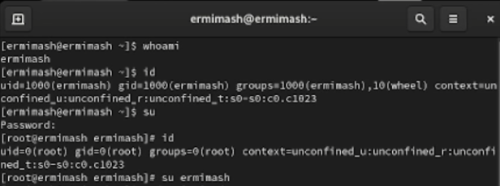
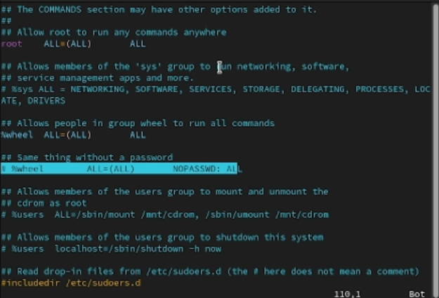
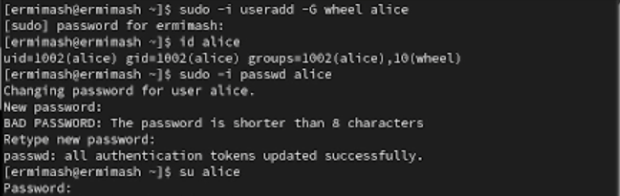
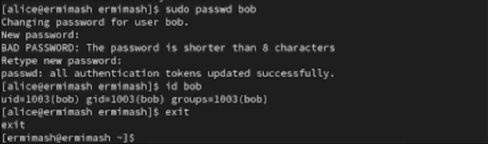
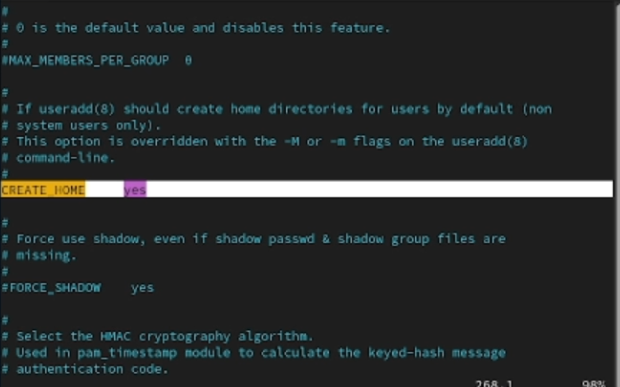
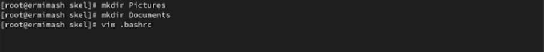
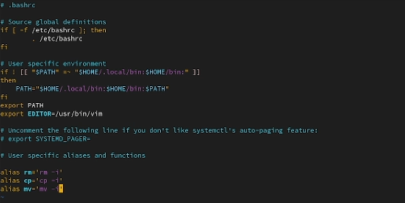
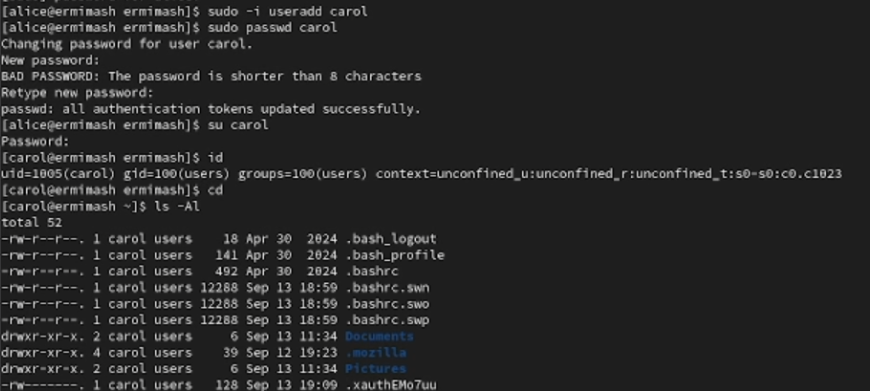
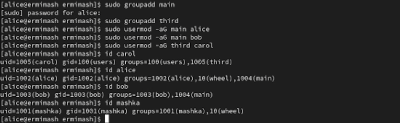

---
## Front matter
title: "Лабораторная работа №2"
subtitle: "Отчёт"
author: "Ермишина Мария Кирилловна"

## Generic otions
lang: ru-RU
toc-title: "Содержание"

## Bibliography
bibliography: bib/cite.bib
csl: pandoc/csl/gost-r-7-0-5-2008-numeric.csl

## Pdf output format
toc: true # Table of contents
toc-depth: 2
lof: true # List of figures
lot: true # List of tables
fontsize: 12pt
linestretch: 1.5
papersize: a4
documentclass: scrreprt
## I18n polyglossia
polyglossia-lang:
  name: russian
  options:
	- spelling=modern
	- babelshorthands=true
polyglossia-otherlangs:
  name: english
## I18n babel
babel-lang: russian
babel-otherlangs: english
## Fonts
mainfont: IBM Plex Serif
romanfont: IBM Plex Serif
sansfont: IBM Plex Sans
monofont: IBM Plex Mono
mathfont: STIX Two Math
mainfontoptions: Ligatures=Common,Ligatures=TeX,Scale=0.94
romanfontoptions: Ligatures=Common,Ligatures=TeX,Scale=0.94
sansfontoptions: Ligatures=Common,Ligatures=TeX,Scale=MatchLowercase,Scale=0.94
monofontoptions: Scale=MatchLowercase,Scale=0.94,FakeStretch=0.9
mathfontoptions:
## Biblatex
biblatex: true
biblio-style: "gost-numeric"
biblatexoptions:
  - parentracker=true
  - backend=biber
  - hyperref=auto
  - language=auto
  - autolang=other*
  - citestyle=gost-numeric
## Pandoc-crossref LaTeX customization
figureTitle: "Рис."
tableTitle: "Таблица"
listingTitle: "Листинг"
lofTitle: "Список иллюстраций"
lotTitle: "Список таблиц"
lolTitle: "Листинги"
## Misc options
indent: true
header-includes:
  - \usepackage{indentfirst}
  - \usepackage{float} # keep figures where there are in the text
  - \floatplacement{figure}{H} # keep figures where there are in the text
---

# Цель работы

Получить представление о работе с учётными записями пользователей и группами
пользователей в операционной системе типа Linux.

# Задание

- Создать базовую конфигурацию для работы с git.
- Создать ключ SSH.
- Создать ключ PGP.
- Настроить подписи git.
- Зарегистрироваться на Github.
- Создать локальный каталог для выполнения заданий по предмету.

# Теоретическое введение

| Флаг | Описание                                                                                                          |
|--------------|----------------------------------------------------------------------------------------------------------------------------|
| `-`          | указывает на отсутствие флага                                                             |
| `l`      | указывает, что ресурс является символической ссылкой     |
| `d`       | указывает, что ресурс является каталогом |
| `b`      | указывает, что ресурс является блочным устройством |
| `c`     | указывает, что ресурс является символьным устройством                                                                          |
| `p`      | указывает, что ресурс является каналом, устройством fifo                                                                           |
| `s`       | указывает, что ресурс является Unix-сокетом                                                                                                           |

# Выполнение лабораторной работы

1. Переключение учётных записей пользователей
Определите, какую учётную запись пользователя вы используете, а так же выводим подробную информацию с помощью команд: (рис. [-@fig:001])
  - whoami
  - id

Используем команду su для переключения к учётной записи root, а после вводим пароль: (рис. [-@fig:001])
  - su
Используем команду id, чтобы узнать данные.

id (UID – id пользователя равный 1000 GID – id группы равный 1000)

После возвразаемся к уч. записи своего пользователя.

{#fig:001 width=70%}

Просмотрите в безопасном режиме файл /etc/sudoers: (рис. [-@fig:002])
  - sudo -i visudo

Убеждаемся, что в открытом с помощью visudo файле присутствует строка %wheel ALL=(ALL) ALL. (рис. [-@fig:002])

{#fig:002 width=70%}

Создаем пользователя alice, входящего в группу wheel и узнаем информацию. После этого создавем пароль для пользователя и переключаемся на эту учю запись: (рис. [-@fig:003])
  - sudo -i useradd -G wheel alice
  - id alice
  - sudo -i passwd alice
  - su alice

{#fig:003 width=70%}

Далее необходимо создать пользователя bob, как создавали alice (однако он не входит в группу wheel): (рис. [-@fig:004])
  - sudo useradd bob
  - sudo passwd bob
  - id bob

{#fig:004 width=70%}

2. Создание учётных записей пользователей 
Переключаемся на учю запись root и открываем файл конфигурации /etc/login.defs с помощью vim: (рис. [-@fig:005])
  - su
  - vim /etc/login.defs
  
Проверяем, что в файла параметр CREATE HOME установлен в значении yes, а USERGROUPS ENAB устанавливаем на no: (рис. [-@fig:005])

{#fig:005 width=70%}

Переходим в каталог /etc/skel, где создавем два каталога: (рис. [-@fig:006])
  - cd /etc/skel
  - mkdir Pictures
  - mkdir Documents
    
{#fig:006 width=70%}

Изменяем содержимое файла .bashrc, добавив строку export EDITOR=/usr/bin/vim. (рис. [-@fig:007])

{#fig:007 width=70%}

Переключаемся на уч. запись alice. Используя утилиту useradd, создаем пользователя carol и устанавливаем для него пароль: (рис. [-@fig:008])
  - su alice
  - sudo -i useradd carol
  - sudo passwd carol
  
Проверяем информацию о пользователе, а так же создавние каталогов: (рис. [-@fig:008])
  - su carol
  - id
  - cd
  - ls -Al

{#fig:008 width=70%}

Переключаемся на уч. запись alice, а после изменяем данные о пароле пользователя carol: (рис. [-@fig:009])

  - su alice
  - sudo cat /etc/shadow | grep carol ()
  - sudo passwd -n 30 -w 3 -x 90 carol
  - sudo cat /etc/shadow | grep carol

Убеждаемся, что идентификатор alice существует во всех трех файлах, ф carol - не во всех: (рис. [-@fig:009])
  - grep alice /etc/passwd /etc/shadow /etc/group
  - sudo grep carol /etc/passwd /etc/shadow /etc/group
  
{#fig:009 width=70%}

3. Работа с группами (рис. [-@fig:010])
Находясь под уч. записью alice, создаем группы main и third:
  - sudo groupadd main
  - sudo groupadd third
  
Используя usermod добавляем alice и bob в группу main, carol - third. Убеждаемся в правильности добавления всех пользователей в свои группы. 

{#fig:010 width=70%}

# Выводы

Изучила идеологии и применение средств контроля версий; освоила умения по работе с git.

# Контрольные вопросы

1. При помощи каких команд можно получить информацию о номере (идентификаторе),назначенном пользователю Linux, о группах, в которые включён пользователь?
Ответ - при помощи команды id - показывает uid, gid и группы пользователя, groups показывает список групп, whoami- имя текущего пользователя
2. Какой UID имеет пользователь root? При помощи какой команды можно узнать UID пользователя? Приведите примеры.
Ответ - у пользователя root всегда 0, с помошью команды id -u "имя пользователя" Привер: id -u root
3. В чём состоит различие между командами su и sudo?
Ответ - su это переключение на другого пользователя с вводом пароля, а sudo это дял выполнения отдельных команд от имени root с вводом своего пароля
4. В каком конфигурационном файле определяются параметры sudo?
Ответ - конфигурация sudo создается в файле /etc/suddoers
5. Какую команду следует использовать для безопасного изменения конфигурации sudo?
Ответ - для безоппасного редактирования используют команду visudo
6. Если вы хотите предоставить пользователю доступ ко всем командам администрирования системы через sudo, членом какой группы он должен быть?
Ответ - чтобы дать пользователю полный доступ ко всем командам через sudo он должен быть членом группы sudo
7. Какие файлы/каталоги можно использовать для определения параметров, которые будут использоваться при создании учётных записей пользователей? Приведите при-меры настроек.
Ответ 1)/etc/default/useradd -общие параметры по умолчанию Пример HOME =/home 2) /etc/login.defs- параметр для паролей uid/gid Пример PASS_MAX_DAYS 90
8. Где хранится информация о первичной и дополнительных группах пользователей ОС типа Linux? В отчёте приведите пояснение таких записей для пользователя alice.
Ответ 1) файл /etc/passwd - указывакет uid и первичную группу пользователей 2)файл /etc/group хранит список всех групп и их участников
9. Пример alice в /etc/passwd вывод будет - alice:x:1001:1001:Alice USer:/home/alice:/bin/bash а при команде /etc/group будет - developers:x:1002:alice,bob
10. Какие команды вы можете использовать для изменения информации о пароле поль-зователя (например о сроке действия пароля)?
Ответ passwd "username" - смена пароля, chage "username" управление сроком действия пароля Пример о смене действия пароля chage -M 90 alice
11. Какую команду следует использовать для прямого изменения информации в файле /etc/group и почему?
Ответ используют visudo для безоппасного редактирования

