---
## Front matter
title: "Лабораторная работа №2"
subtitle: "Отчёт"
author: "Ермишина Мария Кирилловна"

## Generic otions
lang: ru-RU
toc-title: "Содержание"

## Bibliography
bibliography: bib/cite.bib
csl: pandoc/csl/gost-r-7-0-5-2008-numeric.csl

## Pdf output format
toc: true # Table of contents
toc-depth: 2
lof: true # List of figures
lot: true # List of tables
fontsize: 12pt
linestretch: 1.5
papersize: a4
documentclass: scrreprt
## I18n polyglossia
polyglossia-lang:
  name: russian
  options:
	- spelling=modern
	- babelshorthands=true
polyglossia-otherlangs:
  name: english
## I18n babel
babel-lang: russian
babel-otherlangs: english
## Fonts
mainfont: IBM Plex Serif
romanfont: IBM Plex Serif
sansfont: IBM Plex Sans
monofont: IBM Plex Mono
mathfont: STIX Two Math
mainfontoptions: Ligatures=Common,Ligatures=TeX,Scale=0.94
romanfontoptions: Ligatures=Common,Ligatures=TeX,Scale=0.94
sansfontoptions: Ligatures=Common,Ligatures=TeX,Scale=MatchLowercase,Scale=0.94
monofontoptions: Scale=MatchLowercase,Scale=0.94,FakeStretch=0.9
mathfontoptions:
## Biblatex
biblatex: true
biblio-style: "gost-numeric"
biblatexoptions:
  - parentracker=true
  - backend=biber
  - hyperref=auto
  - language=auto
  - autolang=other*
  - citestyle=gost-numeric
## Pandoc-crossref LaTeX customization
figureTitle: "Рис."
tableTitle: "Таблица"
listingTitle: "Листинг"
lofTitle: "Список иллюстраций"
lotTitle: "Список таблиц"
lolTitle: "Листинги"
## Misc options
indent: true
header-includes:
  - \usepackage{indentfirst}
  - \usepackage{float} # keep figures where there are in the text
  - \floatplacement{figure}{H} # keep figures where there are in the text
---

# Цель работы

Целью данной лабораторной работы являются: изучение идеологии и применение средств контроля версий; освоение умения по работе с git. [@tuis]

# Задание

- Создать базовую конфигурацию для работы с git.
- Создать ключ SSH.
- Создать ключ PGP.
- Настроить подписи git.
- Зарегистрироваться на Github.
- Создать локальный каталог для выполнения заданий по предмету.

# Теоретическое введение

| Основные команды git | Описание каталога                                                                                                          |
|--------------|----------------------------------------------------------------------------------------------------------------------------|
| `git init`          | Создание основного дерева репозитория                                                              |
| `git pull `      | Получение обновлений (изменений) текущего дерева из центрального репозитория     |
| `git push`       | Отправка всех произведённых изменений локального дерева в центральный репозиторий                                        |
| `git status`      | Просмотр списка изменённых файлов в текущей директории |
| `git diff`     | Просмотр текущих изменений                                                                          |
| `git add .`      | добавить все изменённые и/или созданные файлы и/или каталоги                                                                           |
| `git add имена_файлов`       | добавить конкретные изменённые и/или созданные файлы и/или каталоги                                                                                                           |
| `git rm имена_файлов`       | удалить файл и/или каталог из индекса репозитория (при этом файл и/или каталог остаётся в локальной директории)                                                                        |
| `git commit -am 'Описание коммита'`       | сохранить все добавленные изменения и все изменённые файлы                                               |
| `git commit`       | сохранить добавленные изменения с внесением комментария через встроенный редактор                                                                                |
| `git checkout -b имя_ветки`       | создание новой ветки, базирующейся на текущей                                                                                 |
| `git checkout имя_ветки`       | переключение на некоторую веткупереключение на некоторую ветку (при переключении на ветку, которой ещё нет в локальном репозитории, она будет создана и связана с удалённой)                                                                                 |
| `git push origin имя_ветки`       | отправка изменений конкретной ветки в центральный репозиторий                                                       |
| `git merge --no-ff имя_ветки`       | слияние ветки с текущим деревом                                                                             |
| `git branch -d имя_ветки`       | удаление локальной уже слитой с основным деревом ветки                                                                                 |
| `git branch -D имя_ветки`       | принудительное удаление локальной ветки                                                                                 |
| `git push origin :имя_веткиgit push origin :имя_ветки`       | удаление ветки с центрального репозитория                                                                                 |

# Выполнение лабораторной работы

1. Установа git и gh.
Их мы устанавливаем с помощью команд:
  - dnf install git (рис. [-@fig:001])
  - dnf install gh (рис. [-@fig:002])

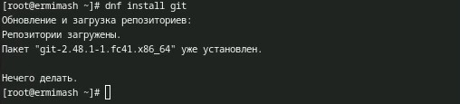{#fig:001 width=70%}

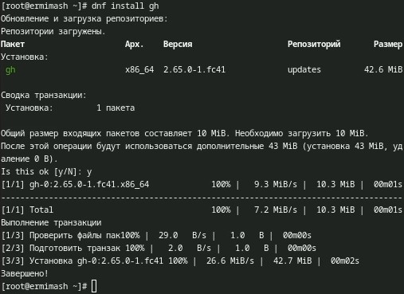{#fig:002 width=70%}

2. Базовая настройка git. (рис. [-@fig:003])
  1. Зададим имя и email владельца репозитория с помощью команд:
  git config --global user.name "Name Surname" 
  git config --global user.email "work@mail"
  
  2. Настроим utf-8 в выводе сообщений git:
  git config --global core.quotepath false
  
  3. Зададим имя начальной ветки (будем называть её master):
  git config --global init.defaultBranch master
    
  4. Параметры autocrlf и safecrlf:
  git config --global core.safecrlf warn
  
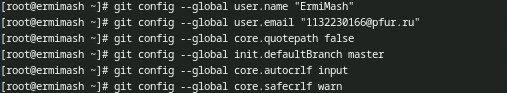{#fig:003 width=70%}
    
3. Создаём ключи SSH. (рис. [-@fig:004])
Их мы создаём с помощью команд:
  - ssh-keygen -t rsa -b 4096 (создание по алгоритму *rsa* с размером 4096 бит)
  - ssh-keygen -t ed25519 (создание по алгоритму *ed25519*)
  
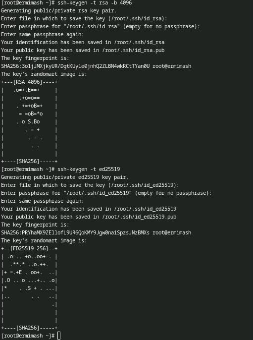{#fig:004 width=70%}
   
4. Создаём ключ PGP. (рис. [-@fig:005])
Используем команду для генерации ключа:
  - gpg --full-generate-key
  
  Данный ключ мы создаём со следующими опциями:
  1. тип RSA and RSA
  2. размер 4096
  3. 0 (срок действия не истекает никогда)
  
  Также указфываем свои данные (Имя, Почту (которая соответствует почте на GitHub), комментарий), которые будут храниться в ключе.
  
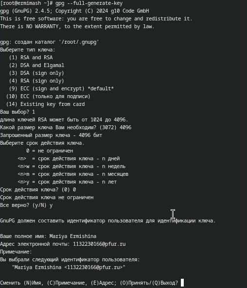{#fig:005 width=70%}

5. Настройка GitHub
Данный пункт я пропустила, так как уже имею аккаунт на GitHub, который я создавала в 1 семестре учёбы.

6. Добавление PGP ключа в GitHub.
  1. Выводим список ключей и копируем отпечаток приватного ключа с помощью следующей команды:
  gpg --list-secret-keys --keyid-format LONG (рис. [-@fig:006])
  
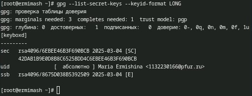{#fig:006 width=70%}
  
  2. Копируем сгенерированный ключ PGP в буфер обмена (с помощью команды получаем полный код, а далее вручную его копируем): 
  gpg --armor --export <PGP Fingerprint>  xclip -sel clip (рис. [-@fig:007])
  
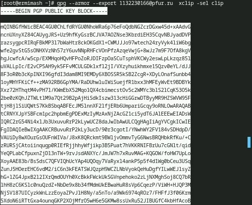{#fig:007 width=70%}
  
  Вставляем наш ключ на сайте GitHub и даём ему название. (рис. [-@fig:008])
  Проверяем наличие ключа, обновив страницу. (рис. [-@fig:009])

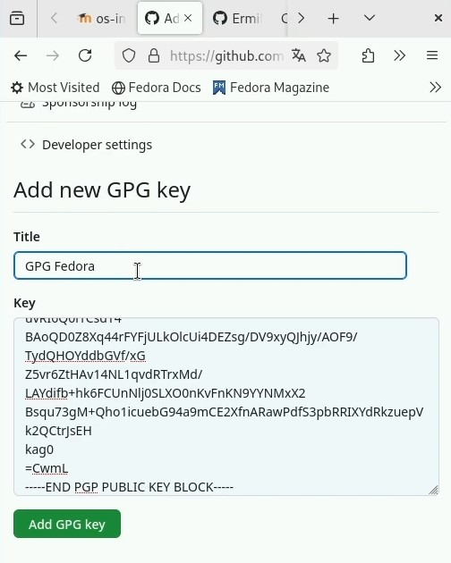{#fig:008 width=70%}
  
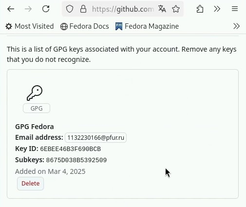{#fig:009 width=70%}

7. Настройка автоматических подписей коммитов git. (рис. [-@fig:010])
Используя введёный email, укажите Git применять его при подписи коммитов с помощью следующих команд: 
  - git config --global user.signingkey <PGP Fingerprint>
  - git config --global commit.gpgsign true
  - git config --global gpg.program $(which gpg2)
  
  {#fig:010 width=70%}

8. Настройка gh. (рис. [-@fig:011])
Мы авторизуемся с помощью команды:
  - gh auth login

После ввода команды мы отвечаем на несколько вопросов и авторизуемся через браузер. При успешной авторизации получаем данную информацию в терминале (рис. [-@fig:011]) и на сайте (рис. [-@fig:012]).

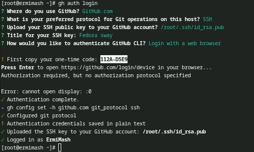{#fig:011 width=70%}

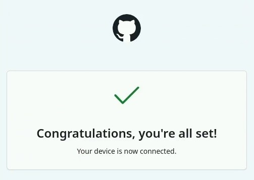{#fig:012 width=70%}

9. Создание репозитория курса на основе шаблона.
Для начала мы создаём каталог для создания шаблона с помощью следующей команды: 
  - mkdir -p ~/work/study/2024-2025/"Операционные системы" (рис. [-@fig:013])

Далее мы переходим в созданный каталог и создаём шаблон рабочего пространства, указывая актуальный учебный год и название предмета, с помощью следующих команд:
  - cd ~/work/study/2024-2025/"Операционные системы" (рис. [-@fig:013])
  - gh repo create study_ 2024-2025_os-intro --template=yamadharma/course-directory-student-template --public (рис. [-@fig:013])
  - git clone --recursive git@github.com:<owner>/study_2022-2023_os-intro.git os-intro (рис. [-@fig:014])
  
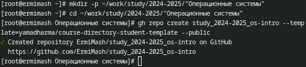{#fig:013 width=70%} 
  
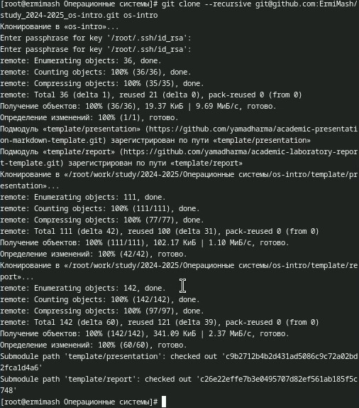{#fig:014 width=70%}
  
Проверяем наличие созданного шаблона на сайте. (рис. [-@fig:015])

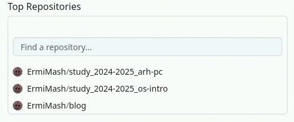{#fig:015 width=70%}

10. Настройка каталога курса.
Мы переходим в каталог курса и удаляем лишние файлы с помощью следующих команд: (рис. [-@fig:016])
  - cd ~/work/study/2022-2023/"Операционные системы"/os-intro
  - rm package.json
  
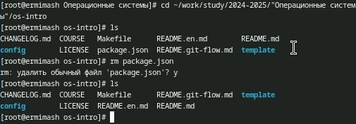{#fig:016 width=70%}

Далее создаём необходимфе каталоги: (рис. [-@fig:017])
  - echo os-intro > COURSE
  - make prepare
  
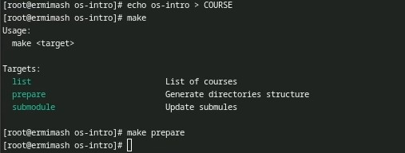{#fig:017 width=70%}
  
После создания каталогов отправляем файлы на сервер: (рис. [-@fig:018])
  - git add .
  - git commit -am 'feat(main): make course structure'
  - git push

{#fig:018 width=70%}

# Выводы

Изучила идеологии и применение средств контроля версий; освоила умения по работе с git.

# Контрольные вопросы

1. Это програмное обеспечение для облегчения работы с изменяющейся информаицей. Позволяет хранить несколько версий одного документы, возвращаться к более ранним версиям, опеределять кто и когда сделал изменение, и многое другое.
2. Хранилище - место хранения всех версий и служеб. информации. Commit - версия; процесс создания новой версии. История - место, где хранятся все коммиты, по которым можно смотреть данные по коммитам. Рабочая копия - тек. состояние файла проекта, осн. на версии из хранилища. 
3. Централизованные VCS: одно основное хранилище всего проекта, каждый копирует себе файлы и изменяет, а потом добавляет изменения; Децентрализованные: у каждого пользователя свой вариант (возможно не один) репозитория. 
4. Инициализация репозитория, добавление файлов, фиксация изменений, проверка статуса, просмотр истории коммитов, создание и слияние веток, удаление веток, откат изменений, резервное копирование.
5. Клонирование репозитория, создание новой ветки, создание новой ветки, внесение изменений, добавление изменений в индекс, создание коммита, обновление локальной ветки, слияние изменений, отправка изменений в удалённый репозиторий, открытие Pull Request (PR), код-ревью, слияние PR, регулярное обновление.
6. Две основные задачи: 1 - хранить информацию о всех изменениях в коде, начиная с самой первой строчки; 2 - обеспечивать удобство командной работы с кодом.
7. git init (инициализировать тек. каталог как git-репозиторий), git -version (проверка версии Git), git remote (посмотреть список удалённых репозиториев), git remote -v (более подробный вывод), git add . (позвол. охватить все файлы в тек. каталоге (вместе с теми, которые начинаются на точку)), git -htlp (узнать больше о доступных параметрах и командах), git push origin master (передать лок. коммиты в ветку удал. репозитория)
8. Локальный: создание новой ветки, работа без интернета, сохранение изменений; удалённый: отправки кодов, получение изменений, создание новых веток. 
9. Ветки нужны, чтобы несколько программистов могли работать над одним и тем же проектом (или даже файлом) одновременно, не мешая друг другу. Также используются для тестов: чтобы не мешать основному поекту создаётся отдельная ветка для экспериментов. 
10. Игнорируемые файлы — это, как правило, артефакты сборки и файлы, генерируемые машиной из исходных файлов в вашем репозитории, либо файлы, которые по какой-либо иной причине не должны попадать в коммиты. Игнорируемые файлы отслеживаются в специальном файле .gitignore, который регистрируется в корневом каталоге репозитория.

# Список литературы{.unnumbered}

::: {#refs}
:::
