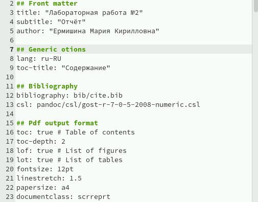
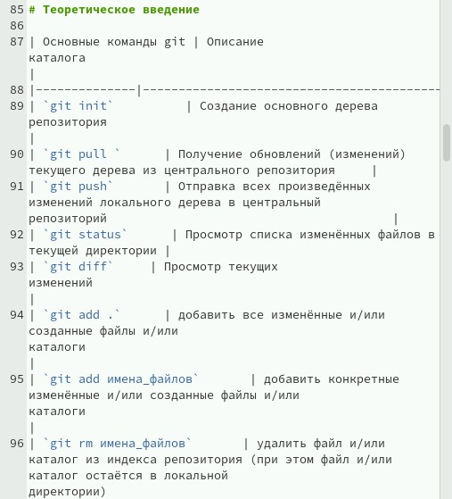
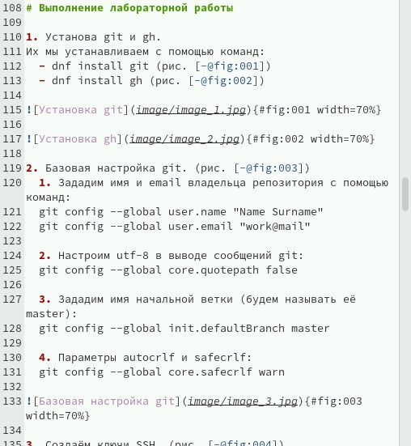
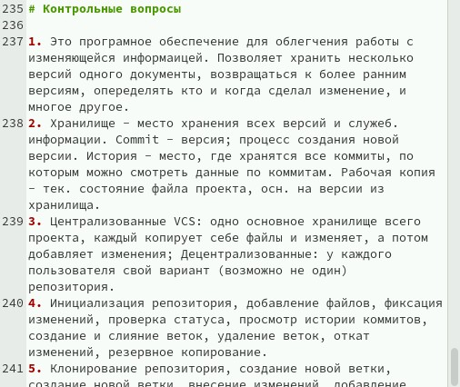

---
## Front matter
lang: ru-RU
title: Лабораторная работа №3
subtitle: Презентация
author:
  - Ермишина М. К.
institute:
  - Российский университет дружбы народов, Москва, Россия
date: 07 марта 2025

## i18n babel
babel-lang: russian
babel-otherlangs: english

## Formatting pdf
toc: false
toc-title: Содержание
slide_level: 2
aspectratio: 169
section-titles: true
theme: metropolis
header-includes:
 - \metroset{progressbar=frametitle,sectionpage=progressbar,numbering=fraction}

## Fonts
mainfont: PT Serif
romanfont: PT Serif
sansfont: PT Sans
monofont: PT Mono
mainfontoptions: Ligatures=TeX
romanfontoptions: Ligatures=TeX
sansfontoptions: Ligatures=TeX,Scale=MatchLowercase
monofontoptions: Scale=MatchLowercase,Scale=0.9
---

# Информация

## Докладчик

:::::::::::::: {.columns align=center}
::: {.column width="70%"}

  * Ермишина Мария Кирилловна
  * студент группы НПИбд-01-24
  * Российский университет дружбы народов
  * [1132230166@pfur.ru](mailto:1132230166@pfur.ru)
  * <https://github.com/ErmiMash>

:::
::: {.column width="30%"}

:::
::::::::::::::

# Элементы презентации

## Цели и задачи

Целью данной работы является приобретение навыков оформления отчётов с помощью легковесного языка разметки Markdown.

Задачи:
- Сделайте отчёт по предыдущей лабораторной работе в формате Markdown.
- В качестве отчёта просьба предоставить отчёты в 3 форматах: pdf, docx и md (в архиве,
поскольку он должен содержать скриншоты, Makefile и т.д.

# Выполнение лабораторной работы

## Изменение заголовка
Сначала мы изменяем title в нашем файле (в дальнейшем он будет заголовком в итоговом файле), изменяем subtitle (подзаголовок) и author (ФИО). 
Остальные значения оставляем без изменений.
{#fig:002 width=70%}

## Изменение "Целей" и "Задач"
Заменяем текст, указанный в шаблоне, на цель, которая указана на ТУИСе.
После изменения информации о цели работы мы переходим к разделу "Задание" - так же заменяем информацию.
Точно так же, как и с разделом "Задание" делаем с информацией в разделе "Теоритическое введение" - указываем базовые команды git. Команды переносим в левую часть таблицы, значения команд - в правую.
{#fig:005 width=70%}

## Переходим к разделу "Выполнение лабораторной работы"
Для быстрого перехода к фотографиям мы пользуемся -@fig (около текста), #fig (вместе с фотографией).
Под фотографиями мы так же указываем их название (в моём случае краткое описание происходящего на скриншоте).

С помощью width=% указываем размер фотографий.
Сами фотографии указываются по слудеющей схеме:
![Название(.jpg{#fig width=
{#fig:006 width=70%}

## Переходим к разделу "Выводы"
Лично я выводы пишу, основываясь на разделе "Цель работы", поэтому заполнение выводов не предоставляет особых проблем.

Также во второй лабораторной работе мы отвечаем на контрольные вопросы. 
В данном разделе мы самостоятельно отвечаем на вопросы, указанные на ТУИСе. Ответы записываем в виде пронумерованного списка. 
{#fig:008 width=70%}

## Список литературы 
Оформляем в файле в формате .bib. В него мы вносим информацию с определённымм синтаксисом, что в дальнейшем позволяет нам исполдьзовать цитаты быстро. 
Данный файл заполняется не в формате Markdown, поэтому акцентировать на нём внимание в данной лабораторной работе нет смысла. 

## Результаты

В ходе данной работы были приобретены навыков оформления отчётов с помощью легковесного языка разметки Markdown.
