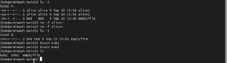

---
## Front matter
lang: ru-RU
title: Лабораторная работа №3
subtitle: Презентация
author:
  - Ермишина М. К.
institute:
  - Российский университет дружбы народов, Москва, Россия
date: 07 марта 2025

## i18n babel
babel-lang: russian
babel-otherlangs: english

## Formatting pdf
toc: false
toc-title: Содержание
slide_level: 2
aspectratio: 169
section-titles: true
theme: metropolis
header-includes:
 - \metroset{progressbar=frametitle,sectionpage=progressbar,numbering=fraction}

## Fonts
mainfont: PT Serif
romanfont: PT Serif
sansfont: PT Sans
monofont: PT Mono
mainfontoptions: Ligatures=TeX
romanfontoptions: Ligatures=TeX
sansfontoptions: Ligatures=TeX,Scale=MatchLowercase
monofontoptions: Scale=MatchLowercase,Scale=0.9
---

# Информация

## Докладчик

:::::::::::::: {.columns align=center}
::: {.column width="70%"}

  * Ермишина Мария Кирилловна
  * студент группы НПИбд-01-24
  * Российский университет дружбы народов
  * [1132230166@pfur.ru](mailto:1132230166@pfur.ru)
  * <https://github.com/ErmiMash>

:::
::: {.column width="30%"}

:::
::::::::::::::

# Элементы презентации

## Цели и задачи

Получение навыков настройки базовых и специальных прав доступа для групп пользо-
вателей в операционной системе типа Linux.

Задачи:
- Прочитайте справочное описание man по командам chgrp, chmod, getfacl, setfacl.
- Выполните действия по управлению базовыми разрешениями для групп пользовате-
лей (раздел 3.3.1).
- Выполните действия по управлению специальными разрешениями для групп пользо-
вателей (раздел 3.3.2).
- Выполните действия по управлению расширенными разрешениями с использованием
списков ACL для групп пользователей (раздел 3.3.3).

# Выполнение лабораторной работы

## Настройка первых каталогов

Открываем терминал с учётной записью root с помощью команды, а после создаем каталоги data/main и /data/third, после этого проверяем владельцев каталогов. 
Прежде чем устанавливать разрешения, изменяем владельцев этих каталогов с root на main и third соответственно, после проверяем владельцев. Устанавливаем необходимые разрешения.
{#fig:001 width=70%}

## Каталоги от имени пользователя bob

Переходим под учётную запись пользователя bob и пробуем перейти в каталог /data/main и создать файл. Те же действия пробуем с каталогом /data/third. 
{#fig:002 width=70%}

## Каталоги от им. пользователя alice

Открываем новый терминал под пользователем alice и переходим в каталог /data/main, создаем два файла.
{#fig:003 width=70%}

## Удаление каталогов с др. пользователя

Возвращаемся на уч. запись bob, переходим в тот же каталог и удаляем файлы, созданные alice. После создаем два файла от bob.
{#fig:004 width=70%}

## Установка бита идентификатора группы

Под пользователем root устанавливаем для каталога /data/main бит идентификатора группы, а также stiky-бит для разделяемого каталога группы. 
  - chmod g+s,o+t /data/main
Под пользователем alice создаем в каталоге /data/main файлы, пробуем удалить файлы от bob. 
  - rm -rf bob*

## Права на чтение и выполнение в каталоге

Открываем терминал с учётной записью root. Устанавливаем права на чтение и выполнение в каталоге /data/main для группы third и права на чтение и выполнение для группы main в каталоге /data/third. 
{#fig:005 width=70%}

## Проверка полномочий и ACL
Создаем новый файл с именем newfile1 в каталоге /data/main и проверяем текущие назначения полномочий.
Выполняем аналогичные действия для каталога /data/third.
Устанавливаем ACL по умолчанию. 
{#fig:006 width=70%}

## Действия в каталоге
Для проверки полномочий группы third в каталоге /data/third входим учётной записью члена группы third и проверяем операции с файлами. 
Проверяем возможность записи в файл.
{#fig:007 width=70%}

## Результаты

В ходе данной работы получила навыки настройки базовых и специальных прав доступа для групп пользователей в операционной системе типа Linux.
