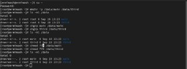
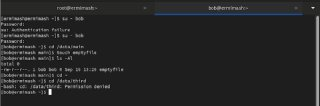
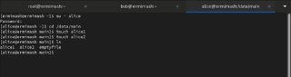
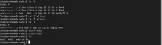
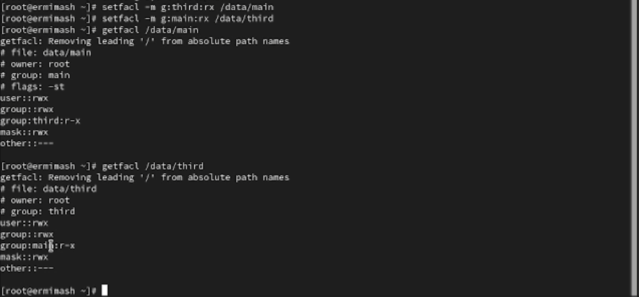
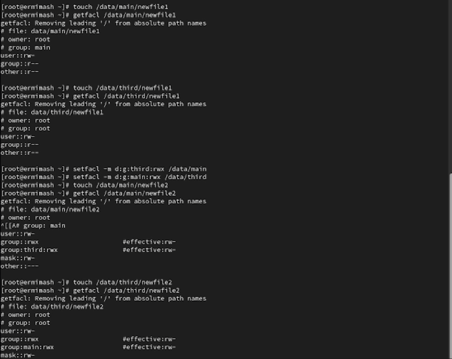
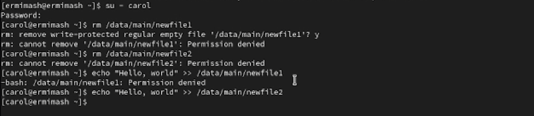

---
## Front matter
title: "Лабораторная работа № 3. Настройка прав доступа	"
subtitle: "Отчёт"
author: "Ермишина Мария Кирилловна"

## Generic otions
lang: ru-RU
toc-title: "Содержание"

## Bibliography
bibliography: bib/cite.bib
csl: pandoc/csl/gost-r-7-0-5-2008-numeric.csl

## Pdf output format
toc: true # Table of contents
toc-depth: 2
lof: true # List of figures
fontsize: 12pt
linestretch: 1.5
papersize: a4
documentclass: scrreprt
## I18n polyglossia
polyglossia-lang:
  name: russian
  options:
	- spelling=modern
	- babelshorthands=true
polyglossia-otherlangs:
  name: english
## I18n babel
babel-lang: russian
babel-otherlangs: english
## Fonts
mainfont: IBM Plex Serif
romanfont: IBM Plex Serif
sansfont: IBM Plex Sans
monofont: IBM Plex Mono
mathfont: STIX Two Math
mainfontoptions: Ligatures=Common,Ligatures=TeX,Scale=0.94
romanfontoptions: Ligatures=Common,Ligatures=TeX,Scale=0.94
sansfontoptions: Ligatures=Common,Ligatures=TeX,Scale=MatchLowercase,Scale=0.94
monofontoptions: Scale=MatchLowercase,Scale=0.94,FakeStretch=0.9
mathfontoptions:
## Biblatex
biblatex: true
biblio-style: "gost-numeric"
biblatexoptions:
  - parentracker=true
  - backend=biber
  - hyperref=auto
  - language=auto
  - autolang=other*
  - citestyle=gost-numeric
## Pandoc-crossref LaTeX customization
figureTitle: "Рис."
tableTitle: "Таблица"
listingTitle: "Листинг"
lofTitle: "Список иллюстраций"
lolTitle: "Листинги"
## Misc options
indent: true
header-includes:
  - \usepackage{indentfirst}
  - \usepackage{float} # keep figures where there are in the text
  - \floatplacement{figure}{H} # keep figures where there are in the text
---

# Цель работы

Получение навыков настройки базовых и специальных прав доступа для групп пользо-
вателей в операционной системе типа Linux.

# Задание

- Прочитайте справочное описание man по командам chgrp, chmod, getfacl, setfacl.
- Выполните действия по управлению базовыми разрешениями для групп пользовате-
лей (раздел 3.3.1).
- Выполните действия по управлению специальными разрешениями для групп пользо-
вателей (раздел 3.3.2).
- Выполните действия по управлению расширенными разрешениями с использованием
списков ACL для групп пользователей (раздел 3.3.3).

# Выполнение лабораторной работы

Требуется создать структуру каталогов с разными разрешениями доступа для разных
групп пользователей.

1. Открываем терминал с учётной записью root с помощью команды, а после создаем каталоги data/main и /data/third: (рис. [-@fig:001])
  - su -
  - mkdir -p /data/main /data/third
  
Проверяем владельцев каталогов: (рис. [-@fig:001])
  - ls -Al /data

Прежде чем устанавливать разрешения, изменяем владельцев этих каталогов с root на main и third соответственно, после проверяем владельцев: (рис. [-@fig:001])
  - chgrp main /data/main
  - chgrp third /data/third
  - ls -Al /data

Установите разрешения, позволяющие владельцам каталогов записывать файлы в эти
каталоги и запрещающие доступ к содержимому каталогов всем другим пользователям
и группам. Проверяем права: (рис. [-@fig:001])
  - chmod 770 /data/main
  - chmod 770 /data/third
  - ls -Al /data
  
{#fig:001 width=70%}

2. В другом терминале переходим под учётную запись пользователя bob и пробуем перейти в каталог /data/main и создать файл: (рис. [-@fig:002])
  - cd /data/main
  - touch emptyfile
  - ls -Al
  
Те же действия пробуем с каталогом /data/thirdм - перейти в каталог не получается. 

{#fig:002 width=70%}

3. Открываем новый терминал под пользователем alice и переходим в каталог /data/main, создаем два файла: (рис. [-@fig:003])
  - cd /data/main
  - touch alice1
  - touch alice2
  
{#fig:003 width=70%}

Возвращаемся на уч. запись bob, переходим в тот же каталог и удаляем файлы, созданные alice: (рис. [-@fig:004])
  - su - bob1. chown bob:main /data/third/newfile.
2. find ~ -user bob -print.
3. chmod 770 /data
4. chmod +x file.
5. getfacl “имя каталога”
6. chmod g+s,o+t /data/main
7. setfacl -m g:group:r <file/dir> 
8. setfacl -dm g:group:r /dir
9. 007
10. sudo chattr +i myfile
  - cd /data/main
  - ls -l
  - rm -f alice*
  
После создаем два файла от bob: (рис. [-@fig:004])
  - touch bob1
  - touch bob2
  
{#fig:004 width=70%}

В терминале под пользователем root установите для каталога /data/main бит идентификатора группы, а также stiky-бит для разделяемого каталога группы:
  - chmod g+s,o+t /data/main

В терминале под пользователем alice создаем в каталоге /data/main файлы alice3 и alice4 и пробуем удалить файлы от bob:
  - touch alice3
  - touch alice4
  - ls -l
  - rm -rf bob*

4. Откройте терминал с учётной записью root. Устанавливаем права на чтение и выполнение в каталоге /data/main для группы third и права на чтение и выполнение для группы main в каталоге /data/third. Используем команду getfacl, чтобы убедиться в правильности установки разрешений: (рис. [-@fig:005])
  - su -
  - setfacl -m g:third:rx /data/main
  - setfacl -m g:main:rx /data/third
  - getfacl /data/main
  - getfacl /data/third
  
{#fig:005 width=70%}

Создаем новый файл с именем newfile1 в каталоге /data/main и проверяем текущие назначения полномочий: (рис. [-@fig:006])
  - touch /data/main/newfile1
  - getfacl /data/main/newfile1
Выполняем аналогичные действия для каталога /data/third.

Установите ACL по умолчанию для каталогов /data/main и /data/third. Убеждаемся, что настройки ACL работают: (рис. [-@fig:006])
  - setfacl -m d:g:third:rwx /data/main 
  - setfacl -m d:g:main:rwx /data/third
  - touch /data/main/newfile2
  - getfacl /data/main/newfile2 - для проверки текущ. полномочий
Выполняем аналогичные действия для каталога /data/third.

{#fig:006 width=70%}

5. Для проверки полномочий группы third в каталоге /data/third входим учётной записью члена группы third и проверяем операции с файлами: (рис. [-@fig:007])
  - su - carol
  - rm /data/main/newfile1
  - rm /data/main/newfile2
  
Проверьте, возможно ли осуществить запись в файл: (рис. [-@fig:007])
  - echo "Hello, world" >> /data/main/newfile1
  - echo "Hello, world" >> /data/main/newfile2
  
{#fig:007 width=70%}

# Контрольные вопросы
1. chown bob:main /data/third/newfile.
2. find ~ -user bob -print.
3. chmod 770 /data
4. chmod +x file.
5. getfacl “имя каталога”
6. chmod g+s,o+t /data/main
7. setfacl -m g:group:r <file/dir> 
8. setfacl -dm g:group:r /dir
9. 007
10. sudo chattr +i myfile

# Выводы

В ходе данной работы получила навыки настройки базовых и специальных прав доступа для групп пользователей в операционной системе типа Linux.

