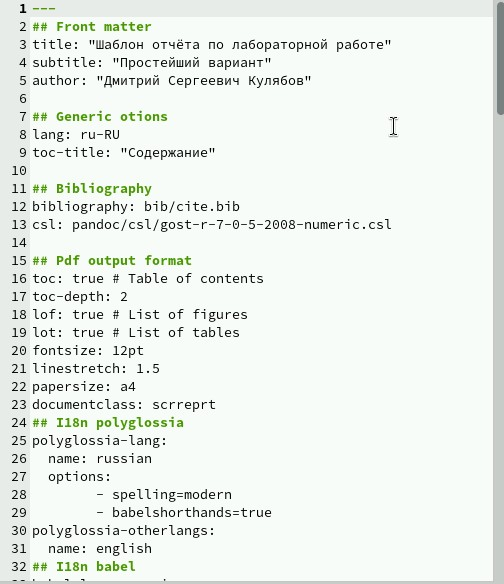
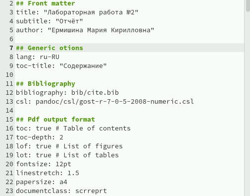
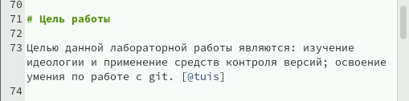
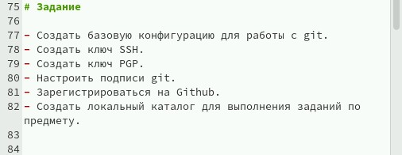
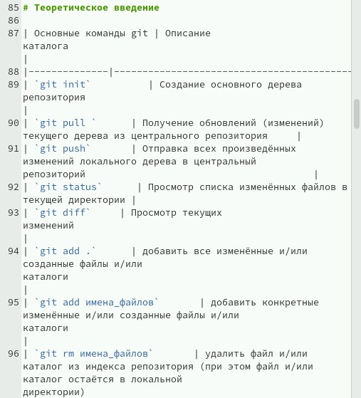
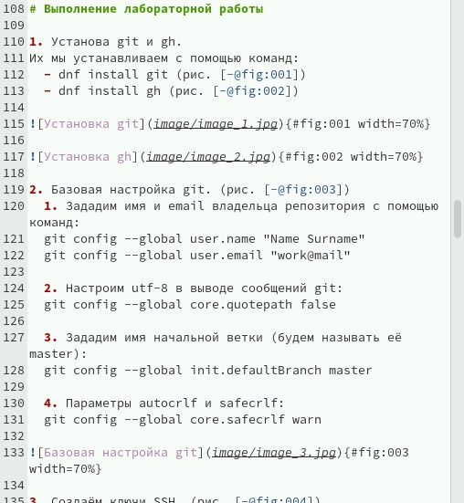
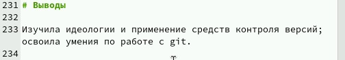
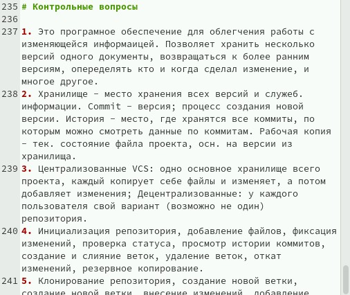

---
## Front matter
title: "Лабораторная работа № 3. Markdown"
subtitle: "Отчёт"
author: "Ермишина Мария Кирилловна"

## Generic otions
lang: ru-RU
toc-title: "Содержание"

## Bibliography
bibliography: bib/cite.bib
csl: pandoc/csl/gost-r-7-0-5-2008-numeric.csl

## Pdf output format
toc: true # Table of contents
toc-depth: 2
lof: true # List of figures
lot: true # List of tables
fontsize: 12pt
linestretch: 1.5
papersize: a4
documentclass: scrreprt
## I18n polyglossia
polyglossia-lang:
  name: russian
  options:
	- spelling=modern
	- babelshorthands=true
polyglossia-otherlangs:
  name: english
## I18n babel
babel-lang: russian
babel-otherlangs: english
## Fonts
mainfont: IBM Plex Serif
romanfont: IBM Plex Serif
sansfont: IBM Plex Sans
monofont: IBM Plex Mono
mathfont: STIX Two Math
mainfontoptions: Ligatures=Common,Ligatures=TeX,Scale=0.94
romanfontoptions: Ligatures=Common,Ligatures=TeX,Scale=0.94
sansfontoptions: Ligatures=Common,Ligatures=TeX,Scale=MatchLowercase,Scale=0.94
monofontoptions: Scale=MatchLowercase,Scale=0.94,FakeStretch=0.9
mathfontoptions:
## Biblatex
biblatex: true
biblio-style: "gost-numeric"
biblatexoptions:
  - parentracker=true
  - backend=biber
  - hyperref=auto
  - language=auto
  - autolang=other*
  - citestyle=gost-numeric
## Pandoc-crossref LaTeX customization
figureTitle: "Рис."
tableTitle: "Таблица"
listingTitle: "Листинг"
lofTitle: "Список иллюстраций"
lotTitle: "Список таблиц"
lolTitle: "Листинги"
## Misc options
indent: true
header-includes:
  - \usepackage{indentfirst}
  - \usepackage{float} # keep figures where there are in the text
  - \floatplacement{figure}{H} # keep figures where there are in the text
---

# Цель работы

Целью данной работы является приобретение навыков оформления отчётов с помощью легковесного языка разметки Markdown. [@tuis]

# Задание

- Сделайте отчёт по предыдущей лабораторной работе в формате Markdown.
- В качестве отчёта просьба предоставить отчёты в 3 форматах: pdf, docx и md (в архиве,
поскольку он должен содержать скриншоты, Makefile и т.д.

# Теоретическое введение

Базовые сведения о Markdown

| Оформление текста | Значения  символов                                                                                                        |
|--------------|----------------------------------------------------------------------------------------------------------------------------|
| `Использование знака #`          | Создание заголовков                                            |
| `Использование **_**`      | Полужирный текст     |
| `Использование *_*`       | Курсивный текст                                           |
| `Использование ***_***`      | Полужирный и курсивный текст |
| `Использование >`     | Создания блока цитаты                                                                                 |
| `Использование -/*`      | Неупорядоченный список                                                                             |
| `Использование 1./2.`       | Упорядоченный список                                                                                                            |
| `'''...'''`       | Обозначение фрагмента кода                                                                                |
| `H~2/2^10`       | Нижние и верхние индексы                                                                               |

# Выполнение лабораторной работы

Для выполнения данной лабораторной работы мы подготавливаем отчёт по 2 лабораторной работе, поэтому для начала открываем файл report.md, который находится в lab02. (рис. [-@fig:001])
В данном файле пример находится шаблон для выполнения отчёта по лабораторной работе. 

{#fig:001 width=70%}

1. Сначала мы изменяем title в нашем файле (в дальнейшем он будет заголовком в итоговом файле), изменяем subtitle (подзаголовок) и author (ФИО). (рис. [-@fig:002])
Остальные значения оставляем без изменений.

{#fig:002 width=70%}

2. Мы переходим к "Цели работы".
Заменяем текст, указанный в шаблоне, на цель, которая указана на ТУИСе. (рис. [-@fig:003])

{#fig:003 width=70%}

3. После изменения информации о цели работы мы переходим к разделу "Задание" - так же заменяем информацию. (рис. [-@fig:004])

{#fig:004 width=70%}

4. Точно так же, как и с разделом "Задание" делаем с информацией в разделе "Теоритическое введение" - указываем базовые команды git. Команды переносим в левую часть таблицы, значения команд - в правую. (рис. [-@fig:005])

{#fig:005 width=70%}

5. После внесения базовой информации мы переходим к разделу "Выполнение лабораторной работы" - в данном разделе мы указываем каждое действие, которое выполняли во второй лабораторной работе и фиксируем все действия скриншотами. (рис. [-@fig:006])

Для быстрого перехода к фотографиям мы пользуемся -@fig (около текста), #fig (вместе с фотографией).
Под фотографиями мы так же указываем их название (в моём случае краткое описание происходящего на скриншоте).

С помощью width=% указываем размер фотографий.
Сами фотографии указываются по слудеющей схеме:
![Название(.jpg{#fig width=

{#fig:006 width=70%}

6. Переходим к разделу "Выводы". (рис. [-@fig:007])
Лично я выводы пишу, основываясь на разделе "Цель работы", поэтому заполнение выводов не предоставляет особых проблем.

{#fig:007 width=70%}

7. Также во второй лабораторной работе мы отвечаем на контрольные вопросы. 
В данном разделе мы самостоятельно отвечаем на вопросы, указанные на ТУИСе. Ответы записываем в виде пронумерованного списка. 

{#fig:008 width=70%}

8. Список литературы оформляем в файле в формате .bib. В него мы вносим информацию с определённымм синтаксисом, что в дальнейшем позволяет нам исполдьзовать цитаты быстро. 
Данный файл заполняется не в формате Markdown, поэтому акцентировать на нём внимание в данной лабораторной работе нет смысла. 

# Выводы

В ходе данной работы были приобретены навыков оформления отчётов с помощью легковесного языка разметки Markdown.

# Список литературы{.unnumbered}

::: {#refs}
:::
