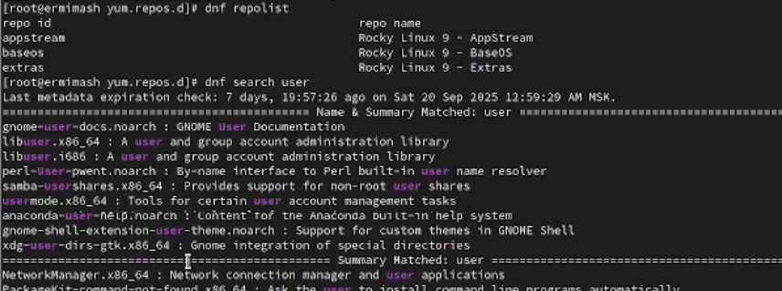
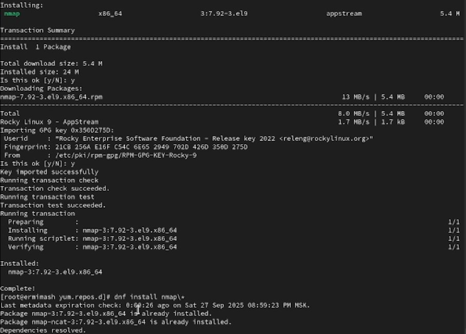
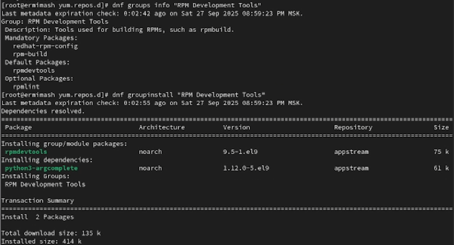

---
## Front matter
lang: ru-RU
title: Лабораторная работа №4
subtitle: Презентация
author:
  - Ермишина М. К.
institute:
  - Российский университет дружбы народов, Москва, Россия
date: 27 сентября 2025

## i18n babel
babel-lang: russian
babel-otherlangs: english

## Formatting pdf
toc: false
toc-title: Содержание
slide_level: 2
aspectratio: 169
section-titles: true
theme: metropolis
header-includes:
 - \metroset{progressbar=frametitle,sectionpage=progressbar,numbering=fraction}

## Fonts
mainfont: PT Serif
romanfont: PT Serif
sansfont: PT Sans
monofont: PT Mono
mainfontoptions: Ligatures=TeX
romanfontoptions: Ligatures=TeX
sansfontoptions: Ligatures=TeX,Scale=MatchLowercase
monofontoptions: Scale=MatchLowercase,Scale=0.9
---

# Информация

## Докладчик

:::::::::::::: {.columns align=center}
::: {.column width="70%"}

  * Ермишина Мария Кирилловна
  * студент группы НПИбд-01-24
  * Российский университет дружбы народов
  * [1132230166@pfur.ru](mailto:1132230166@pfur.ru)
  * <https://github.com/ErmiMash>

:::
::: {.column width="30%"}

:::
::::::::::::::

# Элементы презентации

## Цели и задачи

Целью данной работы является получение навыков работы с репозиториями и менеджерами пакетов.

# Выполнение лабораторной работы
  
## Списки репозиториев
Выведите на экран список репозиториев:
  - dnf repolist
Выведите на экран список пакетов, в названии или описании которых есть слово user:
  - dnf search user
{#fig:003 width=70%}

## Установка и удаление nmap
Установите nmap, предварительно изучив информацию по имеющимся пакетам:
  - dnf install nmap
  - dnf install nmap\*
Удаление:
  - dnf remove nmap
  - dnf remove nmap\*
{#fig:004 width=70%}

## Установка и удаление группы пакетов RPM Development Tools
Установка:
  - dnf groups info "RPM Development Tools"
  - dnf groupinstall "RPM Development Tools"
Удаление: 
  - dnf groupremove "RPM Development Tools"
{#fig:007 width=70%}

## dnf history
 - dnf history
{#fig:009 width=70%}

## Установка lynx
  - dnf list lynx
  - dnf install lynx --downloadonly
{#fig:010 width=70%}

## Файлы lynx
Используя rpm, определите по имени файла, к какому пакету принадлежит lynx, и получите дополнительную информацию о содержимом пакета:
  - rpm -qf $(which lynx)
  - rpm -qi lynx
{#fig:013 width=70%}

## Содержание скриптов и удаление пакета
Выведите на экран расположение и содержание скриптов, выполняемых при установке
пакета:
  - rpm -q --scripts lynx 
Вернитесь в терминал с учётной записью root и удалите пакет: 
  - rpm -e lynx
{#fig:015 width=70%}

## Пакет dnsmasq
Все действия аналогичны с действиями с предыдущим пакетом.

## Результаты

В ходе данной работы были получены навыки работы с репозиториями и менеджерами пакетов.
