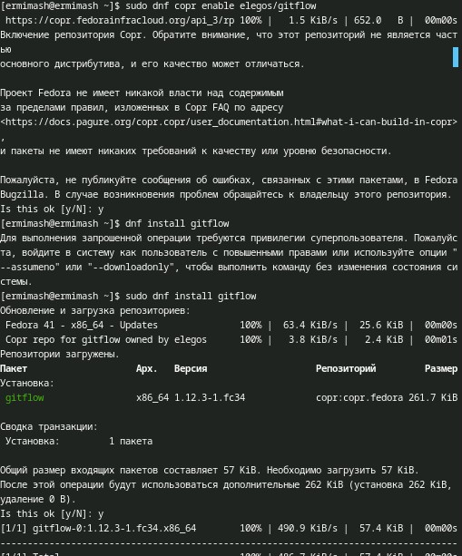
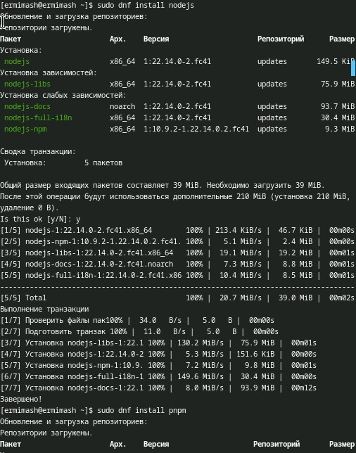
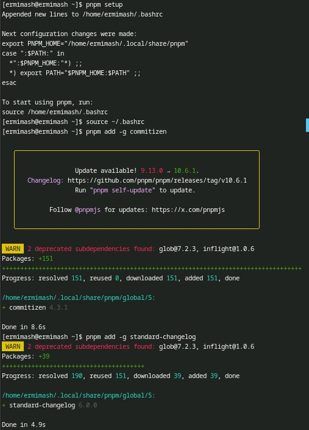
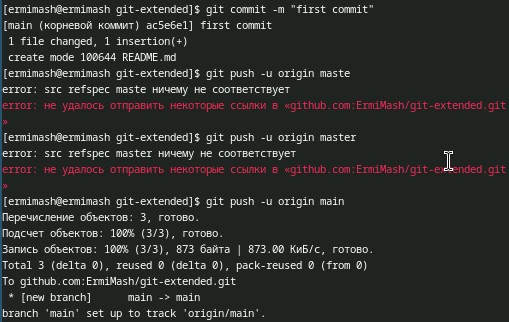
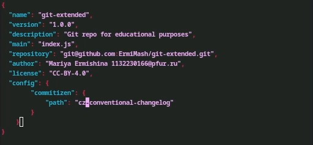
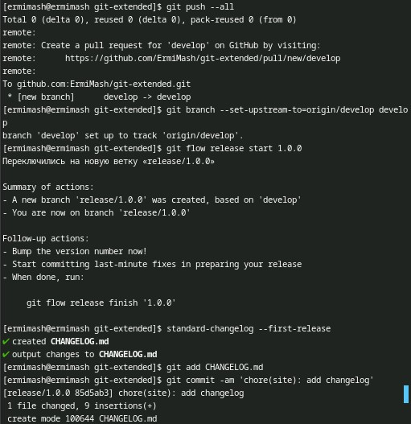
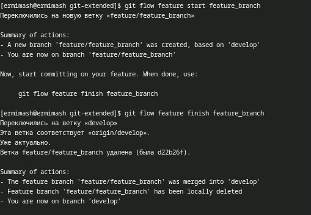
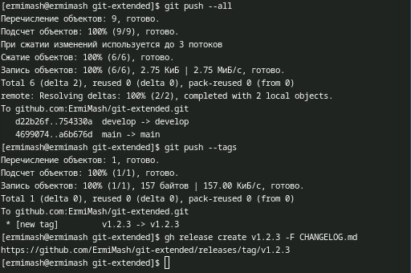

---
## Front matter
lang: ru-RU
title: Лабораторная работа №4
subtitle: Презентация
author:
  - Ермишина М. К.
institute:
  - Российский университет дружбы народов, Москва, Россия
date: 07 марта 2025

## i18n babel
babel-lang: russian
babel-otherlangs: english

## Formatting pdf
toc: false
toc-title: Содержание
slide_level: 2
aspectratio: 169
section-titles: true
theme: metropolis
header-includes:
 - \metroset{progressbar=frametitle,sectionpage=progressbar,numbering=fraction}

## Fonts
mainfont: PT Serif
romanfont: PT Serif
sansfont: PT Sans
monofont: PT Mono
mainfontoptions: Ligatures=TeX
romanfontoptions: Ligatures=TeX
sansfontoptions: Ligatures=TeX,Scale=MatchLowercase
monofontoptions: Scale=MatchLowercase,Scale=0.9
---

# Информация

## Докладчик

:::::::::::::: {.columns align=center}
::: {.column width="70%"}

  * Ермишина Мария Кирилловна
  * студент группы НПИбд-01-24
  * Российский университет дружбы народов
  * [1132230166@pfur.ru](mailto:1132230166@pfur.ru)
  * <https://github.com/ErmiMash>

:::
::: {.column width="30%"}

:::
::::::::::::::

# Элементы презентации

## Цели и задачи

Целью данной работы является получение навыков правильной работы с репозиториями git. 

# Выполнение лабораторной работы

## Установка git-flow
Установка из коллекции репозиториев Copr.
  - sudo dnf copr enable elegos/gitflow
  - sudo dnf install gitflow
{#fig:001 width=70%}

## Установка Node.js
На Node.js базируется программное обеспечение для семантического версионирования и общепринятых коммитов.
  - dnf install nodejs
  - dnf install pnpm
{#fig:002 width=70%}

## Настройка Node.js
Для работы с Node.js добавим каталог с исполняемыми файлами, устанавливаемыми yarn, в переменную PATH.
Сначала запускаем, а после перелогиниваемся и выполняем.
  - pnpm setup
  - source ~/.bashrc 
Общепринятые коммиты
  1. commitizen:
  - pnpm add -g commitizen
  2. standard-changelog 
  - pnpm add -g standard-changelog
{#fig:003 width=70%}
  
## Создание репозитория git
Подключение репозитория к github
Создаём репозиторий на GitHub. Для примера назовём его git-extended.
Делаем первый коммит и выкладываем на github
  - git commit -m "first commit"
  - git remote add origin (SSH репозитория)
  - git push -u origin master (используем main, так как не задавли название ветки)
  
{#fig:004 width=70%}

## Конфигурация общепринятых коммитов
Конфигурация для пакетов Node.js выполняется с помощью команды pnpm init.
В файле нам необходимо изменить данные, приводим файл к следующему виду
{#fig:006 width=70%}
Далее отправляем файлы на Git

## Конфигурация git-flow
Инициализируем git-flow с помощью git flow init. 
Префикс для ярлыков установим в v.
После проверяем нахождение на ветке develop
Загрузите весь репозиторий в хранилище
Создадим релиз с версией 1.0.0 и журнал изменений
{#fig:009 width=70%}

## Работа с репозиторием git
Разработка новой функциональности
Создадим ветку для новой функциональности:
Далее, продолжаем работу c git как обычно.
По окончании разработки новой функциональности следующим шагом следует объединить ветку feature_branch c develop:
{#fig:012 width=70%}

## Создание релиза git-flow
  Создадим релиз с версией 1.2.3
  Обновляем номер версии в файле package.json. Установите её в 1.2.3. 
  Добавим журнал изменений в индекс
  Зальём релизную ветку в основную ветку
  Создадим релиз на github с комментарием из журнала изменений
{#fig:016 width=70%}

## Результаты

В ходе данной работы были получены навыки правильной работы с репозиториями git.
