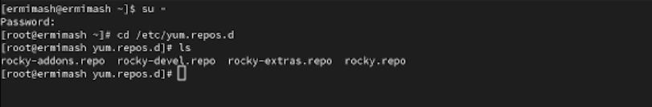
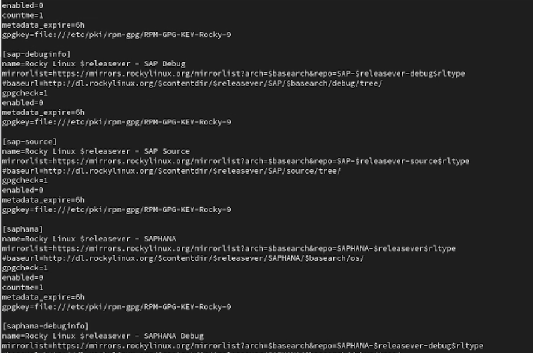
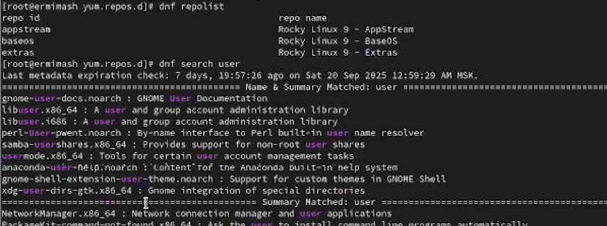
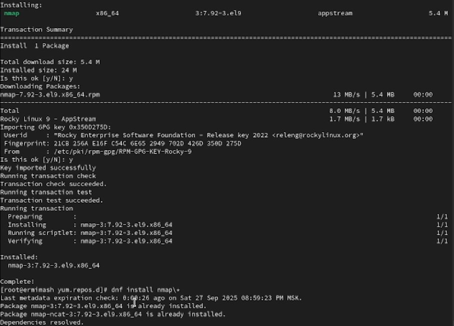
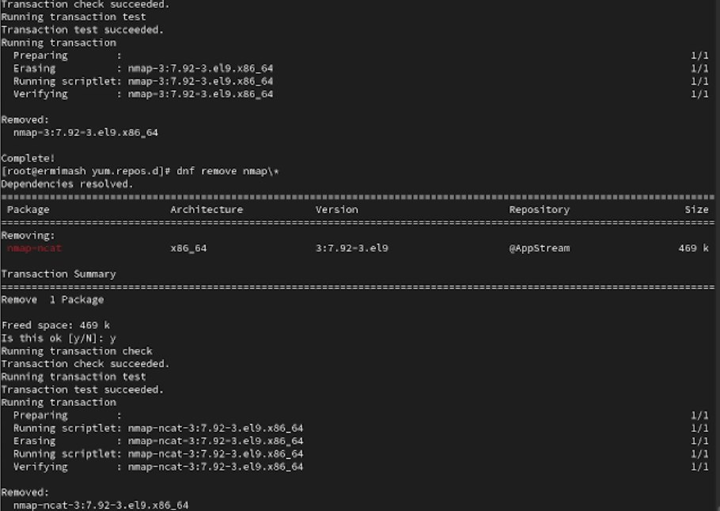
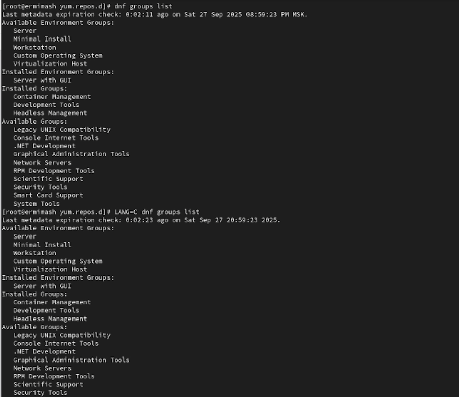
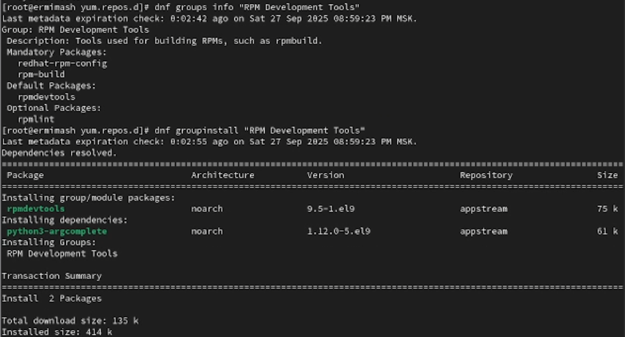
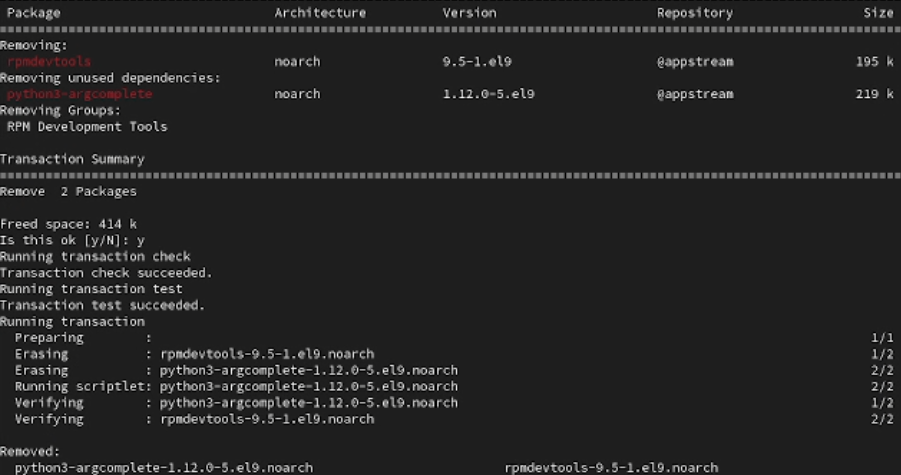

---
## Front matter
title: "Лабораторная работа №4"
subtitle: "Отчёт"
author: "Ермишина Мария Кирилловна"

## Generic otions
lang: ru-RU
toc-title: "Содержание"

## Bibliography
bibliography: bib/cite.bib
csl: pandoc/csl/gost-r-7-0-5-2008-numeric.csl

## Pdf output format
toc: true # Table of contents
toc-depth: 2
lof: true # List of figures
lot: true # List of tables
fontsize: 12pt
linestretch: 1.5
papersize: a4
documentclass: scrreprt
## I18n polyglossia
polyglossia-lang:
  name: russian
  options:
	- spelling=modern
	- babelshorthands=true
polyglossia-otherlangs:
  name: english
## I18n babel
babel-lang: russian
babel-otherlangs: english
## Fonts
mainfont: IBM Plex Serif
romanfont: IBM Plex Serif
sansfont: IBM Plex Sans
monofont: IBM Plex Mono
mathfont: STIX Two Math
mainfontoptions: Ligatures=Common,Ligatures=TeX,Scale=0.94
romanfontoptions: Ligatures=Common,Ligatures=TeX,Scale=0.94
sansfontoptions: Ligatures=Common,Ligatures=TeX,Scale=MatchLowercase,Scale=0.94
monofontoptions: Scale=MatchLowercase,Scale=0.94,FakeStretch=0.9
mathfontoptions:
## Biblatex
biblatex: true
biblio-style: "gost-numeric"
biblatexoptions:
  - parentracker=true
  - backend=biber
  - hyperref=auto
  - language=auto
  - autolang=other*
  - citestyle=gost-numeric
## Pandoc-crossref LaTeX customization
figureTitle: "Рис."
tableTitle: "Таблица"
listingTitle: "Листинг"
lofTitle: "Список иллюстраций"
lotTitle: "Список таблиц"
lolTitle: "Листинги"
## Misc options
indent: true
header-includes:
  - \usepackage{indentfirst}
  - \usepackage{float} # keep figures where there are in the text
  - \floatplacement{figure}{H} # keep figures where there are in the text
---

# Цель работы

Целью данной работы является получение навыков работы с репозиториями и менеджерами пакетов.

# Выполнение лабораторной работы

1. Для начала перейдите в режим работы суперпользователя (используйте команду su -).
Перейдите в каталог /etc/yum.repos.d и изучите содержание каталога и файлов
репозиториев: (рис. [-@fig:001])
  - cd /etc/yum.repos.d
  - ls
  - cat название_репозитория.repo (рис. [-@fig:002])

{#fig:001 width=70%}
{#fig:002 width=70%}

Выведите на экран список репозиториев: (рис. [-@fig:003])
  - dnf repolist
Выведите на экран список пакетов, в названии или описании которых есть слово user: (рис. [-@fig:003])
  - dnf search user

{#fig:003 width=70%}

Установите nmap, предварительно изучив информацию по имеющимся пакетам: (рис. [-@fig:004])
  - dnf search nmap
  - dnf info nmap
  - dnf install nmap
  - dnf install nmap\*
А после удалите nmap: (рис. [-@fig:005])
  - dnf remove nmap
  - dnf remove nmap\*
  
{#fig:004 width=70%}
{#fig:005 width=70%}

Получите список имеющихся групп пакетов, затем установите группу пакетов RPM Development Tools:
  - dnf groups list (рис. [-@fig:006])
  - LANG=C dnf groups list (рис. [-@fig:006])
  - dnf groups info "RPM Development Tools" (рис. [-@fig:007])
  - dnf groupinstall "RPM Development Tools" (рис. [-@fig:007])

{#fig:006 width=70%}
{#fig:007 width=70%}

Для удаления группы пакетов RPM Development Tools можно воспользоваться командой
  - dnf groupremove "RPM Development Tools" (рис. [-@fig:008])
  
{#fig:008 width=70%}

Посмотрите историю использования команды dnf: (рис. [-@fig:009])
  - dnf history
и отмените последнее, например шестое по счёту, действие: (рис. [-@fig:009])
  - dnf history undo 6
  
{#fig:009 width=70%}

2. Предположим, что требуется установить текстовый браузер lynx из rpm-пакета.
Скачайте rpm-пакет lynx: (рис. [-@fig:010])
  - dnf list lynx
  - dnf install lynx --downloadonly
  
{#fig:010 width=70%}

Найдите и перейдите в каталог, в который был помещён пакет после загрузки: (рис. [-@fig:011])
  - find /var/cache/dnf/ -name lynx*
  - rpm -Uhv lynx-<версия>.rpm 
  
{#fig:011 width=70%} 
  
Определите расположение исполняемого файла: (рис. [-@fig:012])
  -  which lynx
Используя rpm, определите по имени файла, к какому пакету принадлежит lynx, и получите дополнительную информацию о содержимом пакета: (рис. [-@fig:012])
  - rpm -qf $(which lynx)
  - rpm -qi lynx
  
{#fig:012 width=70%}

Получите список всех файлов в пакете, используя: (рис. [-@fig:013])
  - rpm -ql lynx
а также выведите перечень файлов с документацией пакета, введя:
  - rpm -qd lynx
  
{#fig:013 width=70%}
  
Посмотрите файлы документации: (рис. [-@fig:014])
  - man lynx
  
{#fig:014 width=70%}
  
Выведите на экран перечень и месторасположение конфигурационных файлов пакета:
  - rpm -qc lynx
Выведите на экран расположение и содержание скриптов, выполняемых при установке
пакета: (рис. [-@fig:015])
  - rpm -q --scripts lynx 
Запустите текстовый браузер lynx.
Вернитесь в терминал с учётной записью root и удалите пакет: (рис. [-@fig:015])
  - rpm -e lynx
  - ls

{#fig:015 width=70%}

3. Предположим, что требуется из rpm-пакетов установить dnsmasq.
Установите пакет dnsmasq и определите расположение исполняемого файла: (рис. [-@fig:016])
  - dnf list dnsmasq
  - dnf install dnsmasq
  - which dnsmasq
  
{#fig:016 width=70%}
  
Определите по имени файла, к какому пакету принадлежит dnsmasq и получите дополнительную информацию о содержимом пакета:
  - rpm -qf $(which dnsmasq)
  - rpm -qi dnsmasq
Получите список всех файлов в пакете а также выведите перечень файлов с документацией пакета:
  - rpm -ql dnsmasq
  - rpm -qd dnsmasq
  
Посмотрите файлы документации: (рис. [-@fig:017])
  - man dnsmasq
  
{#fig:017 width=70%}

Выведите на экран перечень и месторасположение конфигурационных файлов пакета: (рис. [-@fig:018])
  - rpm -qc dnsmasq
Выведите на экран расположение и содержание скриптов, выполняемых при установке пакета: (рис. [-@fig:018])
  - rpm -q --scripts dnsmasq
Вернитесь в терминал с учётной записью root и удалите пакет: (рис. [-@fig:018])
  - rpm -e dnsmask 

{#fig:018 width=70%}

# Контрольные вопросы

1. Какая команда позволяет вам искать пакет грт, содержащий файл
useradd? yum search useradd.
2. Какие команды вам нужно использовать, чтобы показать имя группы dnf, которая содержит инструменты безопасности и показывает, что находится в
этой группе? yum info gel.
3. Какая команда позволяет вам установить грт, который вы загрузили из
Интернета и который не находится в репозиториях? yum install. 
4. Вы хотите убедиться, что пакет грт, который вы загрузили, не содержит никакого опасного кода сценария. Какая команда позволяет это сделать? грт -q -scripts.
5. Какая команда показывает всю документацию в грт? rpm -qd.
6. Какая команда показывает, какому пакету грт принадлежит файл? rpm -qf $(which).

# Выводы

В ходе данной работы были получены навыки работы с репозиториями и менеджерами пакетов.

# Список литературы{.unnumbered}

::: {#refs}
:::
