---
## Front matter
title: "Лабораторная работа №4"
subtitle: "Отчёт"
author: "Ермишина Мария Кирилловна"

## Generic otions
lang: ru-RU
toc-title: "Содержание"

## Bibliography
bibliography: bib/cite.bib
csl: pandoc/csl/gost-r-7-0-5-2008-numeric.csl

## Pdf output format
toc: true # Table of contents
toc-depth: 2
lof: true # List of figures
lot: true # List of tables
fontsize: 12pt
linestretch: 1.5
papersize: a4
documentclass: scrreprt
## I18n polyglossia
polyglossia-lang:
  name: russian
  options:
	- spelling=modern
	- babelshorthands=true
polyglossia-otherlangs:
  name: english
## I18n babel
babel-lang: russian
babel-otherlangs: english
## Fonts
mainfont: IBM Plex Serif
romanfont: IBM Plex Serif
sansfont: IBM Plex Sans
monofont: IBM Plex Mono
mathfont: STIX Two Math
mainfontoptions: Ligatures=Common,Ligatures=TeX,Scale=0.94
romanfontoptions: Ligatures=Common,Ligatures=TeX,Scale=0.94
sansfontoptions: Ligatures=Common,Ligatures=TeX,Scale=MatchLowercase,Scale=0.94
monofontoptions: Scale=MatchLowercase,Scale=0.94,FakeStretch=0.9
mathfontoptions:
## Biblatex
biblatex: true
biblio-style: "gost-numeric"
biblatexoptions:
  - parentracker=true
  - backend=biber
  - hyperref=auto
  - language=auto
  - autolang=other*
  - citestyle=gost-numeric
## Pandoc-crossref LaTeX customization
figureTitle: "Рис."
tableTitle: "Таблица"
listingTitle: "Листинг"
lofTitle: "Список иллюстраций"
lotTitle: "Список таблиц"
lolTitle: "Листинги"
## Misc options
indent: true
header-includes:
  - \usepackage{indentfirst}
  - \usepackage{float} # keep figures where there are in the text
  - \floatplacement{figure}{H} # keep figures where there are in the text
---

# Цель работы

Целью данной работы является получение навыков правильной работы с репозиториями git. [@tuis4]

# Теоретическое введение

1. Gitflow Workflow опубликована и популяризована Винсентом Дриссеном.
2. Gitflow Workflow предполагает выстраивание строгой модели ветвления с учётом выпуска проекта.
3. Данная модель отлично подходит для организации рабочего процесса на основе релизов.
4. Работа по модели Gitflow включает создание отдельной ветки для исправлений ошибок в рабочей среде.
5. Последовательность действий при работе по модели Gitflow:
  - Из ветки master создаётся ветка develop.
  - Из ветки develop создаётся ветка release.
  - Из ветки develop создаются ветки feature.
  - Когда работа над веткой feature завершена, она сливается с веткой develop.
  - Когда работа над веткой релиза release завершена, она сливается в ветки develop и master.
  - Если в master обнаружена проблема, из master создаётся ветка hotfix.
  - Когда работа над веткой исправления hotfix завершена, она сливается в ветки develop и master.

# Выполнение лабораторной работы

1. Установка git-flow
Установка из коллекции репозиториев Copr происходит благодаря следующим командам: (рис. [-@fig:001])
  - sudo dnf copr enable elegos/gitflow
  - sudo dnf install gitflow

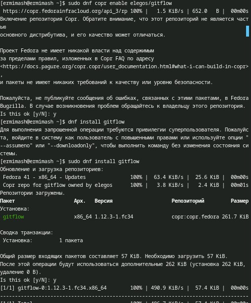{#fig:001 width=70%}

2. Установка Node.js
На Node.js базируется программное обеспечение для семантического версионирования и общепринятых коммитов.
Устанавливаем с помощью команд: (рис. [-@fig:002])
  - dnf install nodejs
  - dnf install pnpm

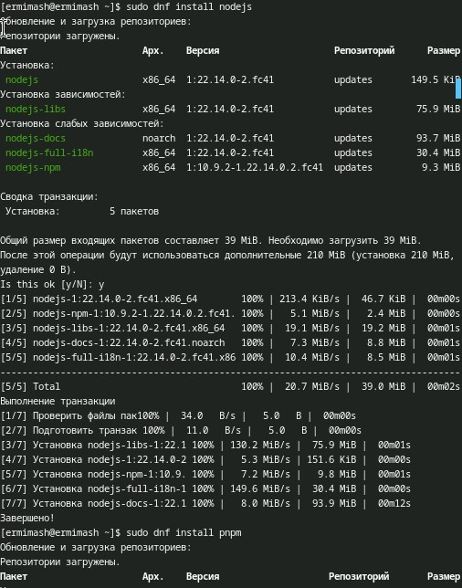{#fig:002 width=70%}

3. Настройка Node.js
Для работы с Node.js добавим каталог с исполняемыми файлами, устанавливаемыми yarn, в переменную PATH.
Сначала запускаем, а после перелогиниваемся и выполняем: (рис. [-@fig:003])
  - pnpm setup
  - source ~/.bashrc

4. Общепринятые коммиты
  1. commitizen: (рис. [-@fig:003])
  - pnpm add -g commitizen
  
  2. standard-changelog (рис. [-@fig:003])
  - pnpm add -g standard-changelog
  
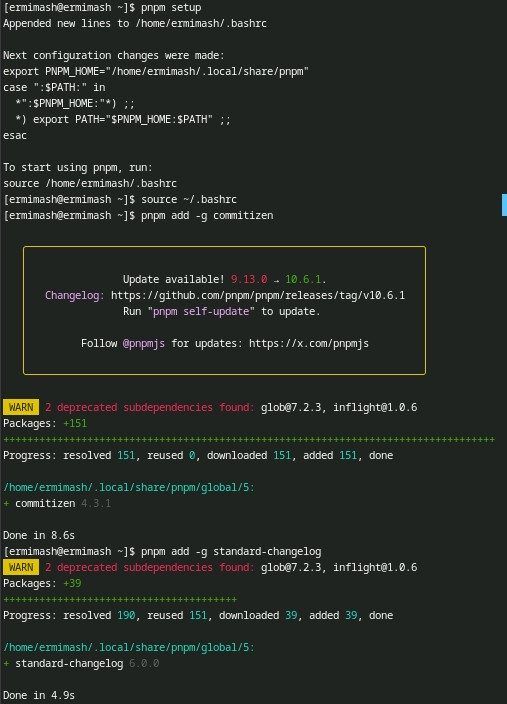{#fig:003 width=70%}

5. Создание репозитория git
  1. Подключение репозитория к github
  Создаём репозиторий на GitHub. Для примера назовём его git-extended.
  Делаем первый коммит и выкладываем на github: (рис. [-@fig:004])
  - git commit -m "first commit"
  - git remote add origin (SSH репозитория)
  - git push -u origin master (используем main, так как не задавли название ветки)
  
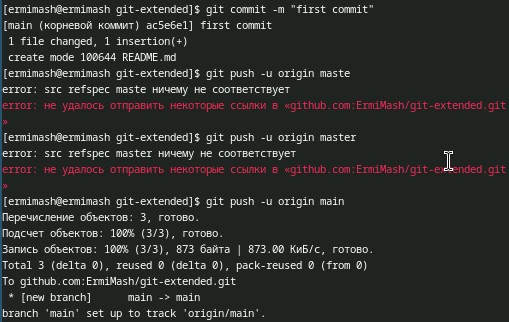{#fig:004 width=70%}

  2. Конфигурация общепринятых коммитов
  Конфигурация для пакетов Node.js выполняется с помощью команды pnpm init. (рис. [-@fig:005])
  В файле нам необходимо изменить данные, приводим файл к следующему виду: (рис. [-@fig:006])
  
  {
    "name": "git-extended",
    "version": "1.0.0",
    "description": "Git repo for educational purposes",
    "main": "index.js",
    "repository": "git@github.com:username/git-extended.git",
    "author": "Name Surname <username@gmail.com>",
    "license": "CC-BY-4.0",
    "config": {
       "commitizen": {
       "path": "cz-conventional-changelog"
       }
    } 
}

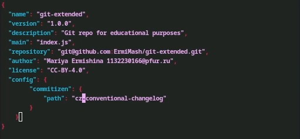{#fig:006 width=70%}

  Далее отправляем файлы на Git: (рис. [-@fig:005]), (рис. [-@fig:007])
  - git add . (добавим новые файлы)
  - git cz (выполним коммит)
  - git push (отправим на github)
  
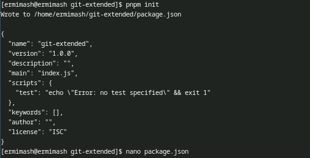{#fig:005 width=70%}
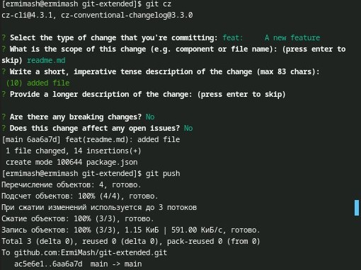{#fig:007 width=70%}

  3. Конфигурация git-flow
  Инициализируем git-flow с помощью git flow init. 
  Префикс для ярлыков установим в v.
  После проверяем нахождение на ветке develop: (рис. [-@fig:008])
  - git branch 
  
  Загрузите весь репозиторий в хранилище с помощью git push --all. (рис. [-@fig:009])
  
  Установите внешнюю ветку как вышестоящую для этой ветки: (рис. [-@fig:009])
  - git branch --set-upstream-to=origin/develop develop
  
  Создадим релиз с версией 1.0.0: (рис. [-@fig:009])
  - git flow release start 1.0.0
  
  Создадим журнал изменений: (рис. [-@fig:009])
  - standard-changelog --first-release
  
  Добавим журнал изменений в индекс: (рис. [-@fig:009])
  - git add CHANGELOG.md
  - git commit -am 'chore(site): add changelog'
  
  Зальём релизную ветку в основную ветку: (рис. [-@fig:010])
  - git flow release finish 1.0.0
  
  Отправим данные на github: (рис. [-@fig:011])
  - git push --all
  - git push --tags
  
  Создадим релиз на github. Для этого будем использовать утилиты работы с github: (рис. [-@fig:011])
  - gh release create v1.0.0 -F CHANGELOG.md
  
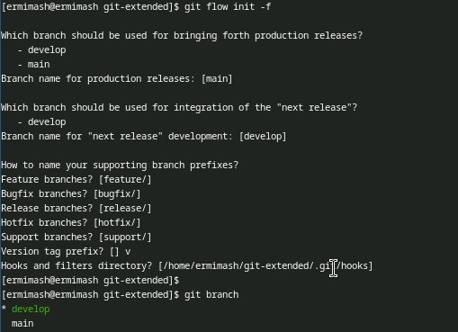{#fig:008 width=70%}
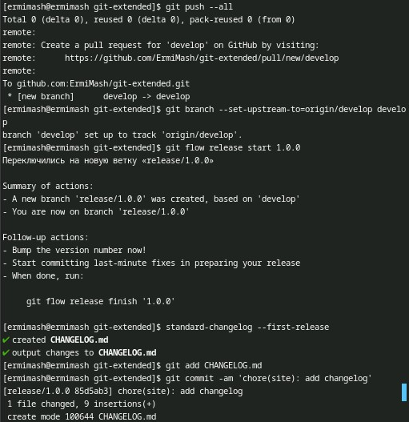{#fig:009 width=70%}
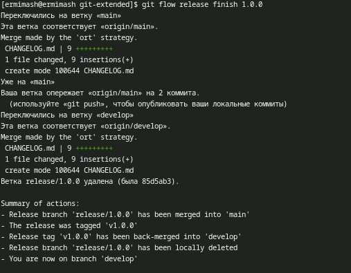{#fig:010 width=70%}
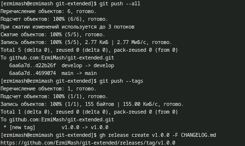{#fig:011 width=70%}

6. Работа с репозиторием git
  1. Разработка новой функциональности (рис. [-@fig:012])
  Создадим ветку для новой функциональности:
  -  git flow feature start feature_branch
  
  Далее, продолжаем работу c git как обычно.
  По окончании разработки новой функциональности следующим шагом следует объединить ветку feature_branch c develop:
  - git flow feature finish feature_branch
  
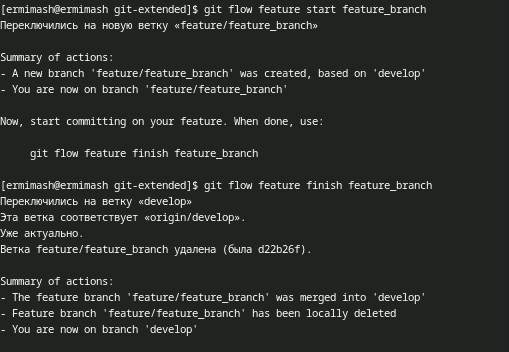{#fig:012 width=70%}

  2. Создание релиза git-flow
  Создадим релиз с версией 1.2.3: (рис. [-@fig:013])
  - git flow release start 1.2.3
  
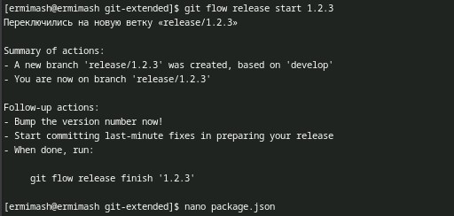{#fig:013 width=70%}
  
  Обновляем номер версии в файле package.json. Установите её в 1.2.3. (рис. [-@fig:014])
  
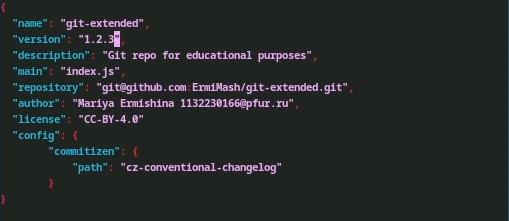{#fig:014 width=70%}
  
  Создадим журнал изменений: (рис. [-@fig:015])
  - standard-changelog
  
  Добавим журнал изменений в индекс: (рис. [-@fig:015])
  - git add CHANGELOG.md
  - git commit -am 'chore(site): update changelog'
  
  Зальём релизную ветку в основную ветку: (рис. [-@fig:015])
  - git flow release finish 1.2.3
  
  Отправим данные на github: (рис. [-@fig:016])
  - git push --all
  - git push --tags
  
  Создадим релиз на github с комментарием из журнала изменений: (рис. [-@fig:016])
  - gh release create v1.2.3 -F CHANGELOG.md
  
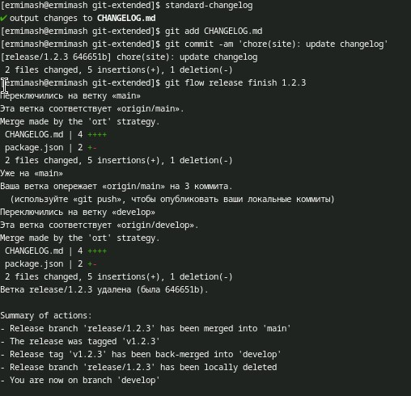{#fig:015 width=70%}
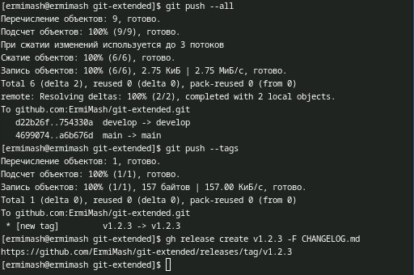{#fig:016 width=70%}

# Выводы

В ходе данной работы были получены навыки правильной работы с репозиториями git.

# Список литературы{.unnumbered}

::: {#refs}
:::
