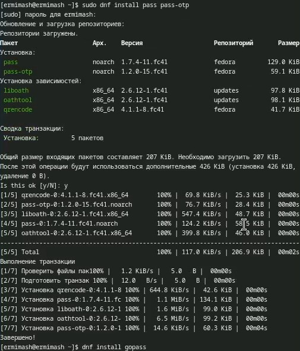
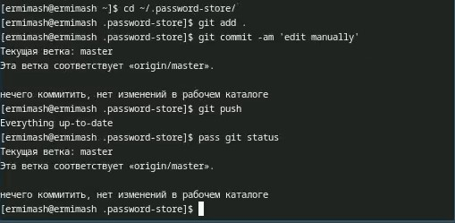
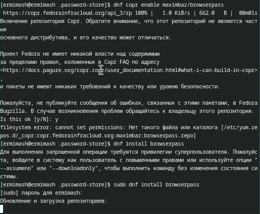
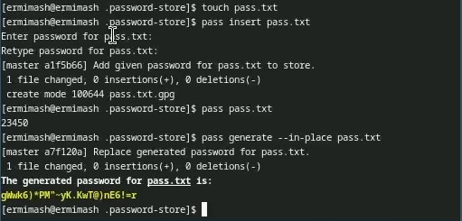
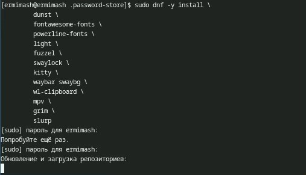
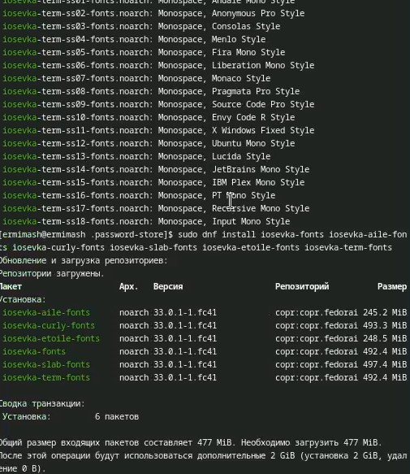
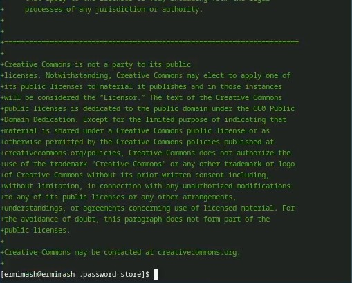
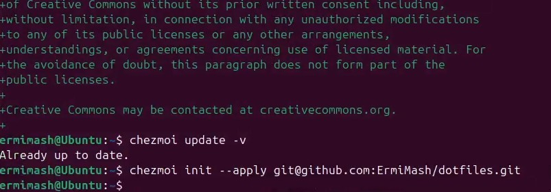

---
## Front matter
lang: ru-RU
title: Лабораторная работа №5
subtitle: Презентация
author:
  - Ермишина М. К.
institute:
  - Российский университет дружбы народов, Москва, Россия
date: 15 марта 2025

## i18n babel
babel-lang: russian
babel-otherlangs: english

## Formatting pdf
toc: false
toc-title: Содержание
slide_level: 2
aspectratio: 169
section-titles: true
theme: metropolis
header-includes:
 - \metroset{progressbar=frametitle,sectionpage=progressbar,numbering=fraction}

## Fonts
mainfont: PT Serif
romanfont: PT Serif
sansfont: PT Sans
monofont: PT Mono
mainfontoptions: Ligatures=TeX
romanfontoptions: Ligatures=TeX
sansfontoptions: Ligatures=TeX,Scale=MatchLowercase
monofontoptions: Scale=MatchLowercase,Scale=0.9
---

# Информация

## Докладчик

:::::::::::::: {.columns align=center}
::: {.column width="70%"}

  * Ермишина Мария Кирилловна
  * студент группы НПИбд-01-24
  * Российский университет дружбы народов
  * [1132230166@pfur.ru](mailto:1132230166@pfur.ru)
  * <https://github.com/ErmiMash>

:::
::: {.column width="30%"}

:::
::::::::::::::

# Элементы презентации

## Цели и задачи

Целью данной лабораторной работы является настройка рабочей среды. 

##Теоретическое введение

Менеджер паролей pass — программа, сделанная в рамках идеологии Unix. Также носит название стандартного менеджера паролей для Unix (The standard Unix password manager).

Основные свойства:
 - Данные хранятся в файловой системе в виде каталогов и файлов.
 - Файлы шифруются с помощью GPG-ключа.
 

# Выполнение лабораторной работы

## Менеджер паролей pass
Для начала мы устанавливаем pass и gopass в нашей виртуальной машине. Делаем это с помощью следующих команд
:
 - dnf install pass pass-otp
 - dnf install gopass
{#fig:001 width=70%}

## Настройка pass.
Первым шагом проверяем ключ GPG. Синхронизируем структуру с git. 
Вручную закоммитим и выложим изменения:
   - cd ~/.password-store/
   - git add .
   - git commit -am 'edit manually'
   - git push
   - pass git status (проверяем статус синхронизации)
{#fig:003 width=70%}

## Настройка интерфейса с броузером
Устанавливаем программу, обеспечивающую интерфейс native messaging, с помощью команд:
 - dnf copr enable maximbaz/browserpass
 - dnf install browserpass
После устанавливаем плагин.
 {#fig:004 width=70%}
  
## Сохранение пароля
Для начала добавляем новый пароль с помощью команды pass insert pass.txt. До этого создаём сам файл pass.txt.
Отображаем наш пароль, после чего заменяем его. Делаем это с помощью следующих команд:
 - pass pass.txt
 - pass generate --in-place pass.txt
{#fig:006 width=70%}

## Управление файлами конфигурации
sudo dnf -y install \
       dunst \
       fontawesome-fonts \
       powerline-fonts \
       light \
       fuzzel \
       swaylock \
       kitty \
       waybar swaybg \
       wl-clipboard \
       mpv \
       grim \
       slurp
{#fig:007 width=70%}

## Устанавливаем шрифты
 - sudo dnf copr enable peterwu/iosevka
 - sudo dnf search iosevka
 - sudo dnf install iosevka-fonts iosevka-aile-fonts iosevka-curly-fonts iosevka-slab-fonts iosevka-etoile-fonts iosevka-term-fonts
{#fig:008 width=70%}

## Установка бинарного файла и создание собственного репозитория с помощью утилит
Будем использовать утилиты командной строки для работы с github. Создадим свой репозиторий для конфигурационных файлов на основе шаблона. Инициализируем chezmoi с репозиторием dotfiles и проверяем, какие изменения внесёт chezmoi в домашний каталог. После проверяем, какие изменения внесёт chezmoi в домашний каталог (chezmoi diff), и, если они нас устраивают, запускаем chezmoi apply -v.
{#fig:010 width=70%}

## Использование chezmoi на нескольких машинах
Воспользуеммся второй виртуальной машиной. На второй машине инициализируйте chezmoi с вашим репозиторием dotfiles.
После этого так же проверяем, какие изменения внесёт chezmoi в домашний каталог (chezmoi diff), и, если они нас устраивают, запускаем chezmoi apply -v. Можно установить свои dotfiles на новый компьютер с помощью одной команды.
{#fig:012 width=70%}{#fig:012 width=70%}

## Ежедневные операции c chezmoi
Извлекаем последние изменения из репозитория и примените их с помощью команды chezmoi update. Извлекаем последние изменения из своего репозитория и посмотрите, что изменится, фактически не применяя изменения: chezmoi git pull -- --autostash --rebase && chezmoi diff. 
Автоматически фиксируем и отправляем изменения в репозиторий - функцию нужно подключить, так как она отключена по умолчанию.
{#fig:012 width=70%}

## Результаты

В ходе данной лабораторной работы получила навыки настройки рабочей среды. 
