---
## Front matter
title: "Лабораторная работа № 5"
subtitle: "Отчёт"
author: "Ермишина Мария Кирилловна"

## Generic otions
lang: ru-RU
toc-title: "Содержание"

## Bibliography
bibliography: bib/cite.bib
csl: pandoc/csl/gost-r-7-0-5-2008-numeric.csl

## Pdf output format
toc: true # Table of contents
toc-depth: 2
lof: true # List of figures
lot: true # List of tables
fontsize: 12pt
linestretch: 1.5
papersize: a4
documentclass: scrreprt
## I18n polyglossia
polyglossia-lang:
  name: russian
  options:
	- spelling=modern
	- babelshorthands=true
polyglossia-otherlangs:
  name: english
## I18n babel
babel-lang: russian
babel-otherlangs: english
## Fonts
mainfont: IBM Plex Serif
romanfont: IBM Plex Serif
sansfont: IBM Plex Sans
monofont: IBM Plex Mono
mathfont: STIX Two Math
mainfontoptions: Ligatures=Common,Ligatures=TeX,Scale=0.94
romanfontoptions: Ligatures=Common,Ligatures=TeX,Scale=0.94
sansfontoptions: Ligatures=Common,Ligatures=TeX,Scale=MatchLowercase,Scale=0.94
monofontoptions: Scale=MatchLowercase,Scale=0.94,FakeStretch=0.9
mathfontoptions:
## Biblatex
biblatex: true
biblio-style: "gost-numeric"
biblatexoptions:
  - parentracker=true
  - backend=biber
  - hyperref=auto
  - language=auto
  - autolang=other*
  - citestyle=gost-numeric
## Pandoc-crossref LaTeX customization
figureTitle: "Рис."
tableTitle: "Таблица"
listingTitle: "Листинг"
lofTitle: "Список иллюстраций"
lotTitle: "Список таблиц"
lolTitle: "Листинги"
## Misc options
indent: true
header-includes:
  - \usepackage{indentfirst}
  - \usepackage{float} # keep figures where there are in the text
  - \floatplacement{figure}{H} # keep figures where there are in the text
---

# Цель работы

Целью данной лабораторной работы является настройка рабочей среды. [@tuis5]

# Теоретическое введение

Менеджер паролей pass — программа, сделанная в рамках идеологии Unix. Также носит название стандартного менеджера паролей для Unix (The standard Unix password manager).

Основные свойства:
 - Данные хранятся в файловой системе в виде каталогов и файлов.
 - Файлы шифруются с помощью GPG-ключа.

# Выполнение лабораторной работы

1. Менеджер паролей pass
Для начала мы устанавливаем pass и gopass в нашей виртуальной машине. Делаем это с помощью следующих команд: (рис. [-@fig:001])
 - dnf install pass pass-otp
 - dnf install gopass
 
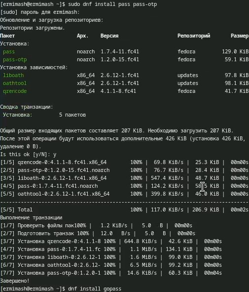{#fig:001 width=70%}
 
После установки необходима настройка. (рис. [-@fig:002])
 - Первым шагом проверяем (при необходимости создаём) ключ GPG. Наличие ключей проверяем с помощью команды gpg --list-secret-keys. 
 - Инициализируем хранилище: pass init 1132230166@pfur.ru
 - Синхронизируем структуру с git: 
   - pass git init
   - pass git remote add origin git@github.com:ErmiMash/pass.git (создаём репозиторий заранее)
   - pass git pull
   - pass git push
 - Вручную закоммитим и выложим изменения: (рис. [-@fig:003])
   - cd ~/.password-store/
   - git add .
   - git commit -am 'edit manually'
   - git push
   - pass git status (проверяем статус синхронизации)

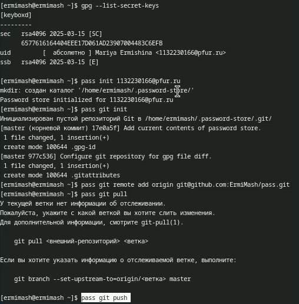{#fig:002 width=70%}

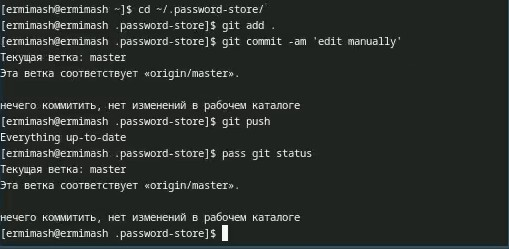{#fig:003 width=70%}

2. Настройка интерфейса с броузером
Устанавливаем программу, обеспечивающую интерфейс native messaging, с помощью команд: (рис. [-@fig:004])
 - dnf copr enable maximbaz/browserpass
 - dnf install browserpass
 
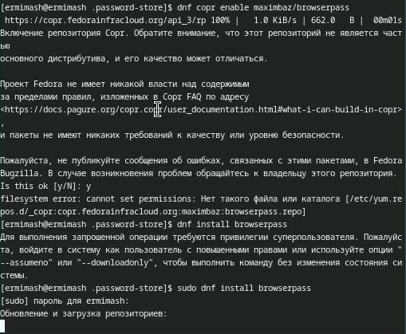{#fig:004 width=70%}

После этого устанавливаем плагин на наш браузер FireFox, перейдя по ссылке https://addons.mozilla.org/en-US/firefox/addon/browserpass-ce/. (рис. [-@fig:005])

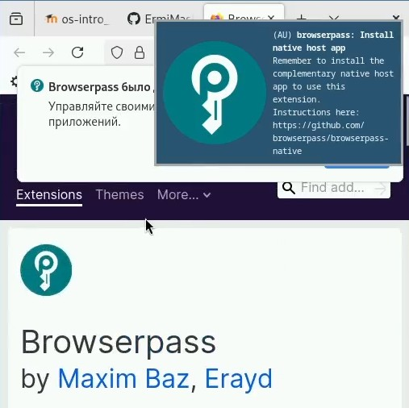{#fig:005 width=70%}

3. Сохранение пароля
Для начала добавляем новый пароль с помощью команды pass insert pass.txt. До этого создаём сам файл pass.txt. (рис. [-@fig:006])

Отображаем наш пароль, после чего заменяем его. Делаем это с помощью следующих команд: (рис. [-@fig:006])
 - pass pass.txt
 - pass generate --in-place pass.txt

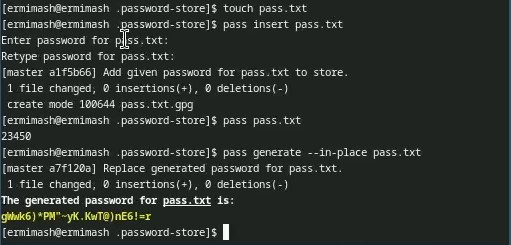{#fig:006 width=70%}

4. Управление файлами конфигурации
Установливаем дополнительное программное обеспечение: (рис. [-@fig:007])

 - sudo dnf -y install \
       dunst \
       fontawesome-fonts \
       powerline-fonts \
       light \
       fuzzel \
       swaylock \
       kitty \
       waybar swaybg \
       wl-clipboard \
       mpv \
       grim \
       slurp

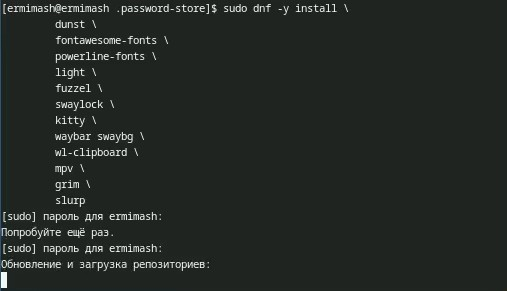{#fig:007 width=70%}

Устанавливаем шрифты: (рис. [-@fig:008])
 - sudo dnf copr enable peterwu/iosevka
 - sudo dnf search iosevka
 - sudo dnf install iosevka-fonts iosevka-aile-fonts iosevka-curly-fonts iosevka-slab-fonts iosevka-etoile-fonts iosevka-term-fonts

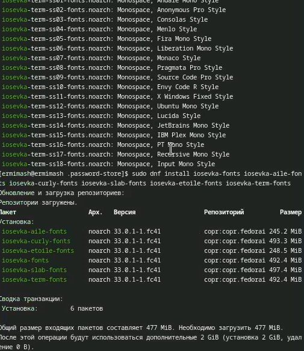{#fig:008 width=70%}

5. Установка бинарного файла
Скрипт определяет архитектуру процессора и операционную систему и скачивает необходимый файл. Устанавливаем: (рис. [-@fig:009])
 - sh -c "$(wget -qO- chezmoi.io/get)"
 
6. Создание собственного репозитория с помощью утилит
Будем использовать утилиты командной строки для работы с github. Создадим свой репозиторий для конфигурационных файлов на основе шаблона: (рис. [-@fig:009])
 - gh repo create dotfiles --template="yamadharma/dotfiles-template" --private

7. Подключение репозитория к своей системе
Инициализируем chezmoi с репозиторием dotfiles: (рис. [-@fig:009])
 - chezmoi init git@github.com:ErmiMash/dotfiles.git

После проверяем, какие изменения внесёт chezmoi в домашний каталог (chezmoi diff), и, если они нас устраивают, запускаем chezmoi apply -v. (рис. [-@fig:010])

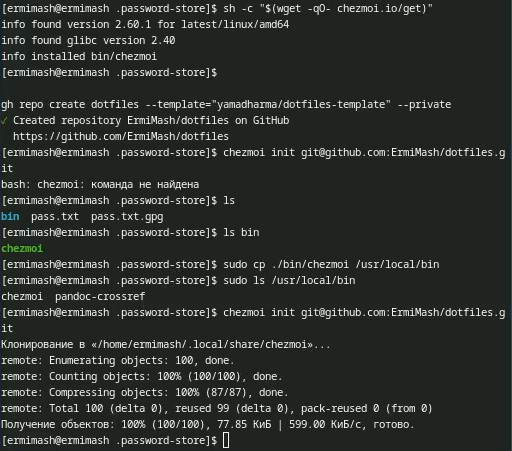{#fig:009 width=70%}

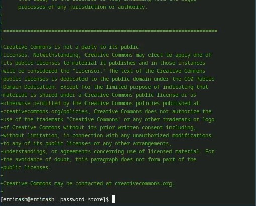{#fig:010 width=70%}

8. Использование chezmoi на нескольких машинах
Воспользуеммся второй виртуальной машиной - в моём случае это Ubuntu.
На второй машине инициализируйте chezmoi с вашим репозиторием dotfiles через SSH: рис. [-@fig:011])
 - chezmoi init git@github.com:ErmiMash/dotfiles.git
 
 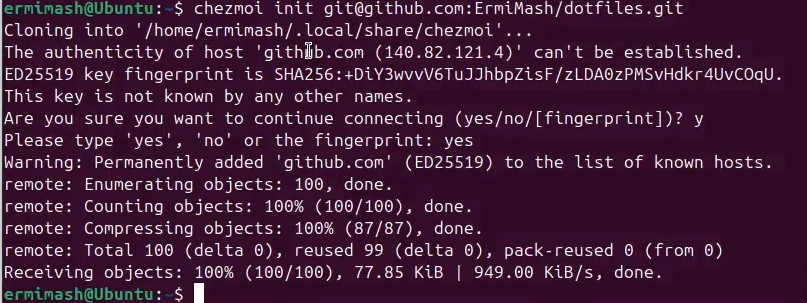{#fig:011 width=70%}
 
После этого так же проверяем, какие изменения внесёт chezmoi в домашний каталог (chezmoi diff), и, если они нас устраивают, запускаем chezmoi apply -v.

Нас устраивают изменения, поэтому редактировать и оъединять данные не нужно. 

При существующем каталоге chezmoi можно получить и применить последние изменения из вашего репозитория: (рис. [-@fig:012])
 - chezmoi update -v
 
9. Настройка новой машины с помощью одной команды
Можно установить свои dotfiles на новый компьютер с помощью одной команды: (рис. [-@fig:012])
 - chezmoi init --apply git@github.com:ErmiMash/dotfiles.git
 
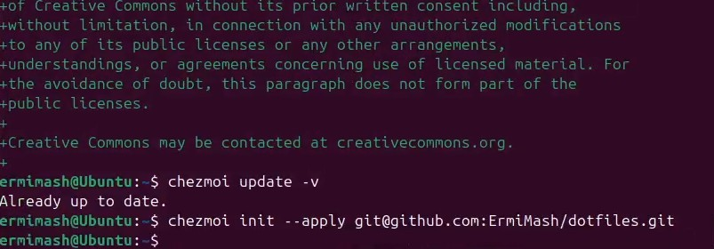{#fig:012 width=70%}

10. Ежедневные операции c chezmoi
Извлекаем последние изменения из репозитория и примените их с помощью команды chezmoi update (это запускает git pull --autostash --rebase в вашем исходном каталоге, а затем chezmoi apply). (рис. [-@fig:013])

Извлекаем последние изменения из своего репозитория и посмотрите, что изменится, фактически не применяя изменения: chezmoi git pull -- --autostash --rebase && chezmoi diff (это запускается git pull --autostash --rebase в вашем исходном каталоге, а chezmoi diff затем показывает разницу между целевым состоянием, вычисленным из вашего исходного каталога, и фактическим состоянием). (рис. [-@fig:013])

Если вы довольны изменениями - chezmoi apply. (рис. [-@fig:013])

Автоматически фиксируем и отправляем изменения в репозиторий - функцию нужно подключить, так как она отключена по умолчанию. Чтобы включить её, добавьте в файл конфигурации ~/.config/chezmoi/chezmoi.toml следующее: (рис. [-@fig:014])

 - [git]
    autoCommit = true
    autoPush = true
    
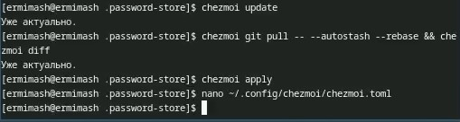{#fig:013 width=70%}

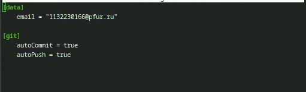{#fig:014 width=70%}

# Выводы

В ходе данной лабораторной работы получила навыки настройки рабочей среды. 

# Список литературы{.unnumbered}

::: {#refs}
:::
