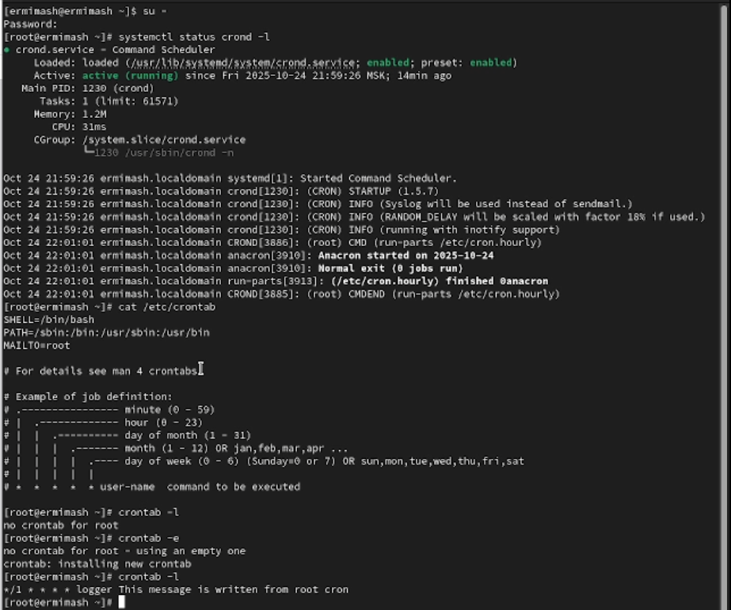
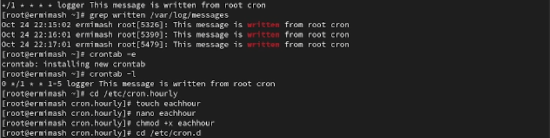
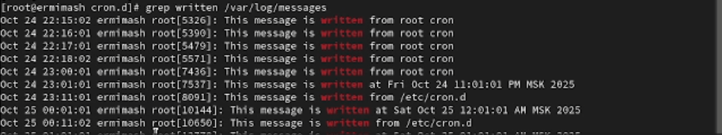

---
## Front matter
lang: ru-RU
title: Лабораторная работа №8
subtitle: Презентация
author:
  - Ермишина М. К.
institute:
  - Российский университет дружбы народов, Москва, Россия
date: 25 октября 2025

## i18n babel
babel-lang: russian
babel-otherlangs: english

## Formatting pdf
toc: false
toc-title: Содержание
slide_level: 2
aspectratio: 169
section-titles: true
theme: metropolis
header-includes:
 - \metroset{progressbar=frametitle,sectionpage=progressbar,numbering=fraction}

## Fonts
mainfont: PT Serif
romanfont: PT Serif
sansfont: PT Sans
monofont: PT Mono
mainfontoptions: Ligatures=TeX
romanfontoptions: Ligatures=TeX
sansfontoptions: Ligatures=TeX,Scale=MatchLowercase
monofontoptions: Scale=MatchLowercase,Scale=0.9
---

# Информация

## Докладчик

:::::::::::::: {.columns align=center}
::: {.column width="70%"}

  * Ермишина Мария Кирилловна
  * студент группы НПИбд-01-24
  * Российский университет дружбы народов
  * [1132230166@pfur.ru](mailto:1132230166@pfur.ru)
  * <https://github.com/ErmiMash>

:::
::: {.column width="30%"}

:::
::::::::::::::

# Элементы презентации

## Цели и задачи

Целью данной лабораторной работы является получение навыков работы с планировщиками событий cron и at.

# Выполнение лабораторной работы

## Планирование задач с помощью cron
Получив полномочия администратора Посмотрите статус демона crond. Посмотрите содержимое файла конфигурации /etc/crontab, а после посмотрите список заданий в расписании - ничего не отобразится, так как расписание ещё не задано:
  - systemctl status crond -l
  - cat /etc/crontab
  - crontab -l	 - crontab -e
{#fig:001 width=50%}

## Первый текстовый файл
Добавьте следующую строку в файл расписания:
  - */1 * * * * logger This message is written from root cron
{#fig:002 width=50%}

## eachhour
Перейдите в каталог /etc/cron.hourly и создайте в нём файл сценария с именем eachhour:
  - cd /etc/cron.hourly
  - touch eachhour
{#fig:003 width=50%}

## Текст в другом текстовой файле
Откройте файл eachhour для редактирования и пропишите в нём следующий скрипт:
  - #!/bin/sh
  - logger This message is written at $(date)
Сделайте файл сценария eachhour исполняемым: 
  - chmod +x eachhour
{#fig:005 width=50%}

## /etc/rsyslog.d
В каталоге /etc/rsyslog.d создайте файл с расписанием eachhour: 
  - cd /etc/cron.d	 - touch eachhour
Откройте этот файл для редактирования и поместите в него следующее содержимое:
  - 11 * * * * root logger This message is written from /etc/cron.d
{#fig:006 width=50%}

## Вывод следующего сообщения
Не выключая систему, через некоторое время (2–3 часа):
  - grep written /var/log/messages
{#fig:007 width=50%}

## Планирование заданий с помощью at
Проверьте, что служба atd загружена и включена:
  - systemctl status atd
Задайте выполнение команды logger message from at в 9:30. Для этого введите:
  - at 9:30	- logger message from at
А после убедитесь, что задание действительно запланировано:
  - atq
{#fig:008 width=50%}

## Результаты

Получены навыки работы с планировщиками событий cron и at.
