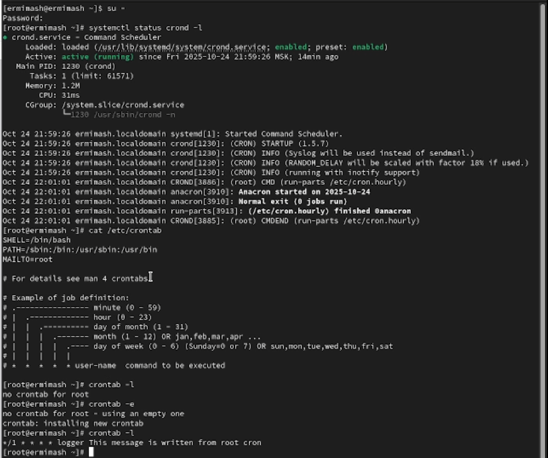
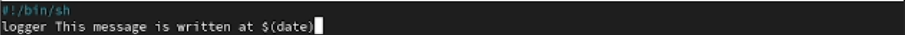
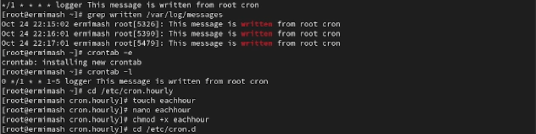
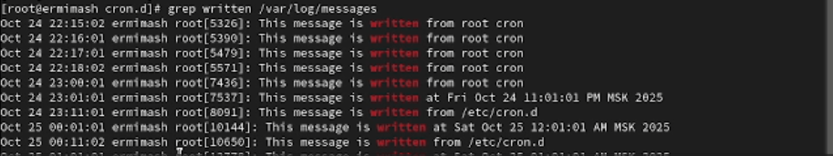

---
## Front matter
title: "Лабораторная работа № 8"
subtitle: "Отчёт"
author: "Ермишина Мария Кирилловна"

## Generic otions
lang: ru-RU
toc-title: "Содержание"

## Bibliography
bibliography: bib/cite.bib
csl: pandoc/csl/gost-r-7-0-5-2008-numeric.csl

## Pdf output format
toc: true # Table of contents
toc-depth: 2
lof: true # List of figures
lot: true # List of tables
fontsize: 12pt
linestretch: 1.5
papersize: a4
documentclass: scrreprt
## I18n polyglossia
polyglossia-lang:
  name: russian
  options:
	- spelling=modern
	- babelshorthands=true
polyglossia-otherlangs:
  name: english
## I18n babel
babel-lang: russian
babel-otherlangs: english
## Fonts
mainfont: IBM Plex Serif
romanfont: IBM Plex Serif
sansfont: IBM Plex Sans
monofont: IBM Plex Mono
mathfont: STIX Two Math
mainfontoptions: Ligatures=Common,Ligatures=TeX,Scale=0.94
romanfontoptions: Ligatures=Common,Ligatures=TeX,Scale=0.94
sansfontoptions: Ligatures=Common,Ligatures=TeX,Scale=MatchLowercase,Scale=0.94
monofontoptions: Scale=MatchLowercase,Scale=0.94,FakeStretch=0.9
mathfontoptions:
## Biblatex
biblatex: true
biblio-style: "gost-numeric"
biblatexoptions:
  - parentracker=true
  - backend=biber
  - hyperref=auto
  - language=auto
  - autolang=other*
  - citestyle=gost-numeric
## Pandoc-crossref LaTeX customization
figureTitle: "Рис."
tableTitle: "Таблица"
listingTitle: "Листинг"
lofTitle: "Список иллюстраций"
lotTitle: "Список таблиц"
lolTitle: "Листинги"
## Misc options
indent: true
header-includes:
  - \usepackage{indentfirst}
  - \usepackage{float} # keep figures where there are in the text
  - \floatplacement{figure}{H} # keep figures where there are in the text
---

# Цель работы

Целью данной лабораторной работы является получение навыков работы с планировщиками событий cron и at.

# Выполнение лабораторной работы

1. Планирование задач с помощью cron
Посмотрите статус демона crond: (рис. [-@fig:001])
  - systemctl status crond -l
Посмотрите содержимое файла конфигурации /etc/crontab:
  - cat /etc/crontab
Посмотрите список заданий в расписании - ничего не отобразится, так как расписание ещё не задано: 
  - crontab -l
Откройте файл расписания на редактирование: 
  - crontab -e
Добавьте следующую строку в файл расписания: (рис. [-@fig:002])
  - */1 * * * * logger This message is written from root cron

{#fig:002 width=70%}

Закройте сеанс редактирования vi и сохраните изменения, используя команду vi
Посмотрите список заданий в расписании - в расписании должна появиться запись о запланированном событии:
  - crontab -l

{#fig:001 width=70%}

Не выключая систему, через некоторое время (2–3 минуты) просмотрите журнал системных событий: (рис. [-@fig:003])
  - grep written /var/log/messages

Измените запись в расписании crontab на следующую: (рис. [-@fig:004])
  - 0 */1 * * 1-5 logger This message is written from root cron

{#fig:004 width=70%}

Посмотрите список заданий в расписании: 
  - crontab -l

Перейдите в каталог /etc/cron.hourly и создайте в нём файл сценария с именем eachhour:
  - cd /etc/cron.hourly
  - touch eachhour
Откройте файл eachhour для редактирования и пропишите в нём следующий скрипт: (рис. [-@fig:005])
  - #!/bin/sh
  - logger This message is written at $(date)

{#fig:005 width=70%}

Сделайте файл сценария eachhour исполняемым: 
  - chmod +x eachhour

{#fig:003 width=70%}

Теперь перейдите в каталог /etc/crond.d и создайте в нём файл с расписанием eachhour:
  - cd /etc/cron.d
  - touch eachhour
Откройте этот файл для редактирования и поместите в него следующее содержимое: (рис. [-@fig:006])
  - 11 * * * * root logger This message is written from /etc/cron.d

{#fig:006 width=70%}

Не выключая систему, через некоторое время (2–3 часа) просмотрите журнал системных событий: (рис. [-@fig:007])
  - grep written /var/log/messages

{#fig:007 width=70%}

2. Планирование заданий с помощью at
Проверьте, что служба atd загружена и включена: (рис. [-@fig:008])
  - systemctl status atd
Задайте выполнение команды logger message from at в 9:30. Для этого введите:
  - at 9:30
  - logger message from at
Используйте Ctrl + d , чтобы закрыть оболочку.
Убедитесь, что задание действительно запланировано:
  - atq
Посмотрите, появилось ли соответствующее сообщение в лог-файле в указанное вами время, с помощью команды:
  - grep 'from at' /var/log/messages

{#fig:008 width=70%}

# Контрольные вопросы

1. 00 00 1,15 * * logger task
2. 00 02 1,15 * * logger task
3. */2 * * * * logger task
4. * * 19 9 logger task
5. * * * * 4 logger task
6. * * * * alice logger task
7. записать его в /etc/cron.deny
8. Найти задание в логах grep cron /var/log/messages
9. atq

# Выводы

Получены навыки работы с планировщиками событий cron и at.
