---
## Front matter
title: "Лабораторная работа № 9"
subtitle: "Отчёт"
author: "Ермишина Мария Кирилловна"

## Generic otions
lang: ru-RU
toc-title: "Содержание"

## Bibliography
bibliography: bib/cite.bib
csl: pandoc/csl/gost-r-7-0-5-2008-numeric.csl

## Pdf output format
toc: true # Table of contents
toc-depth: 2
lof: true # List of figures
lot: true # List of tables
fontsize: 12pt
linestretch: 1.5
papersize: a4
documentclass: scrreprt
## I18n polyglossia
polyglossia-lang:
  name: russian
  options:
	- spelling=modern
	- babelshorthands=true
polyglossia-otherlangs:
  name: english
## I18n babel
babel-lang: russian
babel-otherlangs: english
## Fonts
mainfont: IBM Plex Serif
romanfont: IBM Plex Serif
sansfont: IBM Plex Sans
monofont: IBM Plex Mono
mathfont: STIX Two Math
mainfontoptions: Ligatures=Common,Ligatures=TeX,Scale=0.94
romanfontoptions: Ligatures=Common,Ligatures=TeX,Scale=0.94
sansfontoptions: Ligatures=Common,Ligatures=TeX,Scale=MatchLowercase,Scale=0.94
monofontoptions: Scale=MatchLowercase,Scale=0.94,FakeStretch=0.9
mathfontoptions:
## Biblatex
biblatex: true
biblio-style: "gost-numeric"
biblatexoptions:
  - parentracker=true
  - backend=biber
  - hyperref=auto
  - language=auto
  - autolang=other*
  - citestyle=gost-numeric
## Pandoc-crossref LaTeX customization
figureTitle: "Рис."
tableTitle: "Таблица"
listingTitle: "Листинг"
lofTitle: "Список иллюстраций"
lotTitle: "Список таблиц"
lolTitle: "Листинги"
## Misc options
indent: true
header-includes:
  - \usepackage{indentfirst}
  - \usepackage{float} # keep figures where there are in the text
  - \floatplacement{figure}{H} # keep figures where there are in the text
---

# Цель работы

Целью данной лабораторной работы является получение навыков работы с контекстом безопасности и политиками SELinux.

# Выполнение лабораторной работы

1. Управление режимами SELinux
Запустите терминал и получите полномочия администратора. Просмотрите текущую информацию о состоянии SELinux: (рис. [-@fig:001])
  - sestatus -v
Посмотрите, в каком режиме работает SELinux: (рис. [-@fig:001])
  - getenforce
Измените режим работы SELinux на разрешающий (Permissive): (рис. [-@fig:001])
  - setenforce 0
и снова введите (рис. [-@fig:001])
  - getenforce

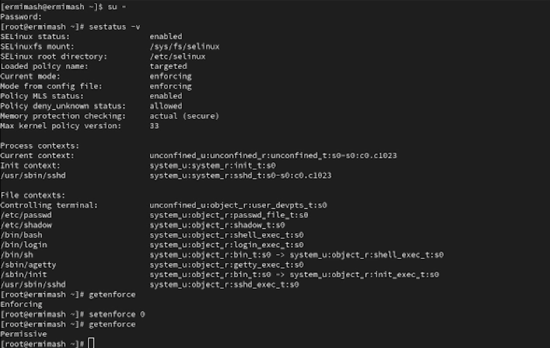{#fig:001 width=70%}

В файле /etc/sysconfig/selinux с помощью редактора установите: (рис. [-@fig:002])
  - SELINUX=disabled

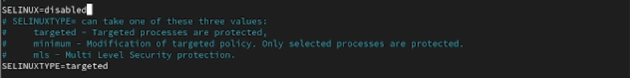{#fig:002 width=70%}

Перезагрузите систему.
После перезагрузки запустите терминал и получите полномочия администратора.
Посмотрите статус SELinux:
  - getenforce
Вы увидите, что SELinux теперь отключён.
Попробуйте переключить режим работы SELinux:
  - setenforce 1

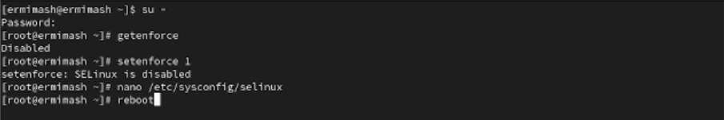{#fig:004 width=70%}

Откройте файл /etc/sysconfig/selinux с помощью редактора и установите: (рис. [-@fig:003])
  - SELINUX=enforcing
Перезагрузите систему.

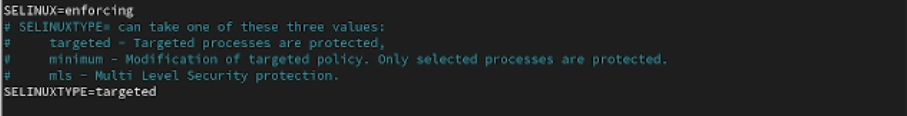{#fig:003 width=70%}

После перезагрузки в терминале с полномочиями администратора просмотрите текущую информацию о состоянии SELinux: (рис. [-@fig:005])
  - sestatus -v

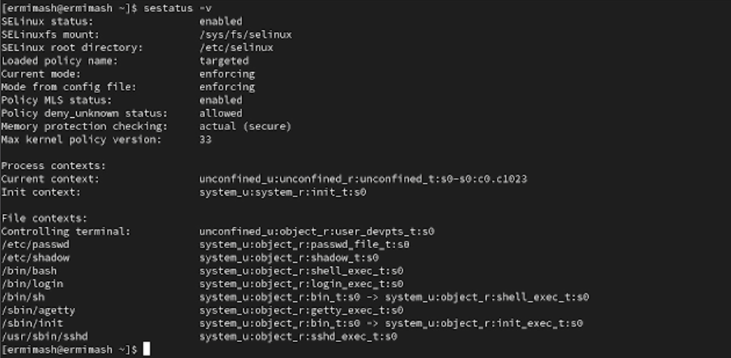{#fig:005 width=70%}

2. Использование restorecon для восстановления контекста безопасности (рис. [-@fig:006])
Запустите терминал и получите полномочия администратора. Посмотрите контекст безопасности файла /etc/hosts:
  - ls -Z /etc/hosts
Скопируйте файл /etc/hosts в домашний каталог:
  - cp /etc/hosts ~/
Проверьте контекст файла ~/hosts:
  - ls -Z ~/hosts
Поскольку копирование считается созданием нового файла, то параметр контекста в файле ~/hosts, расположенном в домашнем каталоге, станет admin_home_t.
Попытайтесь перезаписать существующий файл hosts из домашнего каталога в каталог /etc:
  - mv ~/hosts /etc
Убедитесь, что тип контекста по-прежнему установлен на admin_home_t:
  - ls -Z /etc/hosts
Исправьте контекст безопасности:
  - restorecon -v /etc/hosts
Убедитесь, что тип контекста изменился:
  - ls -Z /etc/hosts
Для массового исправления контекста безопасности на файловой системе введите
  - touch /.autorelabel

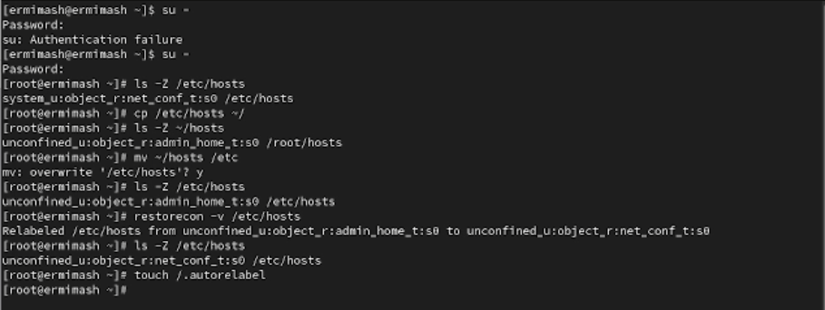{#fig:006 width=70%}

3. Настройка контекста безопасности для нестандартного расположения файлов веб-сервера
Запустите терминал и получите полномочия администратора. Установите необходимое программное обеспечение: (рис. [-@fig:007])
  - dnf -y install httpd
  - dnf -y install lynx
Создайте новое хранилище для файлов web-сервера: (рис. [-@fig:007])
  - mkdir /web
Создайте файл index.html в каталоге с контентом веб-сервера: (рис. [-@fig:007])
  - cd /web
  - touch index.html
и поместите в файл следующий текст "Welcome to my web-server"

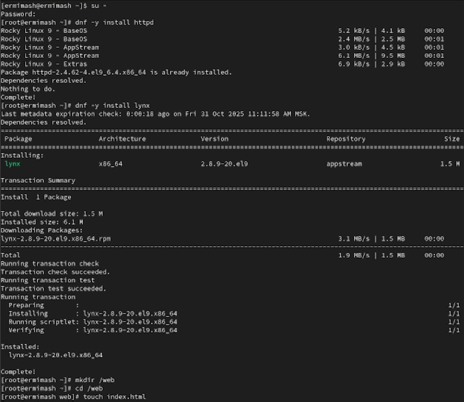{#fig:007 width=70%}

В файле /etc/httpd/conf/httpd.conf закомментируйте строку DocumentRoot "/var/www/html" и ниже добавьте строку "DocumentRoot "/web"" (рис. [-@fig:008])
Затем в этом же файле ниже закомментируйте раздел: (рис. [-@fig:008])
	<Directory "/var/www">
	AllowOverride None
	Require all granted
	</Directory>
и добавьте следующий раздел, определяющий правила доступа: (рис. [-@fig:008])
	<Directory "/web">
	AllowOverride None
	Require all granted
	</Directory>

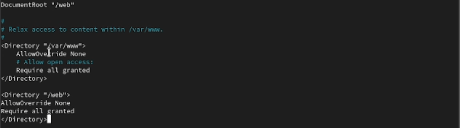{#fig:008 width=70%}

Запустите веб-сервер и службу httpd: (рис. [-@fig:010])
  - systemctl start httpd
  - systemctl enable httpd
В терминале под учётной записью своего пользователя при обращении к веб-серверу в текстовом браузере lynx: (рис. [-@fig:009])
  - lynx http://localhost

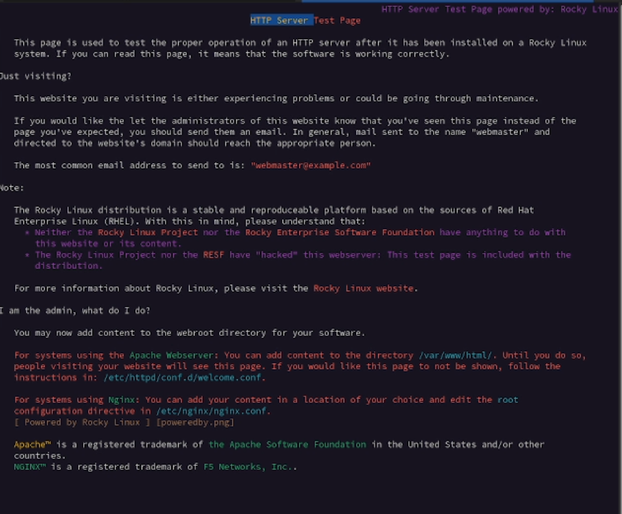{#fig:009 width=70%}

В терминале с полномочиями администратора примените новую метку контекста к /web: (рис. [-@fig:010])
  - semanage fcontext -a -t httpd_sys_content_t "/web(/.*)?"
Восстановите контекст безопасности: (рис. [-@fig:010])
  - restorecon -R -v /web

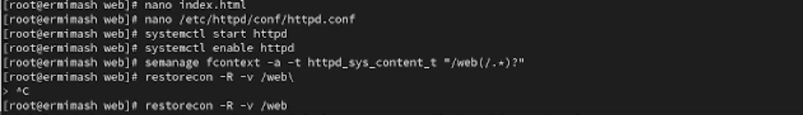{#fig:010 width=70%}

В терминале под учётной записью своего пользователя снова обратитесь к веб-серверу: (рис. [-@fig:011])
  - lynx http://localhost

{#fig:011 width=70%}

4. Работа с переключателями SELinux
Запустите терминал и получите полномочия администратора. Посмотрите список переключателей SELinux для службы ftp:
  - getsebool -a | grep ftp
Для службы ftpd_anon посмотрите список переключателей с пояснением, за что  отвечает каждый переключатель, включён он или выключен:
  - semanage boolean -l | grep ftpd_anon
Измените текущее значение переключателя для службы ftpd_anon_write с off на on:
  - setsebool ftpd_anon_write on
Повторно посмотрите список переключателей SELinux для службы ftpd_anon_write:
  - getsebool ftpd_anon_write
Посмотрите список переключателей с пояснением:
  - semanage boolean -l | grep ftpd_anon
Измените постоянное значение переключателя для службы ftpd_anon_write с off на on:
  - setsebool -P ftpd_anon_write on
Посмотрите список переключателей:
  - semanage boolean -l | grep ftpd_anon

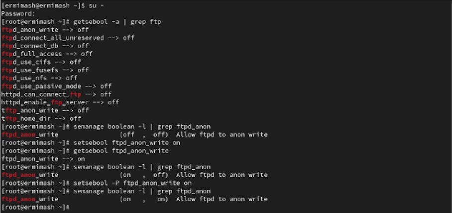{#fig:012 width=70%}

# Контрольные вопросы

1. setenforce 0
2. getsebol -a
3. audit2allow
4. semanage fcontext -a -t httpd_sys_content_t "/web(/.*)?"
restorecon -R -v /web
5. /etc/sysconfig/selinux
6. По умолчанию в /var/log/audit/audit.log
7. getsebool -a | grep ftp
8. Просмотреть контекст безопасности процессора ps -eZ или id -Z

# Выводы

Получены навыки работы с контекстом безопасности и политиками SELinux.
