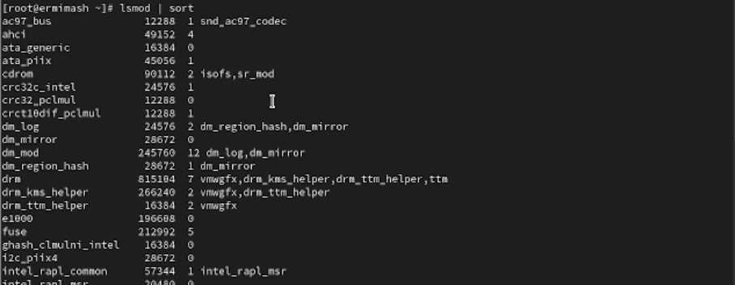

---
## Front matter
lang: ru-RU
title: Лабораторная работа №10
subtitle: Презентация
author:
  - Ермишина М. К.
institute:
  - Российский университет дружбы народов, Москва, Россия
date: 8 ноября 2025

## i18n babel
babel-lang: russian
babel-otherlangs: english

## Formatting pdf
toc: false
toc-title: Содержание
slide_level: 2
aspectratio: 169
section-titles: true
theme: metropolis
header-includes:
 - \metroset{progressbar=frametitle,sectionpage=progressbar,numbering=fraction}

## Fonts
mainfont: PT Serif
romanfont: PT Serif
sansfont: PT Sans
monofont: PT Mono
mainfontoptions: Ligatures=TeX
romanfontoptions: Ligatures=TeX
sansfontoptions: Ligatures=TeX,Scale=MatchLowercase
monofontoptions: Scale=MatchLowercase,Scale=0.9
---

# Информация

## Докладчик

:::::::::::::: {.columns align=center}
::: {.column width="70%"}

  * Ермишина Мария Кирилловна
  * студент группы НПИбд-01-24
  * Российский университет дружбы народов
  * [1132230166@pfur.ru](mailto:1132230166@pfur.ru)
  * <https://github.com/ErmiMash>

:::
::: {.column width="30%"}

:::
::::::::::::::

# Элементы презентации

## Цели и задачи

Целью данной лабораторной работы является получение навыков работы с с утилитами управления модулями ядра операционной системы.

# Выполнение лабораторной работы

## Управление модулями ядра из командной строки
Запустите терминал и получите полномочия администратора. Посмотрите, какие устройства имеются в вашей системе и какие модули ядра с ними связаны: - lspci -k.
Посмотрите, какие модули ядра загружены: - lsmod | sort
{#fig:002 width=40%}

## Модуль ext4
Посмотрите, загружен ли модуль ext4: - lsmod | grep ext4
Загрузите модуль ядра ext4: - modprobe ext4
Убедитесь, что модуль загружен, посмотрев список загруженных модулей: - lsmod | grep ext4
Посмотрите информацию о модуле ядра ext4:  - modinfo ext4
Попробуйте выгрузить модуль ядра ext4: - modprobe -r ext4
{#fig:003 width=40%}

## Загрузка модулей ядра с параметрами
Запустите терминал и получите полномочия администратора. Посмотрите осмотрите, загружен ли модуль bluetooth: - lsmod | grep bluetooth
Загрузите модуль ядра bluetooth: - modprobe bluetooth
Посмотрите список модулей ядра, отвечающих за работу с Bluetooth: - lsmod | grep bluetooth
Посмотрите информацию о модуле bluetooth: - modinfo bluetooth
Выгрузите модуль ядра bluetooth: - modprobe -r bluetooth
{#fig:004 width=40%}

## Обновление ядра системы
Запустите терминал и получите полномочия администратора. Посмотрите версию ядра, используемую в операционной системе: - uname -r
Выведите на экран список пакетов, относящихся к ядру операционной системы: - dnf list kernel
Обновите систему, чтобы убедиться, что все существующие пакеты обновлены: - dnf upgrade --refresh
{#fig:005 width=40%}

## Обновление операционной системы
Обновите ядро операционной системы, а затем саму операционную систему:
  - dnf update kernel
  - dnf update
  - dnf upgrade --refresh
{#fig:006 width=40%}

## Проверка версии ядра 
Посмотрите версию ядра, используемую в операционной системы:
  - uname -r
  - hostnamect

{#fig:007 width=40%}

## Результаты

Получены навыки работы с утилитами управления модулями ядра операционной системы.
