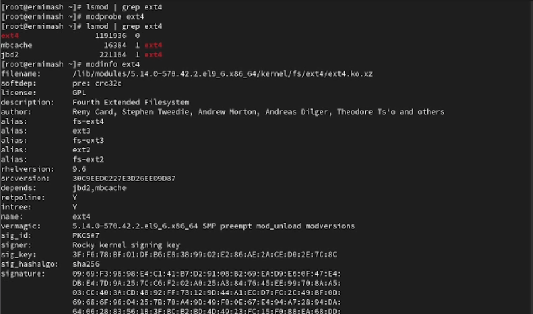
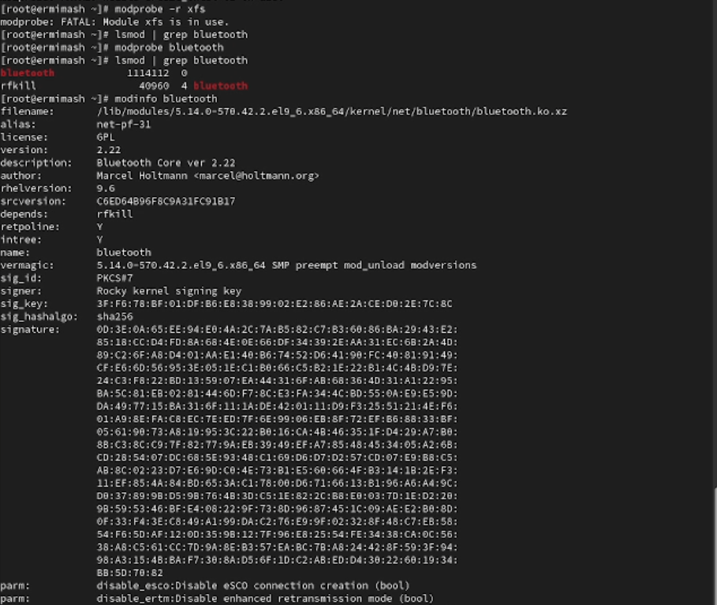
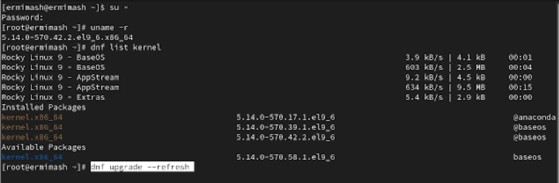
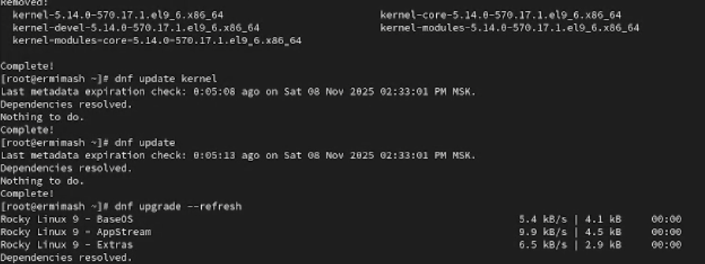
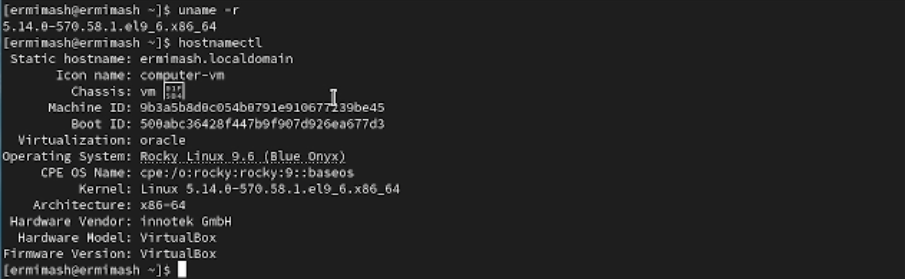

---
## Front matter
title: "Лабораторная работа № 10"
subtitle: "Отчёт"
author: "Ермишина Мария Кирилловна"

## Generic otions
lang: ru-RU
toc-title: "Содержание"

## Bibliography
bibliography: bib/cite.bib
csl: pandoc/csl/gost-r-7-0-5-2008-numeric.csl

## Pdf output format
toc: true # Table of contents
toc-depth: 2
lof: true # List of figures
lot: true # List of tables
fontsize: 12pt
linestretch: 1.5
papersize: a4
documentclass: scrreprt
## I18n polyglossia
polyglossia-lang:
  name: russian
  options:
	- spelling=modern
	- babelshorthands=true
polyglossia-otherlangs:
  name: english
## I18n babel
babel-lang: russian
babel-otherlangs: english
## Fonts
mainfont: IBM Plex Serif
romanfont: IBM Plex Serif
sansfont: IBM Plex Sans
monofont: IBM Plex Mono
mathfont: STIX Two Math
mainfontoptions: Ligatures=Common,Ligatures=TeX,Scale=0.94
romanfontoptions: Ligatures=Common,Ligatures=TeX,Scale=0.94
sansfontoptions: Ligatures=Common,Ligatures=TeX,Scale=MatchLowercase,Scale=0.94
monofontoptions: Scale=MatchLowercase,Scale=0.94,FakeStretch=0.9
mathfontoptions:
## Biblatex
biblatex: true
biblio-style: "gost-numeric"
biblatexoptions:
  - parentracker=true
  - backend=biber
  - hyperref=auto
  - language=auto
  - autolang=other*
  - citestyle=gost-numeric
## Pandoc-crossref LaTeX customization
figureTitle: "Рис."
tableTitle: "Таблица"
listingTitle: "Листинг"
lofTitle: "Список иллюстраций"
lotTitle: "Список таблиц"
lolTitle: "Листинги"
## Misc options
indent: true
header-includes:
  - \usepackage{indentfirst}
  - \usepackage{float} # keep figures where there are in the text
  - \floatplacement{figure}{H} # keep figures where there are in the text
---

# Цель работы

Целью данной лабораторной работы является получение навыков работы с с утилитами управления модулями ядра операционной системы.

# Выполнение лабораторной работы

1. Управление модулями ядра из командной строки
Запустите терминал и получите полномочия администратора. Посмотрите, какие устройства имеются в вашей системе и какие модули ядра с ними связаны: (рис. [-@fig:001])
  - lspci -k

{#fig:001 width=70%}

Посмотрите, какие модули ядра загружены: (рис. [-@fig:002])
  - lsmod | sort

{#fig:002 width=70%}

Посмотрите, загружен ли модуль ext4: (рис. [-@fig:003])
  - lsmod | grep ext4
Загрузите модуль ядра ext4: (рис. [-@fig:003])
  - modprobe ext4
Убедитесь, что модуль загружен, посмотрев список загруженных модулей: (рис. [-@fig:003])
  - lsmod | grep ext4
Посмотрите информацию о модуле ядра ext4: 
  - modinfo ext4
Попробуйте выгрузить модуль ядра ext4:
  - modprobe -r ext4

{#fig:003 width=70%}

Попробуйте выгрузить модуль ядра xfs: (рис. [-@fig:004])
  - modprobe -r xfs

2. Загрузка модулей ядра с параметрами (рис. [-@fig:004])
Запустите терминал и получите полномочия администратора. Посмотрите осмотрите, загружен ли модуль bluetooth:
  - lsmod | grep bluetooth
Загрузите модуль ядра bluetooth:
  - modprobe bluetooth
Посмотрите список модулей ядра, отвечающих за работу с Bluetooth:
  - lsmod | grep bluetooth
Посмотрите информацию о модуле bluetooth:
  - modinfo bluetooth
Выгрузите модуль ядра bluetooth:
  - modprobe -r bluetooth

{#fig:004 width=70%}

3. Обновление ядра системы
Запустите терминал и получите полномочия администратора. Посмотрите версию ядра, используемую в операционной системе: (рис. [-@fig:005])
  - uname -r
Выведите на экран список пакетов, относящихся к ядру операционной системы: (рис. [-@fig:005])
  - dnf list kernel
Обновите систему, чтобы убедиться, что все существующие пакеты обновлены, так как это важно при установке/обновлении ядер Linux и избежания конфликтов: (рис. [-@fig:005])
  - dnf upgrade --refresh

{#fig:005 width=70%}

Обновите ядро операционной системы, а затем саму операционную систему: (рис. [-@fig:006])
  - dnf update kernel
  - dnf update
  - dnf upgrade --refresh
Перегрузите систему.

{#fig:006 width=70%}

Посмотрите версию ядра, используемую в операционной системы: (рис. [-@fig:007])
  - uname -r
  - hostnamect

{#fig:007 width=70%}

# Контрольные вопросы

1. uname -r
2. hostnamectl
3. lsmod | sort
4. modprobe <имя модуля> <параметры> = <значение модуля>
5. modprobe -r <модуль>
6. Сперва выгружаем тот модуль, который занимает нужный нам модуль, а потом выгружаем первоначальный.
7. modinfo <модуль>
8. Обновим систему, чтобы убедиться, что все существующие пакеты обновлены, так как это важно при установке/обновлении ядер Linux и избежания конфликтов:
  - dnf upgrade --refresh
Обновим ядро операционной системы, а затем саму операционную систему:
  - dnf update kernel
  - dnf update dnf upgrade --refresh
Перегрузим систему. При загрузке выберем новое ядро

# Выводы

Получены навыки работы с утилитами управления модулями ядра операционной системы.
