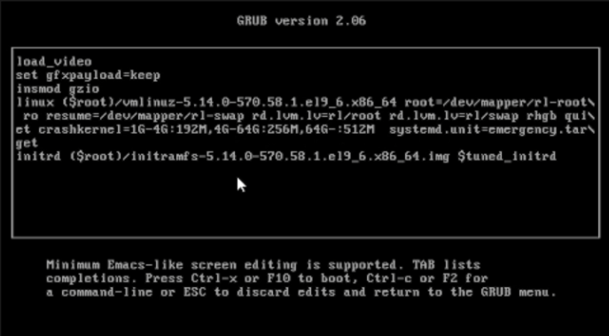

---
## Front matter
lang: ru-RU
title: Лабораторная работа №9
subtitle: Презентация
author:
  - Ермишина М. К.
institute:
  - Российский университет дружбы народов, Москва, Россия
date: 31 октября 2025

## i18n babel
babel-lang: russian
babel-otherlangs: english

## Formatting pdf
toc: false
toc-title: Содержание
slide_level: 2
aspectratio: 169
section-titles: true
theme: metropolis
header-includes:
 - \metroset{progressbar=frametitle,sectionpage=progressbar,numbering=fraction}

## Fonts
mainfont: PT Serif
romanfont: PT Serif
sansfont: PT Sans
monofont: PT Mono
mainfontoptions: Ligatures=TeX
romanfontoptions: Ligatures=TeX
sansfontoptions: Ligatures=TeX,Scale=MatchLowercase
monofontoptions: Scale=MatchLowercase,Scale=0.9
---

# Информация

## Докладчик

:::::::::::::: {.columns align=center}
::: {.column width="70%"}

  * Ермишина Мария Кирилловна
  * студент группы НПИбд-01-24
  * Российский университет дружбы народов
  * [1132230166@pfur.ru](mailto:1132230166@pfur.ru)
  * <https://github.com/ErmiMash>

:::
::: {.column width="30%"}

:::
::::::::::::::

# Элементы презентации

## Цели и задачи

Целью данной лабораторной работы является получение навыков работы с контекстом безопасности и политиками SELinux.

# Выполнение лабораторной работы

## Управление режимами SELinux
Запустите терминал и получите полномочия администратора. Просмотрите текущую информацию о состоянии SELinux:
Посмотрите, в каком режиме работает SELinux:
  - getenforce
Измените режим работы SELinux на разрешающий (Permissive):
  - setenforce 0
Еще раз проверяем режим работы.
{#fig:001 width=40%}

## Первое редактирование файла
В файле /etc/sysconfig/selinux с помощью редактора установите SELINUX=disabled и перезапустите систему. Посмотрите статус SELinux:
  - getenforce
Попробуйте переключить режим работы SELinux:
  - setenforce 1
{#fig:004 width=40%}

## Второе редактирование - принужительный режим
Откройте файл /etc/sysconfig/selinux с помощью редактора и установите:
  - SELINUX=enforcing
Перезагрузите систему.
После перезагрузки в терминале с полномочиями администратора просмотрите текущую информацию о состоянии SELinux:
  - sestatus -v
{#fig:005 width=40%}

## Использование restorecon для восстановления контекста безопасности
Запустите терминал и получите полномочия администратора.Посмотрите контекст безопасности файла /etc/hosts.
Скопируйте файл /etc/hosts в домашний каталог.Проверьте контекст файла ~/hosts.Поскольку копирование считается созданием нового файла, то параметр контекста в файле ~/hosts, расположенном в домашнем каталоге, станет admin_home_t.Попытайтесь перезаписать существующий файл hosts из домашнего каталога в каталог /etc.Убедитесь, что тип контекста по-прежнему установлен на admin_home_t.Исправьте контекст безопасности.Убедитесь, что тип контекста изменился.Для массового исправления контекста безопасности на файловой системе введите
{#fig:006 width=40%}

## Настройка контекста безопасности для нестандартного расположения файлов веб-сервера
Запустите терминал и получите полномочия администратора. Установите необходимое программное обеспечение:
  - dnf -y install httpd  - dnf -y install lynx
Создайте новое хранилище для файлов web-сервера и создайте файл index.html в каталоге с контентом веб-сервера и поместите в файл следующий текст "Welcome to my web-server"
В файле /etc/httpd/conf/httpd.conf отредактируйте строки.
{#fig:008 width=40%}

## Запуск веб-сервер и службу
  - systemctl start httpd  - systemctl enable httpd
В терминале под учётной записью своего пользователя при обращении к веб-серверу в текстовом браузере lynx:
  - lynx http://localhost
Первый запуск имеет неправильный вывод, в терминале с полномочиями администратора примените новую метку контекста к /web  - semanage fcontext -a -t httpd_sys_content_t "/web(/.*)?". Восстановите контекст безопасности:  - restorecon -R -v /web
{#fig:011 width=50%}

## Работа с переключателями SELinux
Запустите терминал и получите полномочия администратора. Посмотрите список переключателей SELinux для службы ftp.Для службы "ftpd_anon посмотрите список переключателей с пояснением, за что  отвечает каждый переключатель, включён он или выключен.Измените текущее значение переключателя для службы ftpd anon write с off на on.
Посмотрите список переключателей с пояснением. 
{#fig:012 width=40%}

## Результаты

Получены навыки работы с контекстом безопасности и политиками SELinux.
