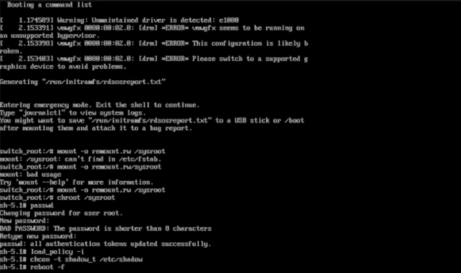

---
## Front matter
lang: ru-RU
title: Лабораторная работа №11
subtitle: Презентация
author:
  - Ермишина М. К.
institute:
  - Российский университет дружбы народов, Москва, Россия
date: 8 ноября 2025

## i18n babel
babel-lang: russian
babel-otherlangs: english

## Formatting pdf
toc: false
toc-title: Содержание
slide_level: 2
aspectratio: 169
section-titles: true
theme: metropolis
header-includes:
 - \metroset{progressbar=frametitle,sectionpage=progressbar,numbering=fraction}

## Fonts
mainfont: PT Serif
romanfont: PT Serif
sansfont: PT Sans
monofont: PT Mono
mainfontoptions: Ligatures=TeX
romanfontoptions: Ligatures=TeX
sansfontoptions: Ligatures=TeX,Scale=MatchLowercase
monofontoptions: Scale=MatchLowercase,Scale=0.9
---

# Информация

## Докладчик

:::::::::::::: {.columns align=center}
::: {.column width="70%"}

  * Ермишина Мария Кирилловна
  * студент группы НПИбд-01-24
  * Российский университет дружбы народов
  * [1132230166@pfur.ru](mailto:1132230166@pfur.ru)
  * <https://github.com/ErmiMash>

:::
::: {.column width="30%"}

:::
::::::::::::::

# Элементы презентации

## Цели и задачи

Целью данной лабораторной работы является получение навыков работы с загрузчиком системы GRUB2.

# Выполнение лабораторной работы

## Модификация параметров GRUB2
Запустите терминал и получите полномочия администратора. В файле /etc/default/grub установите параметр отображения меню загрузки в течение 10 секунд: - GRUB_TIMEOUT=10
Напишите изменения в GRUB2, введя в командной строке:
  - grub2-mkconfig > /boot/grub2/grub.cfg 
Перезагрузите систему

{#fig:001 width=40%}

## Устранения неполадок
Как только появится меню GRUB, выберите строку с текущей версией ядра в меню и нажмите "e" для редактирования. В конце строки введите "systemd.unit=rescue.target"
Посмотрите список всех файлов модулей, которые загружены в настоящее время: - systemctl list-units. Посмотрите задействованные переменные среды оболочки: - systemctl show-environmen. Перегрузите систему, используя команду: - systemctl reboot

{#fig:004 width=40%}

## systemd.unit=emergency.target
Как только отобразится меню GRUB, ещё раз нажмите "e" на строке с текущей версией ядра, чтобы войти в режим редактора. В конце строки, загружающей ядро, введите "systemd.unit=emergency.target"
Введите пароль пользователя root при появлении запроса
После успешного входа в систему посмотрите список всех загруженных файлов модулей: - systemctl list-units. Перегрузите систему, используя команду: - systemctl reboot

{#fig:006 width=40%}

## Сброс пароля root
Когда отобразится меню GRUB, выберите в меню строку с текущей версией ядра системы и нажмите "e", чтобы войти в режим редактора. В конце строки введите "rd.break". Получение доступа к системному образу для чтения и записи: - mount -o remount,rw /sysroot. Сделайте содержимое каталога /sysimage новым корневым каталогом: - chroot /sysroot. Команда задания пароля: - passwd
Поскольку на этом очень раннем этапе загрузки SELinux ещё не активирован, то тип контекста SELinux для файла /etc/shadow будет испорчен. Загрузка политики SELinux с помощью команды: - load_policy -i. Теперь вы можете вручную установить правильный тип контекста для /etc/shadow: - chcon -t shadow t /etc/shadow
Перезагрузите систему с помощью команды.

{#fig:008 width=40%}

## Результаты

Получены навыки работы с загрузчиком системы GRUB2.
