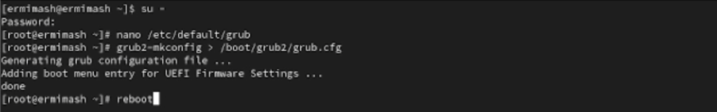
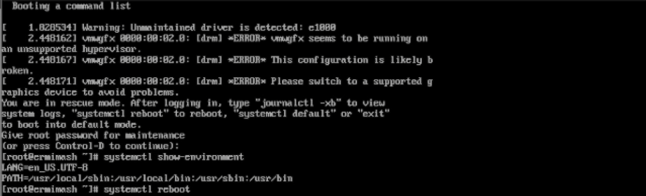
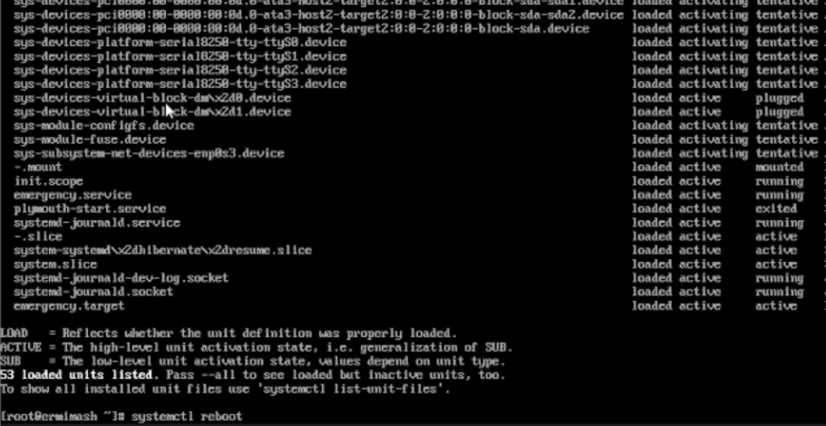

---
## Front matter
title: "Лабораторная работа № 11"
subtitle: "Отчёт"
author: "Ермишина Мария Кирилловна"

## Generic otions
lang: ru-RU
toc-title: "Содержание"

## Bibliography
bibliography: bib/cite.bib
csl: pandoc/csl/gost-r-7-0-5-2008-numeric.csl

## Pdf output format
toc: true # Table of contents
toc-depth: 2
lof: true # List of figures
lot: true # List of tables
fontsize: 12pt
linestretch: 1.5
papersize: a4
documentclass: scrreprt
## I18n polyglossia
polyglossia-lang:
  name: russian
  options:
	- spelling=modern
	- babelshorthands=true
polyglossia-otherlangs:
  name: english
## I18n babel
babel-lang: russian
babel-otherlangs: english
## Fonts
mainfont: IBM Plex Serif
romanfont: IBM Plex Serif
sansfont: IBM Plex Sans
monofont: IBM Plex Mono
mathfont: STIX Two Math
mainfontoptions: Ligatures=Common,Ligatures=TeX,Scale=0.94
romanfontoptions: Ligatures=Common,Ligatures=TeX,Scale=0.94
sansfontoptions: Ligatures=Common,Ligatures=TeX,Scale=MatchLowercase,Scale=0.94
monofontoptions: Scale=MatchLowercase,Scale=0.94,FakeStretch=0.9
mathfontoptions:
## Biblatex
biblatex: true
biblio-style: "gost-numeric"
biblatexoptions:
  - parentracker=true
  - backend=biber
  - hyperref=auto
  - language=auto
  - autolang=other*
  - citestyle=gost-numeric
## Pandoc-crossref LaTeX customization
figureTitle: "Рис."
tableTitle: "Таблица"
listingTitle: "Листинг"
lofTitle: "Список иллюстраций"
lotTitle: "Список таблиц"
lolTitle: "Листинги"
## Misc options
indent: true
header-includes:
  - \usepackage{indentfirst}
  - \usepackage{float} # keep figures where there are in the text
  - \floatplacement{figure}{H} # keep figures where there are in the text
---

# Цель работы

Целью данной лабораторной работы является получение навыков работы с загрузчиком системы GRUB2.

# Выполнение лабораторной работы

1. Модификация параметров GRUB2 (рис. [-@fig:001])
Запустите терминал и получите полномочия администратора.
В файле /etc/default/grub установите параметр отображения меню загрузки в течение 10 секунд: (рис. [-@fig:002])
  - GRUB_TIMEOUT=10

{#fig:002 width=70%}

Напишите изменения в GRUB2, введя в командной строке:
  - grub2-mkconfig > /boot/grub2/grub.cfg 
Перезагрузите систему

{#fig:001 width=70%}

2. Устранения неполадок
Как только появится меню GRUB, выберите строку с текущей версией ядра в меню и нажмите "e" для редактирования.
Прокрутите вниз до строки, начинающейся с linux ($root)/vmlinuz-. Эта строка загружает ядро системы. В конце этой строки введите "systemd.unit=rescue.target". Нажмите Ctrl + x для продолжения процесса загрузки (рис. [-@fig:003])

{#fig:003 width=70%}

Посмотрите список всех файлов модулей, которые загружены в настоящее время: (рис. [-@fig:004])
  - systemctl list-units
Посмотрите задействованные переменные среды оболочки: (рис. [-@fig:004])
  - systemctl show-environmen
Перегрузите систему, используя команду: (рис. [-@fig:004])
  - systemctl reboot

{#fig:004 width=70%}

Как только отобразится меню GRUB, ещё раз нажмите "e" на строке с текущей версией ядра, чтобы войти в режим редактора. В конце строки, загружающей ядро, введите "systemd.unit=emergency.target". Нажмите Ctrl + x для продолжения процесса загрузки (рис. [-@fig:005])

{#fig:005 width=70%}

Введите пароль пользователя root при появлении запроса
После успешного входа в систему посмотрите список всех загруженных файлов модулей: (рис. [-@fig:006])
  - systemctl list-units
Перегрузите систему, используя команду: (рис. [-@fig:006])
  - systemctl reboot

{#fig:006 width=70%}

3. Сброс пароля root
Когда отобразится меню GRUB, выберите в меню строку с текущей версией ядра системы и нажмите "e", чтобы войти в режим редактора. В конце строки, загружающей ядро, введите "rd.break". Нажмите Ctrl + x для продолжения процесса загрузки (рис. [-@fig:007])

{#fig:007 width=70%}

Чтобы получить доступ к системному образу для чтения и записи, наберите: (рис. [-@fig:008])
  - mount -o remount,rw /sysroot
Сделайте содержимое каталога /sysimage новым корневым каталогом, набрав: (рис. [-@fig:008])
  - chroot /sysroot
Теперь вы можете ввести команду задания пароля:
  - passwd
Поскольку на этом очень раннем этапе загрузки SELinux ещё не активирован, то тип контекста SELinux для файла /etc/shadow будет испорчен. Поэтому вы должны убедиться, что тип контекста установлен правильно. Чтобы сделать это, на этом этапе вы должны загрузить политику SELinux с помощью команды: (рис. [-@fig:008])
  - load_policy -i
Теперь вы можете вручную установить правильный тип контекста для /etc/shadow. Для этого введите: (рис. [-@fig:008])
  - chcon -t shadow_t /etc/shadow
Перезагрузите систему с помощью команды: (рис. [-@fig:008])
  - reboot -f

{#fig:008 width=70%}

# Контрольные вопросы

1. /etc/default/grub
2. /boot/grub2/grub.cfg
3. systemctl reboot

# Выводы

Получены навыки работы с загрузчиком системы GRUB2.
