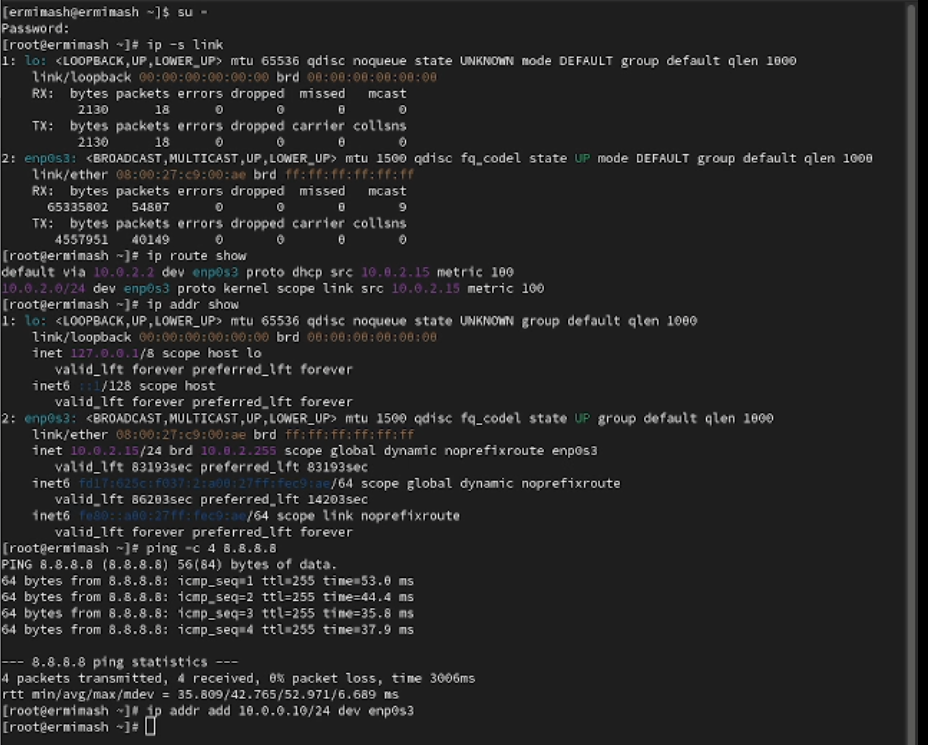
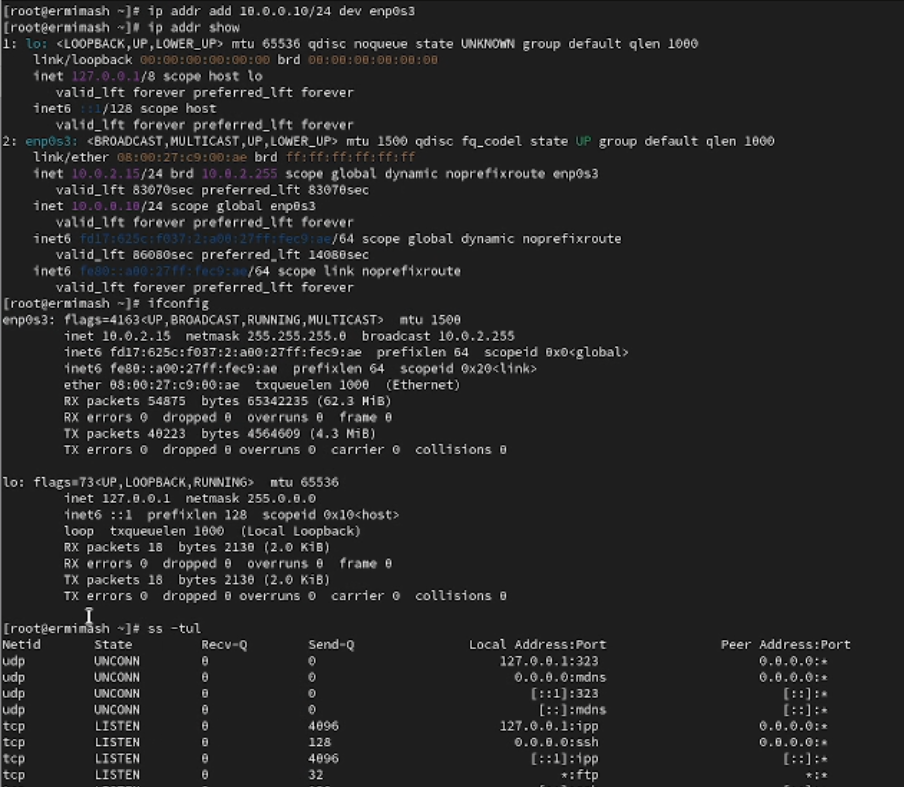
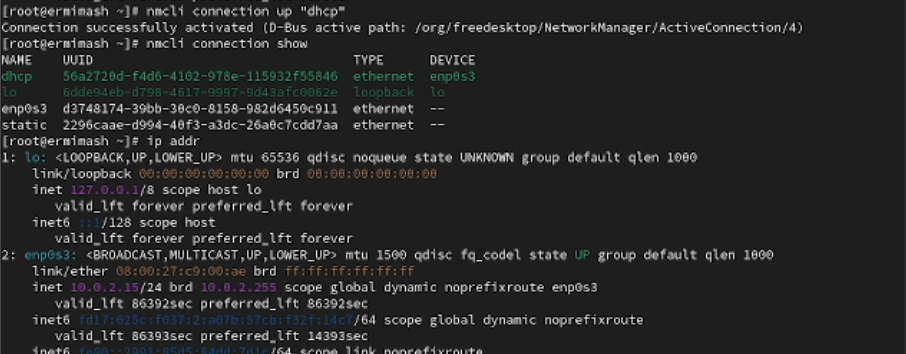

---
## Front matter
title: "Лабораторная работа № 12"
subtitle: "Отчёт"
author: "Ермишина Мария Кирилловна"

## Generic otions
lang: ru-RU
toc-title: "Содержание"

## Bibliography
bibliography: bib/cite.bib
csl: pandoc/csl/gost-r-7-0-5-2008-numeric.csl

## Pdf output format
toc: true # Table of contents
toc-depth: 2
lof: true # List of figures
lot: true # List of tables
fontsize: 12pt
linestretch: 1.5
papersize: a4
documentclass: scrreprt
## I18n polyglossia
polyglossia-lang:
  name: russian
  options:
	- spelling=modern
	- babelshorthands=true
polyglossia-otherlangs:
  name: english
## I18n babel
babel-lang: russian
babel-otherlangs: english
## Fonts
mainfont: IBM Plex Serif
romanfont: IBM Plex Serif
sansfont: IBM Plex Sans
monofont: IBM Plex Mono
mathfont: STIX Two Math
mainfontoptions: Ligatures=Common,Ligatures=TeX,Scale=0.94
romanfontoptions: Ligatures=Common,Ligatures=TeX,Scale=0.94
sansfontoptions: Ligatures=Common,Ligatures=TeX,Scale=MatchLowercase,Scale=0.94
monofontoptions: Scale=MatchLowercase,Scale=0.94,FakeStretch=0.9
mathfontoptions:
## Biblatex
biblatex: true
biblio-style: "gost-numeric"
biblatexoptions:
  - parentracker=true
  - backend=biber
  - hyperref=auto
  - language=auto
  - autolang=other*
  - citestyle=gost-numeric
## Pandoc-crossref LaTeX customization
figureTitle: "Рис."
tableTitle: "Таблица"
listingTitle: "Листинг"
lofTitle: "Список иллюстраций"
lotTitle: "Список таблиц"
lolTitle: "Листинги"
## Misc options
indent: true
header-includes:
  - \usepackage{indentfirst}
  - \usepackage{float} # keep figures where there are in the text
  - \floatplacement{figure}{H} # keep figures where there are in the text
---

# Цель работы

Целью данной лабораторной работы является получение навыков настройки сетевых параметров системы.

# Выполнение лабораторной работы

1. Проверка конфигурации сети
Запустите терминал и получите полномочия администратора. 
Выведите на экран информацию о существующих сетевых подключениях, а также статистику о количестве отправленных пакетов и связанных с ними сообщениях об ошибках: (рис. [-@fig:001])
  - ip -s link
Выведите на экран информацию о текущих маршрутах: (рис. [-@fig:001])
  - ip route show
Выведите на экран информацию о текущих назначениях адресов для сетевых интерфейсов на устройстве: (рис. [-@fig:001])
  - ip addr show
Используйте команду ping для проверки правильности подключения к Интернету: (рис. [-@fig:001])
  - ping -c 4 8.8.8.8
Добавьте дополнительный адрес к вашему интерфейсу: (рис. [-@fig:002])
  - ip addr add 10.0.0.10/24 dev yourdevicename
Проверьте, что адрес добавился: (рис. [-@fig:002])
  - ip addr show
Сравните вывод информации от утилиты ip и от команды ifconfig: (рис. [-@fig:002])
  - ifconfig
Выведите на экран список всех прослушиваемых системой портов UDP и TCP: (рис. [-@fig:002])
  - ss -tul

{#fig:001 width=70%}
{#fig:002 width=70%}

2. Управление сетевыми подключениями с помощью nmcli
Получите полномочия администратора. Выведите на экран информацию о текущих соединениях: (рис. [-@fig:003])
  - nmcli connection show
Добавьте Ethernet-соединение с именем dhcp к интерфейсу: (рис. [-@fig:003])
  - nmcli connection add con-name "dhcp" type ethernet ifname 
    ifname
Добавьте к этому же интерфейсу Ethernet-соединение с именем static, статическим IPv4-адресом адаптера и статическим адресом шлюза: (рис. [-@fig:003])
  - nmcli connection add con-name "static" ifname ifname
    autoconnect no type ethernet ip4 10.0.0.10/24 gw4 10.0.0.1
    ifname ifname
Выведите информацию о текущих соединениях: (рис. [-@fig:003])
  - nmcli connection show
Переключитесь на статическое соединение: (рис. [-@fig:003])
  - nmcli connection up "static"
Проверьте успешность переключения: (рис. [-@fig:003])
  - nmcli connection show 
  - ip addr
Вернитесь к соединению dhcp: (рис. [-@fig:004])
  - nmcli connection up "dhcp"
Проверьте успешность переключения: (рис. [-@fig:004])
  - nmcli connection show
  - ip addr

{#fig:003 width=70%}
{#fig:004 width=70%}

3. Изменение параметров соединения с помощью nmcli (рис. [-@fig:007])
Отключите автоподключение статического соединения:
  - nmcli connection modify "static" connection.autoconnect no
Добавьте DNS-сервер в статическое соединение:
  - nmcli connection modify "static" ipv4.dns 10.0.0.10
Добавьте второй DNS-сервер:
  - nmcli connection modify "static" +ipv4.dns 8.8.8.8
Измените IP-адрес статического соединения:
  - nmcli connection modify "static" ipv4.addresses 10.0.0.20/24
Добавьте другой IP-адрес для статического соединения:
  - nmcli connection modify "static" +ipv4.addresses 10.20.30.40/16
После изменения свойств соединения активируйте его:
  - nmcli connection up "static"
Проверьте успешность переключения:
  - nmcli con show 
  - ip addr
Посмотрите настройки сети на устройстве: (рис. [-@fig:005])
  - nmtui

{#fig:005 width=70%}

Посмотрите настройки сетевых соединений в графическом интерфейсе операционной системы (рис. [-@fig:006])

{#fig:006 width=70%}

Переключитесь на первоначальное сетевое соединение:
  - nmcli connection up "ifname"
  
{#fig:007 width=70%}

# Контрольные вопросы

1. ip link
2. NetworkManager
3. /etc/hosts – список всех хостов 
/etc/hostname – имя хоста локального устройства
4. hostamectl set-hostname
5. Если система пытается разрешить имя и находит его в /etc/hosts, она не будет пытаться смотреть записи в DNS. Поэтому нужно изменить именно этот файл
6. ip route show
7. systemctl status NetworkManager
8. nmcli con mod <имя соединения> ipv4.addresses "<текущий ip>,<новый ip>'' gw4 <новый ip> - изменить текущий ip адрес и шлюз
nmcli con mod <имя соединения> ipv4.addresses "<текущий ip>,<новый ip>'' - изменить текущий ip адрес
route add default GW <новый ip> <название интерфейса> — изменить шлюз по умолчанию

# Выводы

Получены навыки настройки сетевых параметров системы.
