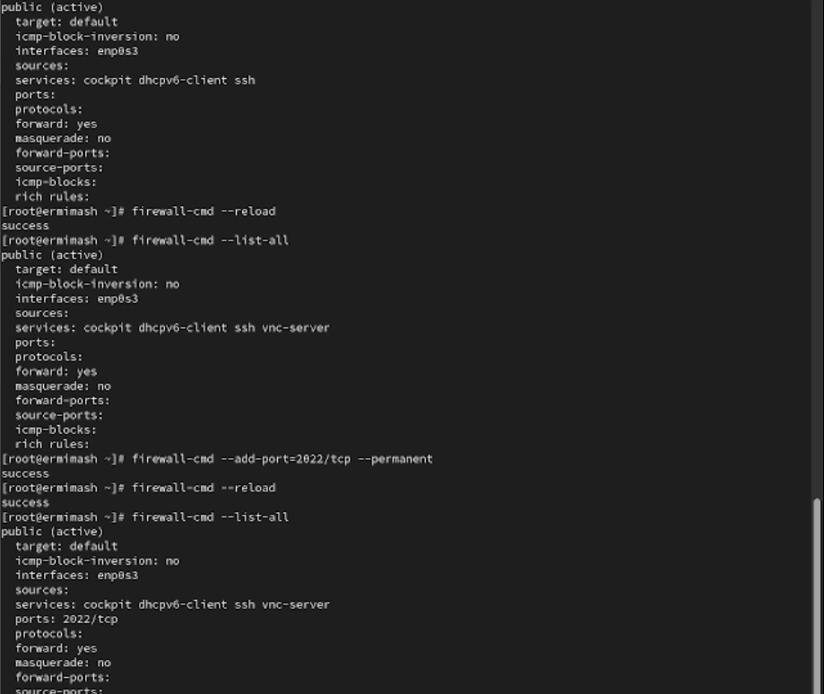
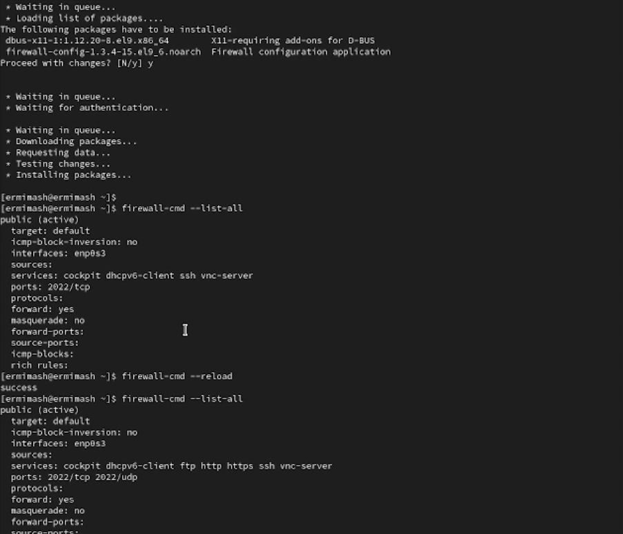

---
## Front matter
lang: ru-RU
title: Лабораторная работа №13
subtitle: Презентация
author:
  - Ермишина М. К.
institute:
  - Российский университет дружбы народов, Москва, Россия
date: 22 ноября 2025

## i18n babel
babel-lang: russian
babel-otherlangs: english

## Formatting pdf
toc: false
toc-title: Содержание
slide_level: 2
aspectratio: 169
section-titles: true
theme: metropolis
header-includes:
 - \metroset{progressbar=frametitle,sectionpage=progressbar,numbering=fraction}

## Fonts
mainfont: PT Serif
romanfont: PT Serif
sansfont: PT Sans
monofont: PT Mono
mainfontoptions: Ligatures=TeX
romanfontoptions: Ligatures=TeX
sansfontoptions: Ligatures=TeX,Scale=MatchLowercase
monofontoptions: Scale=MatchLowercase,Scale=0.9
---

# Информация

## Докладчик

:::::::::::::: {.columns align=center}
::: {.column width="70%"}

  * Ермишина Мария Кирилловна
  * студент группы НПИбд-01-24
  * Российский университет дружбы народов
  * [1132230166@pfur.ru](mailto:1132230166@pfur.ru)
  * <https://github.com/ErmiMash>

:::
::: {.column width="30%"}

:::
::::::::::::::

# Элементы презентации

## Цели и задачи

Целью данной лабораторной работы является получение навыков настройки пакетного фильтра в Linux.

# Выполнение лабораторной работы

## Управление брандмауэром с помощью firewall-cmd

{#fig:001 width=70%}

## Добавление VNC

{#fig:002 width=70%}

## Добавление конфигураций

{#fig:003 width=70%}

## Настройки брандмауэра

{#fig:007 width=70%}

## Управление брандмауэром с помощью firewall-config

{#fig:005 width=70%}

## Самостоятельная работа

{#fig:006 width=70%}

## Результаты

Получены навыки настройки пакетного фильтра в Linux.
