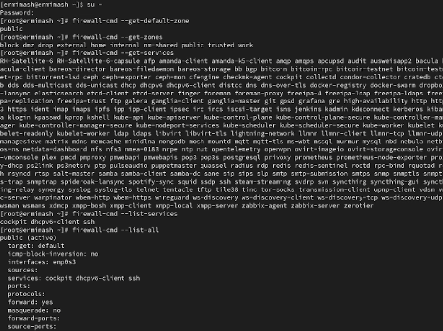
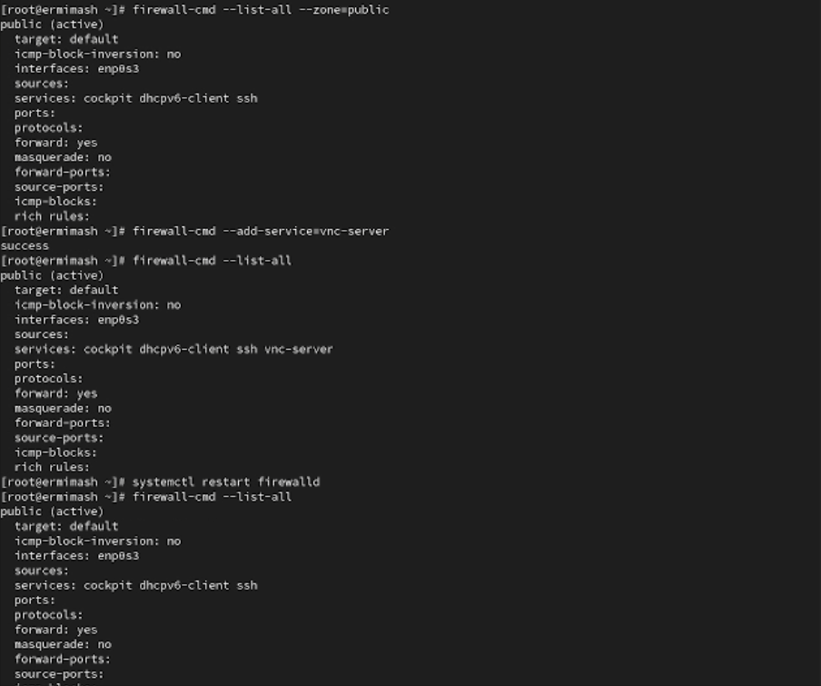
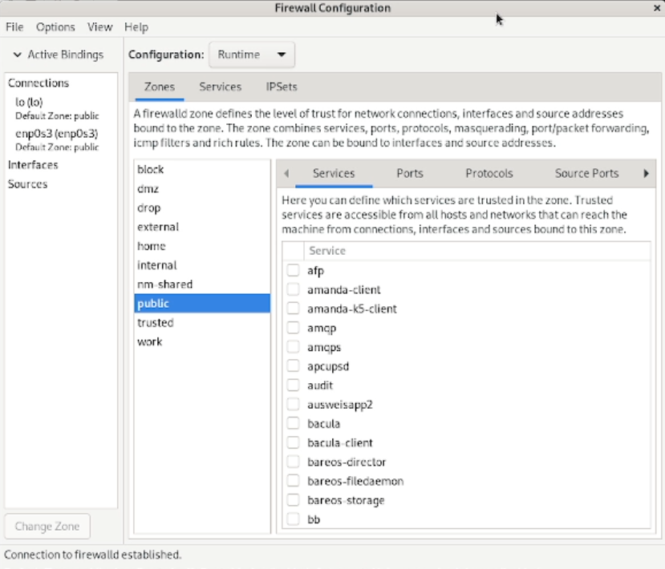
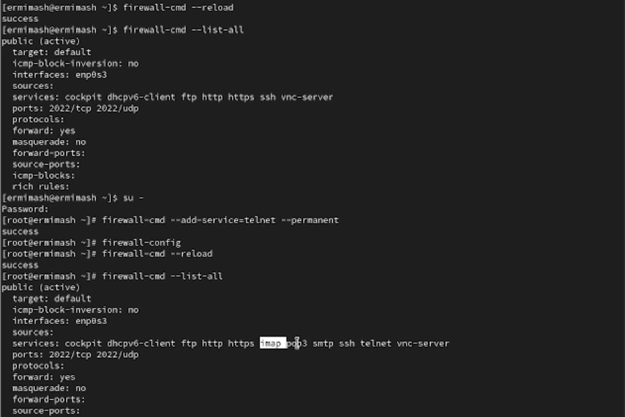

---
## Front matter
title: "Лабораторная работа № 13"
subtitle: "Отчёт"
author: "Ермишина Мария Кирилловна"

## Generic otions
lang: ru-RU
toc-title: "Содержание"

## Bibliography
bibliography: bib/cite.bib
csl: pandoc/csl/gost-r-7-0-5-2008-numeric.csl

## Pdf output format
toc: true # Table of contents
toc-depth: 2
lof: true # List of figures
lot: true # List of tables
fontsize: 12pt
linestretch: 1.5
papersize: a4
documentclass: scrreprt
## I18n polyglossia
polyglossia-lang:
  name: russian
  options:
	- spelling=modern
	- babelshorthands=true
polyglossia-otherlangs:
  name: english
## I18n babel
babel-lang: russian
babel-otherlangs: english
## Fonts
mainfont: IBM Plex Serif
romanfont: IBM Plex Serif
sansfont: IBM Plex Sans
monofont: IBM Plex Mono
mathfont: STIX Two Math
mainfontoptions: Ligatures=Common,Ligatures=TeX,Scale=0.94
romanfontoptions: Ligatures=Common,Ligatures=TeX,Scale=0.94
sansfontoptions: Ligatures=Common,Ligatures=TeX,Scale=MatchLowercase,Scale=0.94
monofontoptions: Scale=MatchLowercase,Scale=0.94,FakeStretch=0.9
mathfontoptions:
## Biblatex
biblatex: true
biblio-style: "gost-numeric"
biblatexoptions:
  - parentracker=true
  - backend=biber
  - hyperref=auto
  - language=auto
  - autolang=other*
  - citestyle=gost-numeric
## Pandoc-crossref LaTeX customization
figureTitle: "Рис."
tableTitle: "Таблица"
listingTitle: "Листинг"
lofTitle: "Список иллюстраций"
lotTitle: "Список таблиц"
lolTitle: "Листинги"
## Misc options
indent: true
header-includes:
  - \usepackage{indentfirst}
  - \usepackage{float} # keep figures where there are in the text
  - \floatplacement{figure}{H} # keep figures where there are in the text
---

# Цель работы

Целью данной лабораторной работы является получение навыков настройки пакетного фильтра в Linux.

# Выполнение лабораторной работы

1. Управление брандмауэром с помощью firewall-cmd
Запустите терминал и получите полномочия администратора. 
Определите текущую зону по умолчанию, введя: (рис. [-@fig:001])
  - firewall-cmd --get-default-zone
Определите доступные зоны, введя: (рис. [-@fig:001])
  - firewall-cmd --get-zones
Посмотрите службы, доступные на вашем компьютере, используя (рис. [-@fig:001])
  - firewall-cmd --get-services
Определите доступные службы в текущей зоне: (рис. [-@fig:001])
  - firewall-cmd --list-services
Сравните результаты вывода информации при использовании команд: (рис. [-@fig:001])
  - firewall-cmd --list-all
  - firewall-cmd --list-all --zone=public (рис. [-@fig:002])
Добавьте сервер VNC в конфигурацию брандмауэра: (рис. [-@fig:002])
  - firewall-cmd --add-service=vnc-server
Проверьте, добавился ли vnc-server в конфигурацию: (рис. [-@fig:002])
  - firewall-cmd --list-all
Перезапустите службу firewalld: (рис. [-@fig:002])
  - systemctl restart firewalld
Проверьте, есть ли vnc-server в конфигурации: (рис. [-@fig:002])
  - firewall-cmd --list-all

{#fig:001 width=70%}
{#fig:002 width=70%}

Добавьте службу vnc-server ещё раз, но на этот раз сделайте её постоянной, используя команду (рис. [-@fig:003])
  - firewall-cmd --add-service=vnc-server --permanent
Проверьте наличие vnc-server в конфигурации: (рис. [-@fig:003])
  - firewall-cmd --list-all
Перезагрузите конфигурацию firewalld и просмотрите конфигурацию времени выполнения: (рис. [-@fig:003])
  - firewall-cmd --reload
  - firewall-cmd --list-all
Добавьте в конфигурацию межсетевого экрана порт 2022 протокола TCP: (рис. [-@fig:003])
  - firewall-cmd --add-port=2022/tcp --permanent
Затем перезагрузите конфигурацию firewalld: (рис. [-@fig:003])
  - firewall-cmd --reload
Проверьте, что порт добавлен в конфигурацию: (рис. [-@fig:003])
  - firewall-cmd --list-all

{#fig:003 width=70%}

2. Управление брандмауэром с помощью firewall-config
Откройте терминал и под учётной записью своего пользователя запустите интерфейс GUI firewall-config: (рис. [-@fig:005])
  - firewall-config

Нажмите выпадающее меню рядом с параметром Configuration (рис. [-@fig:004])
Откройте раскрывающийся список и выберите Permanent. Это позволит сделать постоянными все изменения, которые вы вносите при конфигурировании 
Выберите зону public и отметьте службы http, https и ftp, чтобы включить их.
Выберите вкладку Ports и на этой вкладке нажмите Add . Введите порт 2022 и протокол udp, нажмите ОК , чтобы добавить их в список. Закройте утилиту firewall-config 

{#fig:004 width=70%}

В окне терминала введите (рис. [-@fig:005])
  - firewall-cmd --list-all
Перегрузите конфигурацию firewall-cmd: (рис. [-@fig:005])
  - firewall-cmd --reload
и список доступных сервисов:
  - firewall-cmd --list-all

{#fig:005 width=70%}

3. Самостоятельная работа (рис. [-@fig:006])
Создайте конфигурацию межсетевого экрана, которая позволяет получить доступ
к следующим службам:
  - telnet;
  - imap;
  - pop3;
  - smtp.
Сделайте это как в командной строке (для службы telnet), так и в графическом интерфейсе (для служб imap, pop3, smtp)
Убедитесь, что конфигурация является постоянной и будет активирована после перезагрузки компьютера

{#fig:006 width=70%}

# Контрольные вопросы

1. sudo systemctl start firewalld
2. firewall-cmd -add-port/udp –permanent
3. firewall-cmd –list-all-zones
4. firewall-cmd –remove-service=vnc-server
5. firewall-cmd –reload
6. firewall-cmd --list-all --zone=<zone-name>
7. firewall-cmd –zone=public –change-interface=enol
8. В зону по умолчанию (firewall-cmd –get-default-zone)

# Выводы

Получены навыки настройки пакетного фильтра в Linux.
