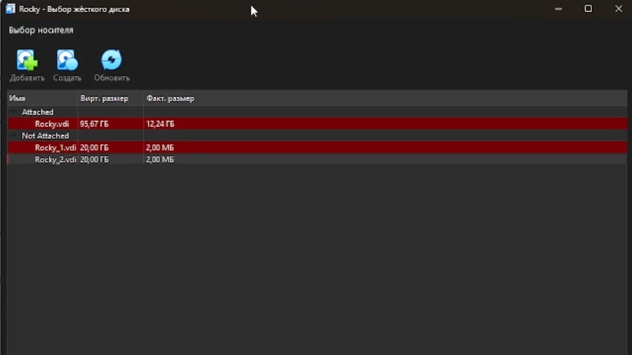
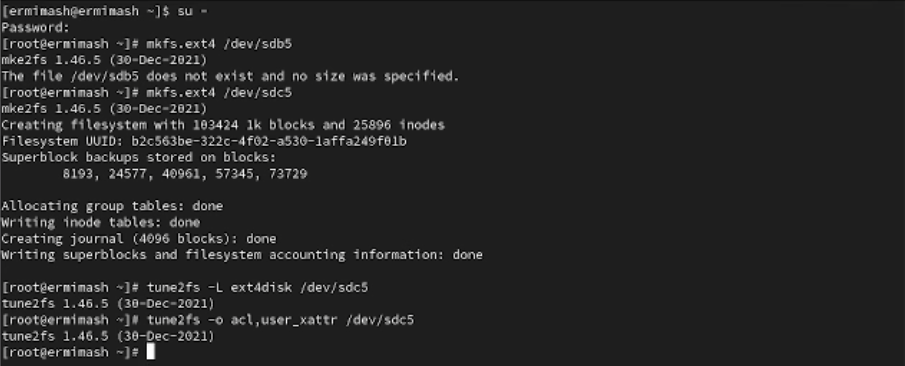
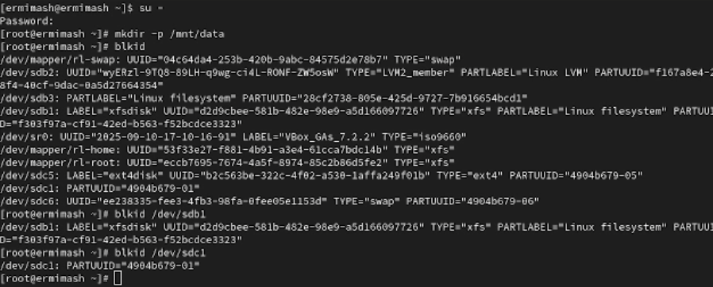

---
## Front matter
lang: ru-RU
title: Лабораторная работа №14
subtitle: Презентация
author:
  - Ермишина М. К.
institute:
  - Российский университет дружбы народов, Москва, Россия
date: 6 декабря 2025

## i18n babel
babel-lang: russian
babel-otherlangs: english

## Formatting pdf
toc: false
toc-title: Содержание
slide_level: 2
aspectratio: 169
section-titles: true
theme: metropolis
header-includes:
 - \metroset{progressbar=frametitle,sectionpage=progressbar,numbering=fraction}

## Fonts
mainfont: PT Serif
romanfont: PT Serif
sansfont: PT Sans
monofont: PT Mono
mainfontoptions: Ligatures=TeX
romanfontoptions: Ligatures=TeX
sansfontoptions: Ligatures=TeX,Scale=MatchLowercase
monofontoptions: Scale=MatchLowercase,Scale=0.9
---

# Информация

## Докладчик

:::::::::::::: {.columns align=center}
::: {.column width="70%"}

  * Ермишина Мария Кирилловна
  * студент группы НПИбд-01-24
  * Российский университет дружбы народов
  * [1132230166@pfur.ru](mailto:1132230166@pfur.ru)
  * <https://github.com/ErmiMash>

:::
::: {.column width="30%"}

:::
::::::::::::::

# Элементы презентации

## Цели и задачи

Целью данной лабораторной работы является получение навыков создания разделов на диске и файловых систем. Получить навыки монтирования файловых систем.

# Выполнение лабораторной работы

## Создание виртуальных носителей
Для добавления диска в VirtualBox для вашей виртуальной машины нажмите в меню Настроить , выберите Носители , затем на контроллере SATA нажмите «Добавить жёсткий диск».
{#fig:001 width=50%}
{#fig:002 width=50%}

## Создание разделов MBR с помощью fdisk
Необходимо сделать разметку диска /dev/sdb с помощью утилиты fdisk:   - fdisk /dev/sdb. Введите m , чтобы получить справку по командам. Нажмите p , чтобы просмотреть текущее распределение пространства диска. Введите n , чтобы добавить новый раздел. Выберите p , чтобы создать основной раздел
Укажите первый и последний секторы
Нажмите w , чтобы записать изменения на диск и выйти из fdisk
{#fig:003 width=50%}

## Создание разделов GPT с помощью gdisk
Создайте раздел с помощью gdisk. Введите n , чтобы добавить новый раздел. Нажмите Enter , чтобы принять предлагаемый по умолчанию первый сектор. Enter , чтобы принять тип раздела. Нажмите p , чтобы отобразить разбиение диска. Если текущее разбиение устраивает, нажмите w
{#fig:005 width=70%}

## Форматирование файловой системы XFS
В терминале с полномочиями администратора для диска dev/sdb1 создайте файловую систему XFS:
  - mkfs.xfs /dev/sdb1
Для установки метки файловой системы в xfsdisk используйте команду
  - xfs_admin -L xfsdisk /dev/sdb1
{#fig:006 width=70%}

## Форматирование файловой системы EXT4
В терминале с полномочиями администратора для диска dev/sdb5 создайте файловую систему EXT4:  - mkfs.ext4 /dev/sdb5
Для установки метки файловой системы в ext4disk используйте команду  - tune2fs -L ext4disk /dev/sdb5
Для установки параметров монтирования по умолчанию для файловой системы используйте команду  - tune2fs -o acl,user_xattr /dev/sdb5
{#fig:007 width=70%}

## Монтирование разделов с помощью /etc/fstab
Создайте точку монтирования для раздела XFS /dev/sdb1:
  - mkdir -p /mnt/data
Посмотрите информацию об идентификаторах блочных устройств (UUID):
  - blkid
Следующая команда монтирует всё, что указано в /etc/fstab:
  - mount -a
Проверьте, что раздел примонтирован правильно:
  - df -h

## Файл /etc/fstab
  - UUID=значение_идентификатора /mnt/data xfs defaults 1 2
{#fig:009 width=70%}

## Результаты

Получены навыки создания разделов на диске и файловых систем. Получение навыков монтирования файловых систем.
