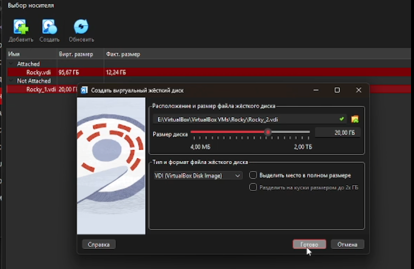
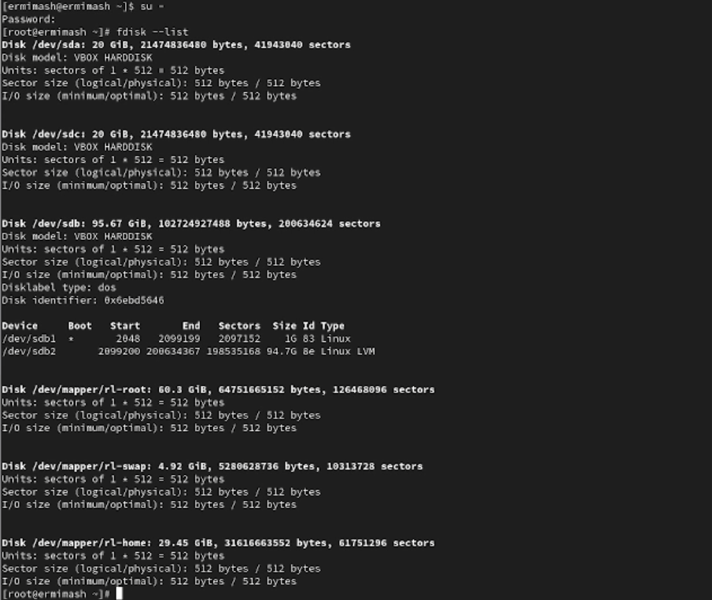
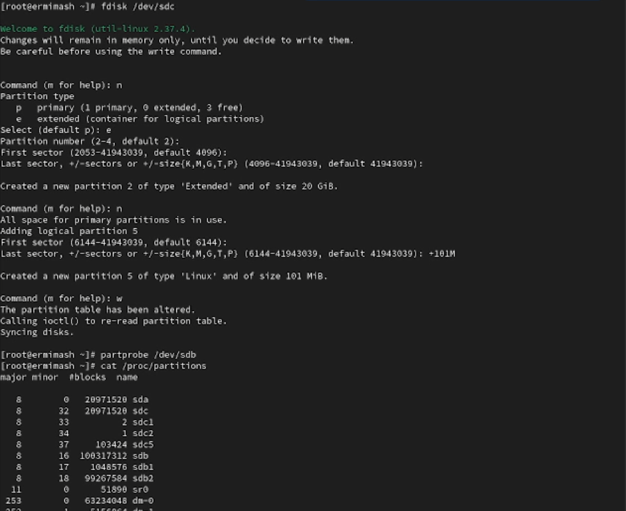
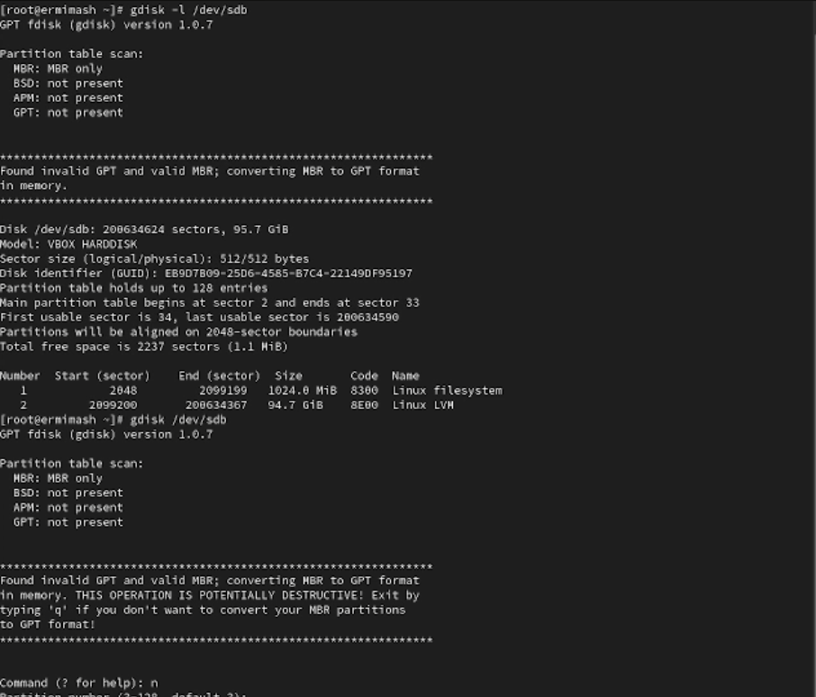
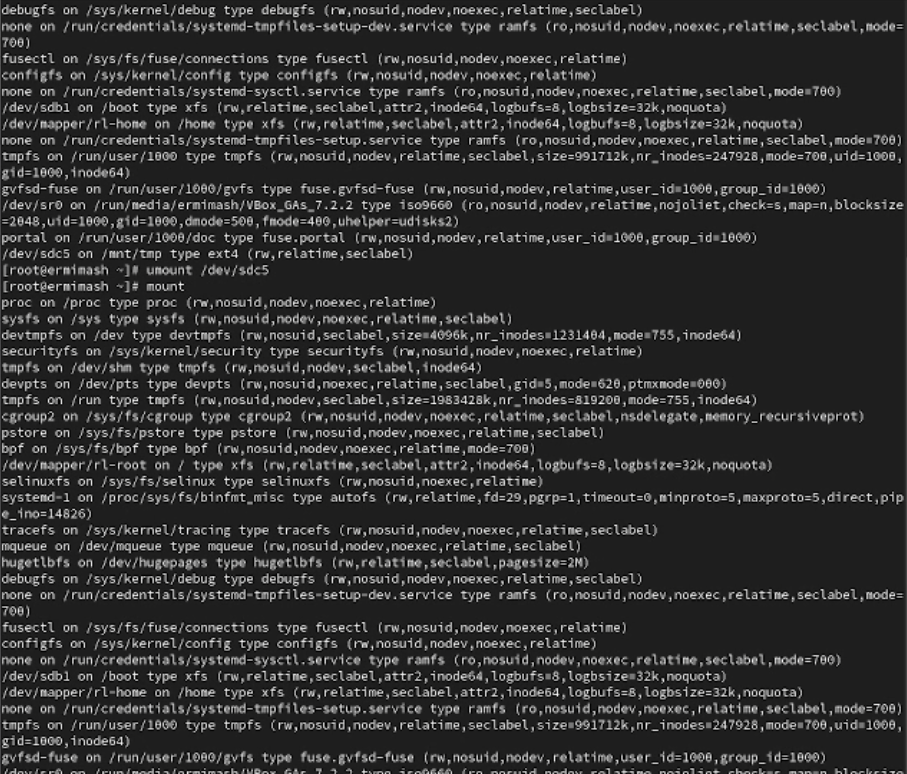
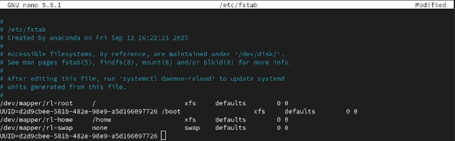

---
## Front matter
title: "Лабораторная работа № 14"
subtitle: "Отчёт"
author: "Ермишина Мария Кирилловна"

## Generic otions
lang: ru-RU
toc-title: "Содержание"

## Bibliography
bibliography: bib/cite.bib
csl: pandoc/csl/gost-r-7-0-5-2008-numeric.csl

## Pdf output format
toc: true # Table of contents
toc-depth: 2
lof: true # List of figures
lot: true # List of tables
fontsize: 12pt
linestretch: 1.5
papersize: a4
documentclass: scrreprt
## I18n polyglossia
polyglossia-lang:
  name: russian
  options:
	- spelling=modern
	- babelshorthands=true
polyglossia-otherlangs:
  name: english
## I18n babel
babel-lang: russian
babel-otherlangs: english
## Fonts
mainfont: IBM Plex Serif
romanfont: IBM Plex Serif
sansfont: IBM Plex Sans
monofont: IBM Plex Mono
mathfont: STIX Two Math
mainfontoptions: Ligatures=Common,Ligatures=TeX,Scale=0.94
romanfontoptions: Ligatures=Common,Ligatures=TeX,Scale=0.94
sansfontoptions: Ligatures=Common,Ligatures=TeX,Scale=MatchLowercase,Scale=0.94
monofontoptions: Scale=MatchLowercase,Scale=0.94,FakeStretch=0.9
mathfontoptions:
## Biblatex
biblatex: true
biblio-style: "gost-numeric"
biblatexoptions:
  - parentracker=true
  - backend=biber
  - hyperref=auto
  - language=auto
  - autolang=other*
  - citestyle=gost-numeric
## Pandoc-crossref LaTeX customization
figureTitle: "Рис."
tableTitle: "Таблица"
listingTitle: "Листинг"
lofTitle: "Список иллюстраций"
lotTitle: "Список таблиц"
lolTitle: "Листинги"
## Misc options
indent: true
header-includes:
  - \usepackage{indentfirst}
  - \usepackage{float} # keep figures where there are in the text
  - \floatplacement{figure}{H} # keep figures where there are in the text
---

# Цель работы

Целью данной лабораторной работы является получение навыков создания разделов на диске и файловых систем. Получение навыков монтирования файловых систем.

# Выполнение лабораторной работы

1. Создание виртуальных носителей
Добавьте к вашей виртуальной машине два диска размером 512 МБ.
Для добавления диска в VirtualBox для вашей виртуальной машины нажмите в меню Настроить , выберите Носители , затем на контроллере SATA нажмите «Добавить жёсткий диск». В открывшемся окне нажмите «Создать образ диска», в следующем окне выберите VDI и нажмите Далее  затем отметьте «Динамический виртуальный жёсткий диск» и нажмите Далее, укажите месторасположение диска и его название (disk1.vdi или disk2.vdi), а также его размер — 512 МБ, нажмите Создать. В окне выбора жёсткого диска встаньте на обозначение созданного диска и нажмите Выбрать. (рис. [-@fig:001])
Для добавления второго диска размером 512 МБ к контроллеру SATA повторите указанные выше действия. (рис. [-@fig:002])

{#fig:001 width=70%}
{#fig:002 width=70%}

2. Создание разделов MBR с помощью fdisk
Запустите вашу виртуальную машину с добавленными дополнительными дисками
disk1 и disk2. В командной строке с полномочиями администратора с помощью fdisk посмотрите перечень разделов на всех имеющихся в системе устройствах жёстких дисков: (рис. [-@fig:003])
  - fdisk --list
Необходимо сделать разметку диска /dev/sdb с помощью утилиты fdisk (измените название раздела, если необходимо, в соответствии с вашим оборудованием): (рис. [-@fig:004])
  - fdisk /dev/sdb
Изменения останутся в памяти только до тех пор, пока вы не решите их записать.
Введите m , чтобы получить справку по командам. Нажмите p , чтобы просмотреть текущее распределение пространства диска. Введите n , чтобы добавить новый раздел. Выберите p , чтобы создать основной раздел и примите номер раздела, который предлагается
Укажите первый сектор на диске, с которого начнётся новый раздел. После укажите последний сектор, которым будет завершён раздел
Нажмите w , чтобы записать изменения на диск и выйти из fdisk
Таблица разделов находится только в памяти ядра. Сравните вывод команды - fdisk -l /dev/sdb с выводом команды - cat /proc/partitions
Запишите изменения в таблицу разделов ядра:
  - partprobe /dev/sdb

{#fig:003 width=70%}
{#fig:004 width=70%}

3. Создание логических разделов
В терминале с полномочиями администратора запустите
fdisk /dev/sdb
Введите n , чтобы добавить новый раздел. Введите e , чтобы создать расширенный раздел. Нажмите Enter , чтобы принять первый сектор по умолчанию и снова нажмите Enter , когда fdisk запросит последний сектор.
Из интерфейса fdisk снова нажмите n . Утилита сообщит, что нет свободных первичных разделов и по умолчанию предложит добавить логический раздел с номером 5. Нажмите Enter , чтобы принять выбор первого сектора в качестве сектора по умолчанию. На вопрос о последнем секторе введите +101M
После создания логического раздела введите w , чтобы записать изменения на диск и выйти из fdisk. Чтобы завершить процедуру и обновить таблицу разделов, введите
  - partprobe /dev/sdb
Новый раздел теперь готов к использованию.
Просмотрите информацию о добавленных разделах:
  - cat /proc/partitions
  - fdisk --list /dev/sdb
  
4. Создание раздела подкачки
олучите полномочия администратора. Запустите fdisk:
fdisk /dev/sdb
Нажмите n , чтобы добавить новый раздел. Утилита сообщит, что нет свободных первичных разделов и по умолчанию предложит добавить логический раздел с номером раздела 6.
Нажмите Enter , чтобы принять первый сектор по умолчанию. На вопрос о последнем секторе введите +100M (или любой другой размер, который вы хотите использовать).
Далее измените тип раздела. Для этого нажмите t , затем укажите номер партиции, для которой хотите изменить тип (в данном случае это номер 6). Затем введите код типа раздела (в данном случае 82 — раздел подкачки).
После создания логического раздела введите w , чтобы записать изменения на диск и выйти из fdisk. Чтобы завершить процедуру и обновить таблицу разделов ядра, введите
  - partprobe /dev/sdb
Новый раздел теперь готов к использованию.
Просмотрите информацию о добавленных разделах:
  - cat /proc/partitions
  - fdisk --list /dev/sdb
Отформатируйте раздел подкачки, используя команду
  - mkswap /dev/sdb6
Для включения вновь выделенного пространства подкачки используйте
  - swapon /dev/sdb6
Для просмотра размера пространства подкачки, которое в настоящее время выделено, введите 
  - free -m
  
5. Создание разделов GPT с помощью gdisk (рис. [-@fig:005])
В терминале с полномочиями администратора с помощью gdisk посмотрите таблицы разделов и разделы на втором добавленном вами ранее диске /dev/sdc:
 - gdisk -l /dev/sdc
Создайте раздел с помощью gdisk:
  - gdisk /dev/sdc
Введите n , чтобы добавить новый раздел. Нажмите Enter , чтобы принять предлагаемый по умолчанию первый сектор. Enter , чтобы принять тип раздела 8300 по умолчанию
Теперь раздел создан (но ещё не записан на диск). Нажмите p , чтобы отобразить разбиение диска. Если текущее разбиение устраивает, нажмите w , чтобы записать изменения на диск.
Обновите таблицу разделов:
  - partprobe /dev/sdc
Просмотрите информацию о добавленных разделах:
  - cat /proc/partitions
  - gdisk -l /dev/sdc

{#fig:005 width=70%}

6. Форматирование файловой системы XFS (рис. [-@fig:006])
В терминале с полномочиями администратора для диска dev/sdb1 создайте файловую систему XFS:
  - mkfs.xfs /dev/sdb1
Для установки метки файловой системы в xfsdisk используйте команду
  - xfs_admin -L xfsdisk /dev/sdb1

{#fig:006 width=70%}
 
7. Форматирование файловой системы EXT4 (рис. [-@fig:007])
В терминале с полномочиями администратора для диска dev/sdb5 создайте файловую систему EXT4:
  - mkfs.ext4 /dev/sdb5
Для установки метки файловой системы в ext4disk используйте команду
  - tune2fs -L ext4disk /dev/sdb5
Для установки параметров монтирования по умолчанию для файловой системы используйте команду
  - tune2fs -o acl,user_xattr /dev/sdb5

{#fig:007 width=70%}

8. Ручное монтирование файловых систем
Получите полномочия администратора
Для создания точки монтирования для раздела введите
  - mkdir -p /mnt/tmp
Чтобы смонтировать файловую систему, используйте следующую команду
  - mount /dev/sdb5 /mnt/tmp
Для проверки корректности монтирования раздела введите:
  - mount
Чтобы отмонтировать раздел, можно использовать umount либо с именем устройства, либо с именем точки монтирования. Таким образом, обе следующие команды будут работать:
  - umount /dev/sdb5
Проверьте, что раздел отмонтирован:
  - mount
  
9. Монтирование разделов с помощью /etc/fstab (рис. [-@fig:008])
Создайте точку монтирования для раздела XFS /dev/sdb1:
  - mkdir -p /mnt/data
Посмотрите информацию об идентификаторах блочных устройств (UUID):
  - blkid
Эта утилита позволяет определить тип файловой системы блочного устройства (TYPE), его идентификатор (UUID) и метку тома (LABEL)
Введите blkid /dev/sdb1 и затем используйте мышь, чтобы скопировать значение идентификатора UUID для устройства /dev/sdb1.
Откройте файл /etc/fstab на редактирование и добавьте следующую строку: (рис. [-@fig:009])

{#fig:009 width=70%}

  - UUID=значение_идентификатора /mnt/data xfs defaults 1 2
Перед попыткой автоматического монтирования при перезагрузке рекомендуется проверить конфигурацию. Следующая команда монтирует всё, что указано в /etc/fstab:
  - mount -a
Проверьте, что раздел примонтирован правильно:
  - df -h
  
{#fig:008 width=70%}

# Выводы

Получены навыки создания разделов на диске и файловых систем. Получение навыков монтирования файловых систем.
