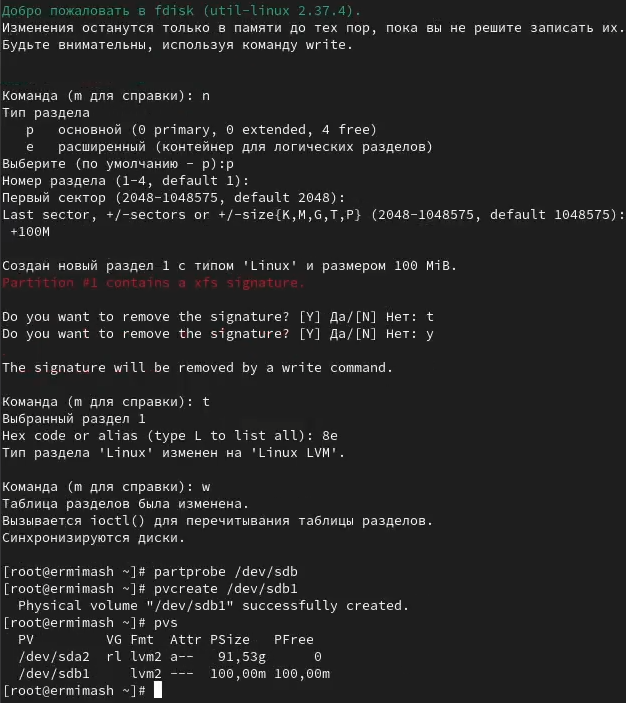
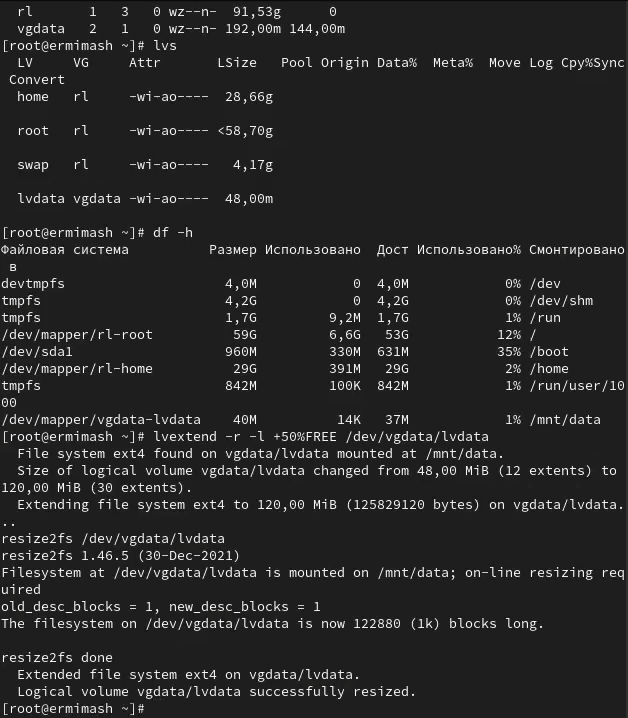
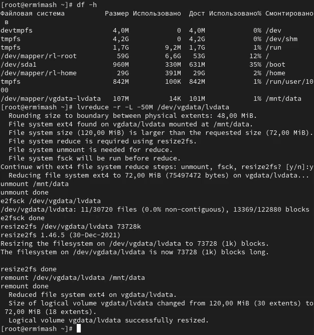

---
## Front matter
lang: ru-RU
title: Лабораторная работа №15
subtitle: Презентация
author:
  - Ермишина М. К.
institute:
  - Российский университет дружбы народов, Москва, Россия
date: 13 декабря 2025

## i18n babel
babel-lang: russian
babel-otherlangs: english

## Formatting pdf
toc: false
toc-title: Содержание
slide_level: 2
aspectratio: 169
section-titles: true
theme: metropolis
header-includes:
 - \metroset{progressbar=frametitle,sectionpage=progressbar,numbering=fraction}

## Fonts
mainfont: PT Serif
romanfont: PT Serif
sansfont: PT Sans
monofont: PT Mono
mainfontoptions: Ligatures=TeX
romanfontoptions: Ligatures=TeX
sansfontoptions: Ligatures=TeX,Scale=MatchLowercase
monofontoptions: Scale=MatchLowercase,Scale=0.9
---

# Информация

## Докладчик

:::::::::::::: {.columns align=center}
::: {.column width="70%"}

  * Ермишина Мария Кирилловна
  * студент группы НПИбд-01-24
  * Российский университет дружбы народов
  * [1132230166@pfur.ru](mailto:1132230166@pfur.ru)
  * <https://github.com/ErmiMash>

:::
::: {.column width="30%"}

:::
::::::::::::::

# Элементы презентации

## Цели и задачи

Целью данной лабораторной работы является получение навыков управления логическими томами.

# Выполнение лабораторной работы

## Создание физического тома
С помощью команды mount без параметров убеждаемся, что диски /dev/sdb
и /dev/sdc не подмонтированы. С помощью fdisk делаем новую разметку для /dev/sdb и /dev/sdc, удалив ранее созданные партиции

{#fig:003 width=50%}

## Проверка изменений
Записываем изменения в таблицу разделов ядра и просматриваем информацию о разделах

{#fig:004 width=50%}

## Создание раздела LVM
С помощью fdisk создаем основной раздел с типом LVM. После обновляемм таблицу разделов и указываем раздел как физ. том

{#fig:005 width=50%}

## Создание группы томов и логических томов
В терминале с полномочиями администратора проверьте доступность физических томов в вашей системе и создаем группу томов

{#fig:006 width=50%}

## Изменение размера логических томов
Создаем физический том и расширяем vgdata

{#fig:009 width=40%}
{#fig:010 width=40%}

## Результаты

Получены навыки управления логическими томами.
