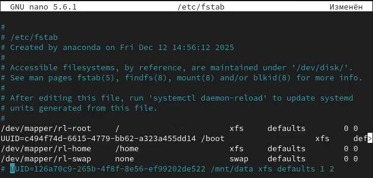
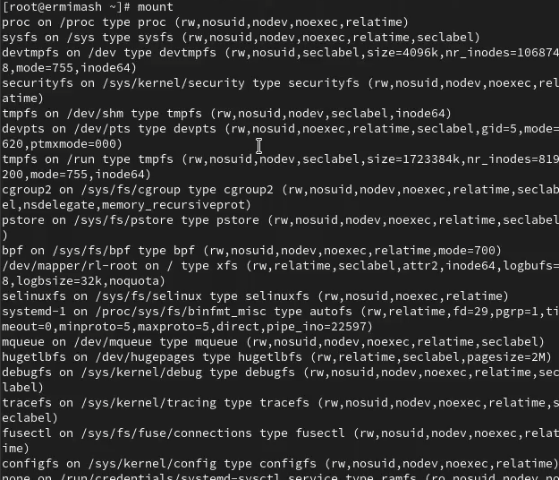
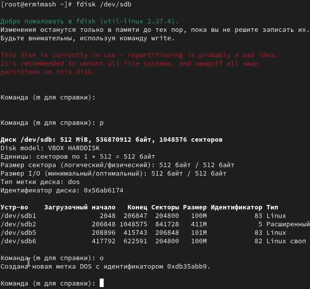
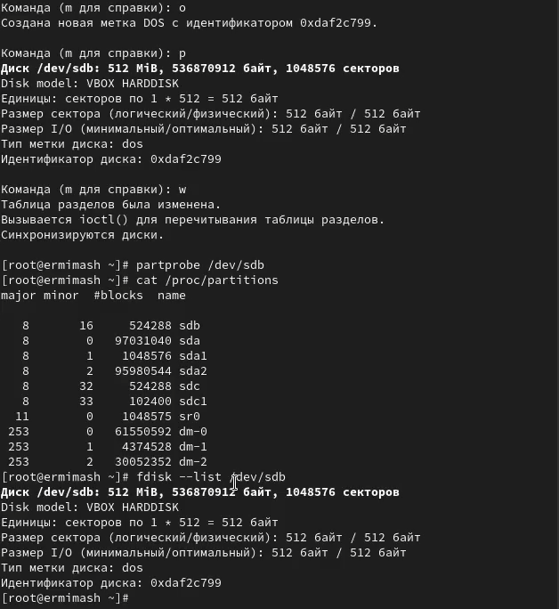
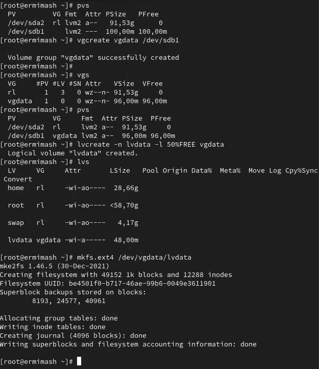
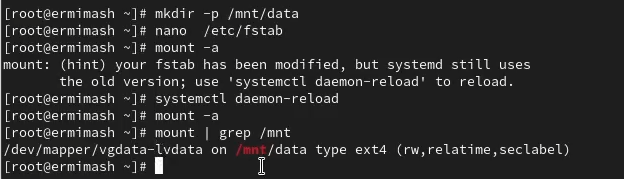
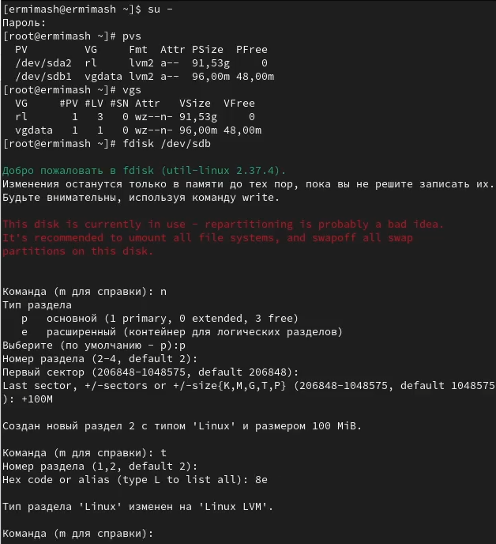

---
## Front matter
title: "Лабораторная работа № 15"
subtitle: "Отчёт"
author: "Ермишина Мария Кирилловна"

## Generic otions
lang: ru-RU
toc-title: "Содержание"

## Bibliography
bibliography: bib/cite.bib
csl: pandoc/csl/gost-r-7-0-5-2008-numeric.csl

## Pdf output format
toc: true # Table of contents
toc-depth: 2
lof: true # List of figures
lot: true # List of tables
fontsize: 12pt
linestretch: 1.5
papersize: a4
documentclass: scrreprt
## I18n polyglossia
polyglossia-lang:
  name: russian
  options:
  - spelling=modern
  - babelshorthands=true
polyglossia-otherlangs:
  name: english
## I18n babel
babel-lang: russian
babel-otherlangs: english
## Fonts
mainfont: IBM Plex Serif
romanfont: IBM Plex Serif
sansfont: IBM Plex Sans
monofont: IBM Plex Mono
mathfont: STIX Two Math
mainfontoptions: Ligatures=Common,Ligatures=TeX,Scale=0.94
romanfontoptions: Ligatures=Common,Ligatures=TeX,Scale=0.94
sansfontoptions: Ligatures=Common,Ligatures=TeX,Scale=MatchLowercase,Scale=0.94
monofontoptions: Scale=MatchLowercase,Scale=0.94,FakeStretch=0.9
mathfontoptions:
## Biblatex
biblatex: true
biblio-style: "gost-numeric"
biblatexoptions:
  - parentracker=true
  - backend=biber
  - hyperref=auto
  - language=auto
  - autolang=other*
  - citestyle=gost-numeric
## Pandoc-crossref LaTeX customization
figureTitle: "Рис."
tableTitle: "Таблица"
listingTitle: "Листинг"
lofTitle: "Список иллюстраций"
lotTitle: "Список таблиц"
lolTitle: "Листинги"
## Misc options
indent: true
header-includes:
  - \usepackage{indentfirst}
  - \usepackage{float} # keep figures where there are in the text
  - \floatplacement{figure}{H} # keep figures where there are in the text
---

# Цель работы

Целью данной лабораторной работы является получение навыков управления логическими томами.

# Выполнение лабораторной работы

1. Создание физического тома
В терминале с полномочиями администратора в файле /etc/fstab закомментируйте (рис. [-@fig:001]) строки автомонтирования /mnt/data и /mnt/data-ext. 

{#fig:001 width=70%}

С помощью команды mount без параметров убедитесь, что диски /dev/sdb
и /dev/sdc не подмонтированы. (рис. [-@fig:002])

{#fig:002 width=70%}

С помощью fdisk сделайте новую разметку для /dev/sdb и /dev/sdc, удалив ранее созданные партиции: (рис. [-@fig:003])
– В терминале с полномочиями администратора введите fdisk /dev/sdb
– Введите p для просмотра текущей разметки дискового пространства. Затем
для удаления всех имеющихся партиций на диске достаточно создать новую
пустую таблицу DOS-партиции, используя команду o. Убедитесь, что партиции
удалены, введя p. Сохраните изменения, введя w 

{#fig:003 width=70%}

Запишите изменения в таблицу разделов ядра: (рис. [-@fig:004])
  - partprobe /dev/sdb
Просмотрите информацию о разделах: (рис. [-@fig:004])
  - cat /proc/partitions
  - fdisk --list /dev/sdb

{#fig:004 width=70%}

С помощью fdisk создайте основной раздел с типом LVM: (рис. [-@fig:005])
– Введите
  - fdisk /dev/sdb
– Введите n , чтобы создать новый раздел. Выберите p , чтобы сделать его основным разделом, и используйте номер раздела, который предлагается по умолчанию. Если вы используете чистое устройство, это будет номер раздела 1.
– Нажмите Enter при запросе для первого сектора и введите +100M, чтобы выбрать последний сектор.
– Вернувшись в приглашение fdisk, введите t , чтобы изменить тип раздела. Поскольку существует только один раздел, fdisk не спрашивает, какой раздел использовать.
– Программа запрашивает тип раздела, который вы хотите использовать. Выберите 8е. Затем нажмите w , чтобы записать изменения на диск и выйти из fdisk

Чтобы обновить таблицу разделов, введите
  - partprobe /dev/sdb

Теперь, когда раздел был создан, вы должны указать его как физический том LVM. Для этого введите (с учётом наименования дисков в вашей системе):
  - pvcreate /dev/sdb1

{#fig:005 width=70%}
2. Создание группы томов и логических томов
В терминале с полномочиями администратора проверьте доступность физических томов в вашей системе: (рис. [-@fig:006])
  - pvs
Создайте группу томов с присвоенным ей физическим томом: (рис. [-@fig:006])
  - vgcreate vgdata /dev/sdb1
Убедитесь, что группа томов была создана успешно: (рис. [-@fig:006])
  - vgs
  - pvs
Введите следующую команду для создания логического тома LVM с именем lvdata, который будет использовать 50% доступного дискового пространства в группе томов vgdata: (рис. [-@fig:006])
  - lvcreate -n lvdata -l 50%FREE vgdata
Для проверки успешного добавления тома введите: (рис. [-@fig:006])
  - lvs
На этом этапе вы готовы создать файловую систему поверх логического тома. Для этого введите: (рис. [-@fig:006])
  - mkfs.ext4 /dev/vgdata/lvdata
Чтобы создать папку, на которую можно смонтировать том, введите: (рис. [-@fig:007])
  - mkdir -p /mnt/data
Добавьте следующую строку в /etc/fstab: (рис. [-@fig:007])
  - /dev/vgdata/lvdata /mnt/data ext4 defaults 1 2 
Проверьте, монтируется ли файловая система: (рис. [-@fig:007])
  - mount -a
  - mount | grep /mnt
  
{#fig:006 width=70%}
{#fig:007 width=70%}

3. Изменение размера логических томов
В терминале с полномочиями администратора введите pvs и vgs, чтобы отобразить текущую конфигурацию физических томов и группы томов. (рис. [-@fig:008])
С помощью fdisk добавьте раздел /dev/sdb2 размером 100 М. Задайте тип раздела 8e. (рис. [-@fig:008])

{#fig:008 width=70%}

Создайте физический том:
  - pvcreate /dev/sdb2
Расширьте vgdata:
  - vgextend vgdata /dev/sdb2
Проверьте, что размер доступной группы томов увеличен: (рис. [-@fig:009])
  - vgs
Проверьте текущий размер логического тома lvdata: (рис. [-@fig:009])
  - lvs
Проверьте текущий размер файловой системы на lvdata: (рис. [-@fig:009])
  - df -h
  
{#fig:009 width=70%}
  
Увеличьте lvdata на 50% оставшегося доступного дискового пространства в группе томов: (рис. [-@fig:010])
  - lvextend -r -l +50%FREE /dev/vgdata/lvdata
Убедитесь, что добавленное дисковое пространство стало доступным: (рис. [-@fig:010])
  - lvs
  - df -h
Уменьшите размер lvdata на 50 МБ: (рис. [-@fig:010])
  - lvreduce -r -L -50M /dev/vgdata/lvdata
Убедитесь в успешном изменении дискового пространства:
  - lvs
  - df -h

{#fig:010 width=70%}

# Контрольные вопросы

1. GPT
2. vgcreate vggroup /dev/sdb3
3. pvs 
4. vgextend vggroup /dev/sdd
5. vereate -n Ivyoll -1 vggroup
6. Ivextend -r -| +100M Ivvoll
7. Создать раздел на 200Мб с помощью fdisk
8. -r
9. lvs 
10. fsck /dev/vgdata/Ivdata

# Выводы

Получены навыки управления логическими томами.
