---
## Front matter
title: "Лабораторная работа № 16"
subtitle: "Отчёт"
author: "Ермишина Мария Кирилловна"

## Generic otions
lang: ru-RU
toc-title: "Содержание"

## Bibliography
bibliography: bib/cite.bib
csl: pandoc/csl/gost-r-7-0-5-2008-numeric.csl

## Pdf output format
toc: true # Table of contents
toc-depth: 2
lof: true # List of figures
lot: true # List of tables
fontsize: 12pt
linestretch: 1.5
papersize: a4
documentclass: scrreprt
## I18n polyglossia
polyglossia-lang:
  name: russian
  options:
  - spelling=modern
  - babelshorthands=true
polyglossia-otherlangs:
  name: english
## I18n babel
babel-lang: russian
babel-otherlangs: english
## Fonts
mainfont: IBM Plex Serif
romanfont: IBM Plex Serif
sansfont: IBM Plex Sans
monofont: IBM Plex Mono
mathfont: STIX Two Math
mainfontoptions: Ligatures=Common,Ligatures=TeX,Scale=0.94
romanfontoptions: Ligatures=Common,Ligatures=TeX,Scale=0.94
sansfontoptions: Ligatures=Common,Ligatures=TeX,Scale=MatchLowercase,Scale=0.94
monofontoptions: Scale=MatchLowercase,Scale=0.94,FakeStretch=0.9
mathfontoptions:
## Biblatex
biblatex: true
biblio-style: "gost-numeric"
biblatexoptions:
  - parentracker=true
  - backend=biber
  - hyperref=auto
  - language=auto
  - autolang=other*
  - citestyle=gost-numeric
## Pandoc-crossref LaTeX customization
figureTitle: "Рис."
tableTitle: "Таблица"
listingTitle: "Листинг"
lofTitle: "Список иллюстраций"
lotTitle: "Список таблиц"
lolTitle: "Листинги"
## Misc options
indent: true
header-includes:
  - \usepackage{indentfirst}
  - \usepackage{float} # keep figures where there are in the text
  - \floatplacement{figure}{H} # keep figures where there are in the text
---

# Цель работы

Целью данной лабораторной работы является освоение работу с RAID-массивами при помощи утилиты mdadm.

# Выполнение лабораторной работы

1. Создание RAID-диска
В терминале с полномочиями администратора проверяем наличие созданных дисков: (рис. [-@fig:001])
  - fdisk -l | grep /dev/sd

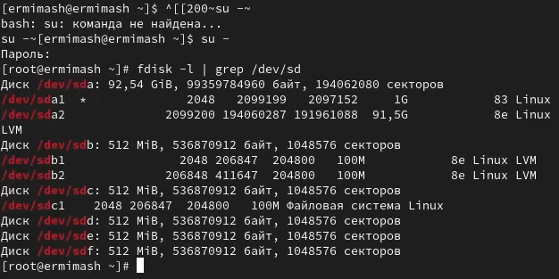{#fig:001 width=70%}

Создаем на каждом из дисков раздел:
  - sfdisk /dev/sdd EOF
    ;
    EOF
  - sfdisk /dev/sde EOF
    ;
    EOF
  - sfdisk /dev/sdf EOF
    ;
    EOF

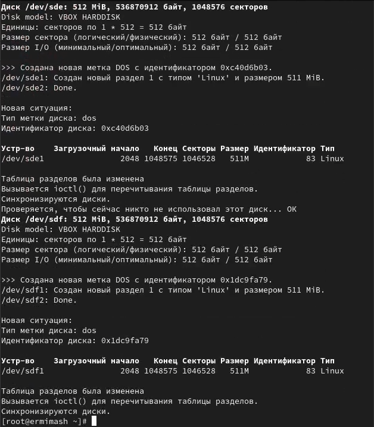{#fig:002 width=70%}

Проверяем текущий тип созданных разделов: (рис. [-@fig:003])
  - sfdisk --print-id /dev/sdd 1
  - sfdisk --print-id /dev/sde 1
  - sfdisk --print-id /dev/sdf 1

Смотрим, какие типы партиций, относящиеся к RAID, можно задать: (рис. [-@fig:003])
  - sfdisk -T | grep -i raid
  
Устанавливаем тип разделов в Linux raid autodetect: (рис. [-@fig:003])
  - sfdisk --change-id /dev/sdd 1 fd
  - sfdisk --change-id /dev/sde 1 fd
  - sfdisk --change-id /dev/sdf 1 fd

Просмотрите состояние дисков: (рис. [-@fig:003])
  - sfdisk -l /dev/sdd
  - sfdisk -l /dev/sde
  - sfdisk -l /dev/sdf

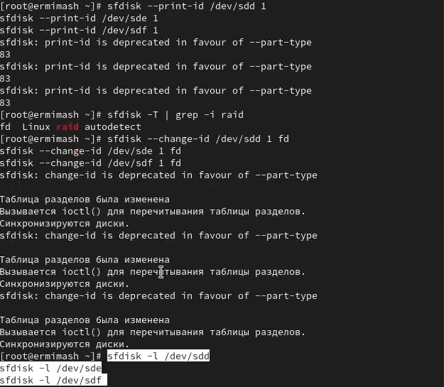{#fig:003 width=70%}

При помощи утилиты mdadm создаем массив RAID 1 из двух дисков: (рис. [-@fig:004])
  - mdadm --create --verbose /dev/md0 --level=1 --raid-devices=2 /dev/sdd1 /dev/sde1

Проверяем состояние массива RAID, используя команды: (рис. [-@fig:004])
  - cat /proc/mdstat
  - mdadm --query /dev/md0
  - mdadm --detail /dev/md0

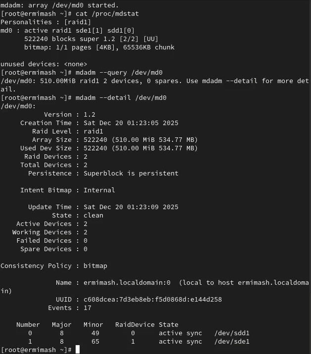{#fig:004 width=70%}

Создаем файловую систему на RAID: (рис. [-@fig:005])
  - mkfs.ext4 /dev/md0
Подмонтируем RAID: (рис. [-@fig:005])
  - mkdir /data
  - mount /dev/md0 /data
Для автомонтирования добавляем запись в /etc/fstab: (рис. [-@fig:006])
  - /dev/md0 /data ext4 defaults 1 2
  
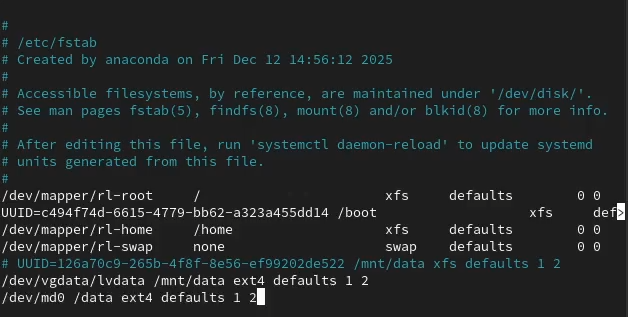{#fig:006 width=70%}
  
Имитируем сбой одного из дисков: (рис. [-@fig:005])
  - mdadm /dev/md0 --fail /dev/sde1
Удаляем сбойный диск: (рис. [-@fig:005])
  - mdadm /dev/md0 --remove /dev/sde1
Заменяем диск в массиве: (рис. [-@fig:005])
  - mdadm /dev/md0 --add /dev/sdf1

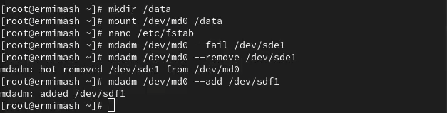{#fig:005 width=70%}

Смотрим состояние массива (рис. [-@fig:007])

Удаляем массив и очищаем метаданные:
  - umount /dev/md0
  - mdadm --stop /dev/md0
  - mdadm --zero-superblock /dev/sdd1
  - mdadm --zero-superblock /dev/sde1
  - mdadm --zero-superblock /dev/sdf1

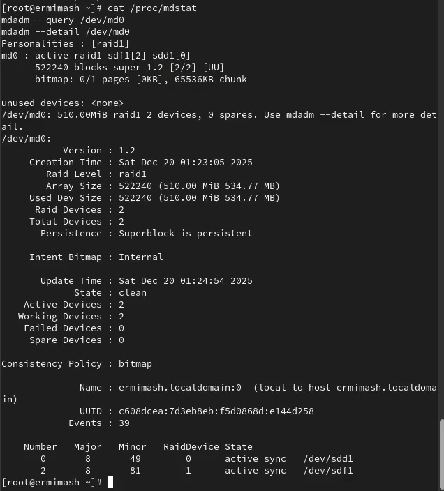{#fig:007 width=70%}

2. RAID-массив с горячим резервом (hotspare)
В терминале с полномочиями администратора создаем массив RAID 1 из двух дисков: (рис. [-@fig:008])
  - mdadm --create --verbose /dev/md0 --level=1 --raid-devices=2 /dev/sdd1 /dev/sde1
Добавляем третий диск: (рис. [-@fig:008])
  - mdadm --add /dev/md0 /dev/sdf1
Подмонтируем /dev/md0: (рис. [-@fig:008])
  - mount /dev/md0

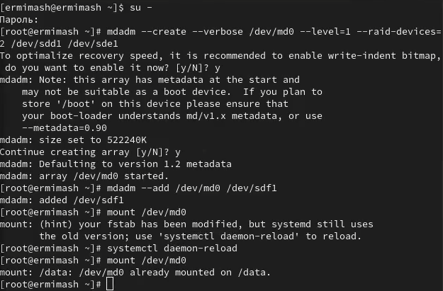{#fig:008 width=70%}

Проверяем состояние массива (рис. [-@fig:009])

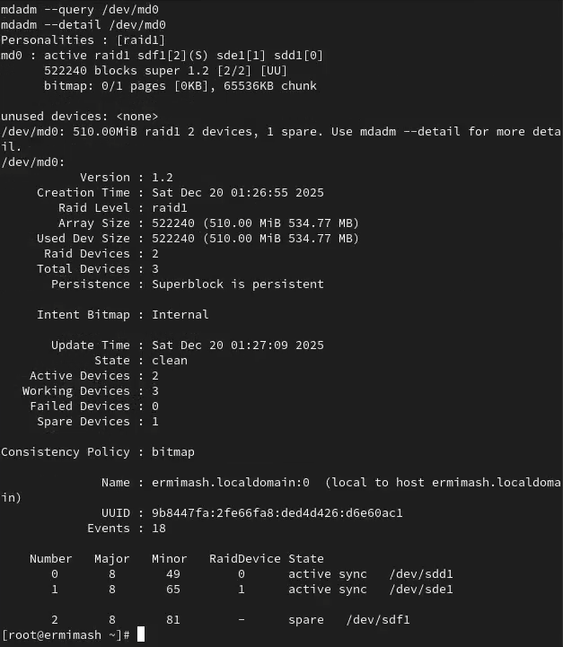{#fig:009 width=70%}
  
Имитируем сбой одного из дисков: (рис. [-@fig:010])
  - mdadm /dev/md0 --fail /dev/sde1
Проверьте состояние массива: (рис. [-@fig:010])
  - mdadm --detail /dev/md0

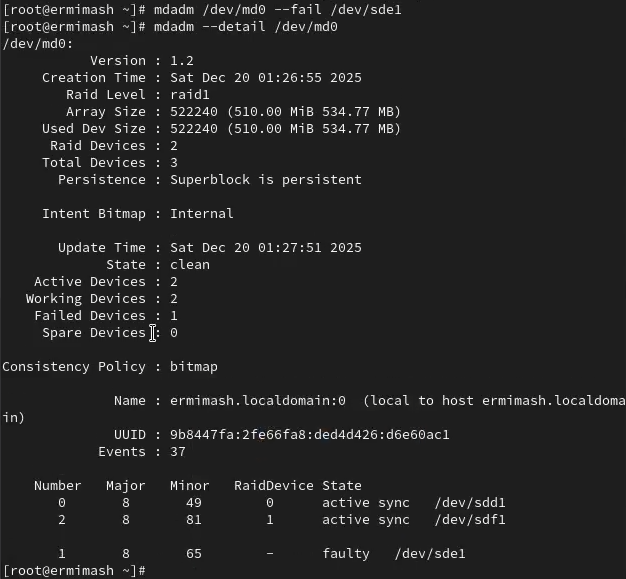{#fig:010 width=70%}

Удаляем массив и очистите метаданные:
  - umount /dev/md0
  - mdadm --stop /dev/md0
  - mdadm --zero-superblock /dev/sdd1
  - mdadm --zero-superblock /dev/sde1
  - mdadm --zero-superblock /dev/sdf1

3. Преобразование массива RAID 1 в RAID 5
В терминале с полномочиями администратора создаем массив RAID 1 из двух дисков: (рис. [-@fig:011])
  - mdadm --create --verbose /dev/md0 --level=1 --raid-devices=2 /dev/sdd1 /dev/sde1
Дабвляем третий диск: (рис. [-@fig:011])
  - mdadm --add /dev/md0 /dev/sdf1
Подмонтируем /dev/md0: (рис. [-@fig:011])
  - mount /dev/md0

{#fig:010 width=70%}

Проверяем состояние массива (рис. [-@fig:012])

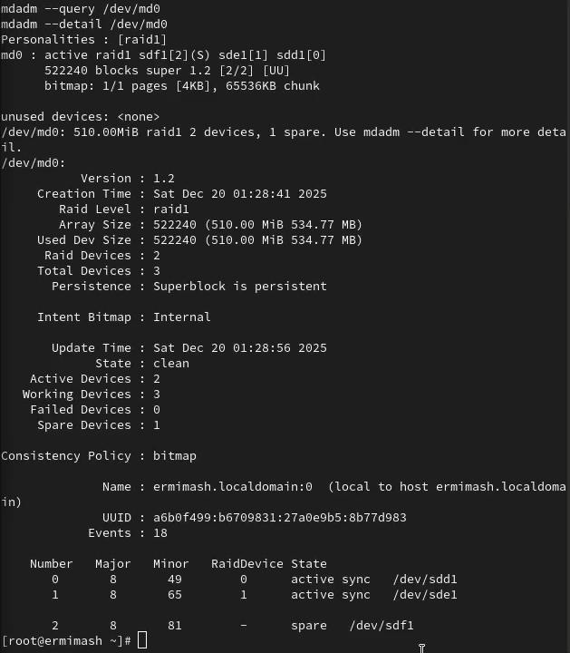{#fig:012 width=70%}

Изменяем тип массива RAID: (рис. [-@fig:013])
  - mdadm --grow /dev/md0 --level=5
Проверяем состояние массива: (рис. [-@fig:013])
  - mdadm --detail /dev/md0

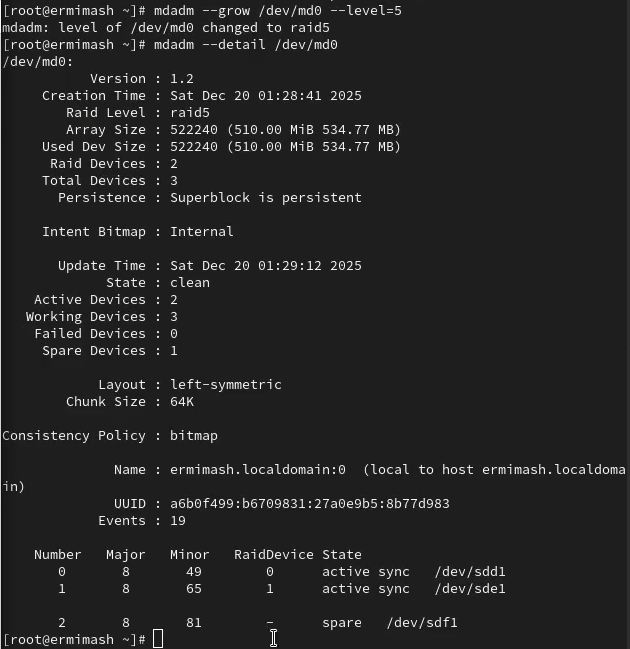{#fig:013 width=70%}

Изменяем количество дисков в массиве RAID 5: (рис. [-@fig:014])
  - mdadm --grow /dev/md0 --raid-devices 3
Проверяем состояние массива: (рис. [-@fig:014])
  - mdadm --detail /dev/md0

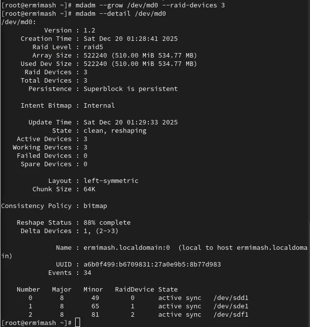{#fig:014 width=70%}

Удаляем массив и очистите метаданные:
  - umount /dev/md0
  - mdadm --stop /dev/md0
  - mdadm --zero-superblock /dev/sdd1
  - mdadm --zero-superblock /dev/sde1
  - mdadm --zero-superblock /dev/sdf1

Закомментируем запись в /etc/fstab:
  - /dev/md0 /data ext4 defaults 1 2

# Контрольные вопросы

1. Аббревиатура RAID расшифровывается как Redundant Array of Inexpensive Disks (избыточный массив недорогих дисков) или Redundant Array of Independent Disks (избыточный массив независимых дисков). Это способ хранения данных на нескольких установленных накопителях.
2. Есть программные и аппаратные RAID-массивы. 
Программные массивы создаются уже после установки ОС средствами программных продуктов и утилит, что и является главным недостатком таких дисковых массивов. 
Аппаратные RAID создают дисковый массив до установки ОС и от неё не зависят. 
Существуют следующие уровни спецификации RAID: 0, 1, 2, 3, 4, 5, 6. Кроме того, существуют комбинированные уровни: 01/10, 50/05, 15/51, 60/06
3. RAID 0 - дисковой массив из двух или более жестких дисков без резервирования. Запись происходит следующим образом: информация разбивается на блоки данных (количество блоков зависит от количества дисков) фиксированной длинны и записывается поочередно, то есть первый блок данных записывается на один диск, второй блок данных на второй диск и так далее
Каждый диск записывает/читает свою порцию данных, что позволяет значительно увеличить скорость работы
Для записи используется весь объем дисков, однако это снижает надежность хранения данных, поскольку при отказе одного диска - массив разрушается, и восстановить данные практически невозможно
Сам RAID 0 редко используется из-за своей низкой надежности, зачастую используется как оболочка для комбинированных уровней
RAID 1 - дисковой массив из двух или более жестких дисков. Этот уровень является обычным зеркалированием данных
RAID 5- дисковой массив из трех или более жестких дисков. Для записи используется чередование и четность
RAID 6 - дисковой массив из четырех или более жестких дисков. Используется два блока четности, что увеличивает надежность, но снижает скорость записи данных

# Выводы

Освоена работа с RAID-массивами при помощи утилиты mdadm.
