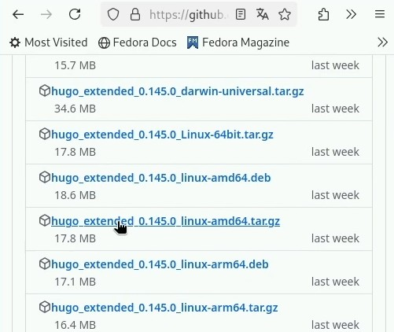
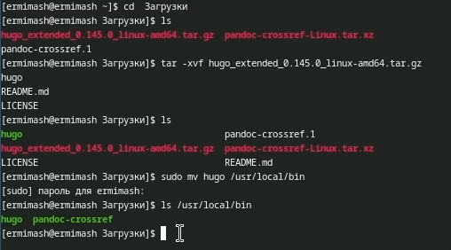
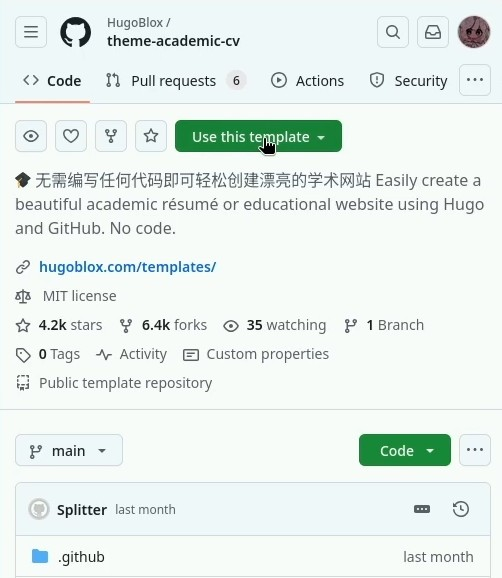
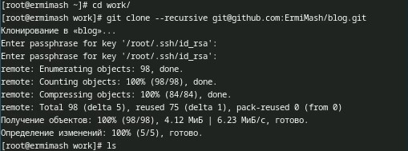
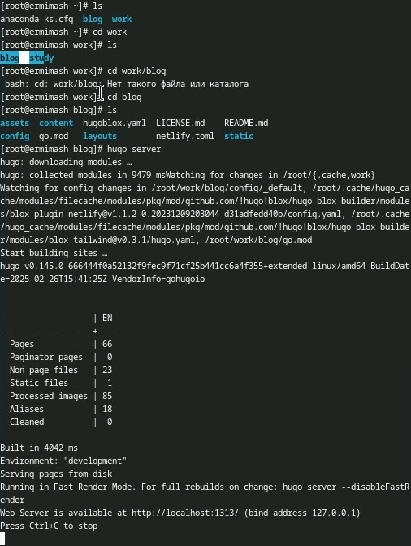
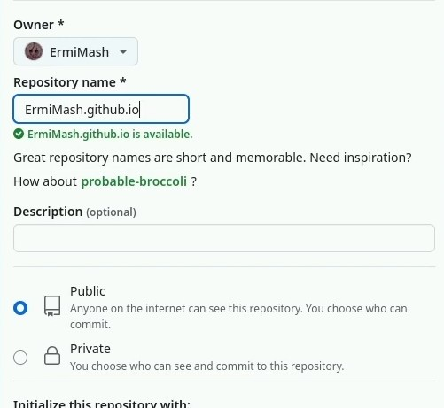
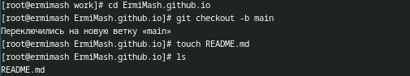
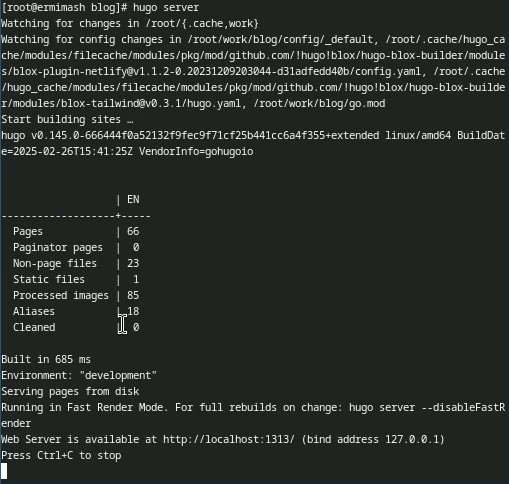
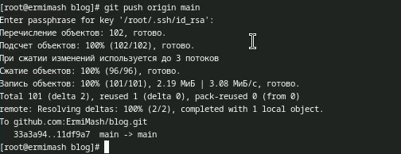

---
## Front matter
lang: ru-RU
title: Индивидуальный проект - персональный сайт научного работника
subtitle: Первый этап. Презентация
author:
  - Ермишина М. К.
institute:
  - Российский университет дружбы народов, Москва, Россия
date: 07 марта 2025

## i18n babel
babel-lang: russian
babel-otherlangs: english

## Formatting pdf
toc: false
toc-title: Содержание
slide_level: 2
aspectratio: 169
section-titles: true
theme: metropolis
header-includes:
 - \metroset{progressbar=frametitle,sectionpage=progressbar,numbering=fraction}

## Fonts
mainfont: PT Serif
romanfont: PT Serif
sansfont: PT Sans
monofont: PT Mono
mainfontoptions: Ligatures=TeX
romanfontoptions: Ligatures=TeX
sansfontoptions: Ligatures=TeX,Scale=MatchLowercase
monofontoptions: Scale=MatchLowercase,Scale=0.9
---

# Информация

## Докладчик

:::::::::::::: {.columns align=center}
::: {.column width="70%"}

  * Ермишина Мария Кирилловна
  * студент группы НПИбд-01-24
  * Российский университет дружбы народов
  * [1132230166@pfur.ru](mailto:1132230166@pfur.ru)
  * <https://github.com/ErmiMash>

# Элементы презентации

## Цели и задачи

Целью данного этапа индивидуального проекта является размещение на Github pages заготовки для персонального сайта.

Задачи:
- Установить необходимое программное обеспечение.
- Скачать шаблон темы сайта.
- Разместить его на хостинге git.
- Установить параметр для URLs сайта.
- Разместить заготовку сайта на Github pages.

# Выполнение лабораторной работы

## Установка hugo 
Для начала выполнения проекта нам необходимо установить hugo. 
Устанавливать файлы мы будем с сайта GitHub вручную. 
Выбираем необходиммый файл ии скачиваем его.
{#fig:001 width=40%}

## Разархивирирование файла
В моём случае новый файл будет называться hugo.
Далее мы переносим новый файл в /usr/local/bin.
И проверяем наличие файла с помощью ls.
{#fig:002 width=40%}

## Добавление репозитория
Нам необходимо добавить на наш аккаунт git репозиторий, который указан в технической реализации проекта. 
Я назвала его Blog.
{#fig:003 width=40%}

## Клонируем данные
Далее мы переходим в каталог work, в который нам неоходимо клонировать данные из нашего нового репозитория.
git clone --recursive
{#fig:004 width=40%}

## Запуск сервера
После добавления всех файлов мы переходим в каталог blog, который появился после клонирования файлов. 
Теперь мы можем запустить наш сервер, с помощью которого наш сайт начнёт работать. Воспользуемся следующими командами: 
hugo server (запускаем сервер)
{#fig:005 width=40%}

## Создаем новый пустой репозиторий. 
Его необходимо назвать следующим образром: ник_git.github.io - это параметр URLs сайта.
{#fig:007 width=40%}

## Создание файла README.md
После создания нового репозитория нам необходимо клонировать его данные в наш каталог work.
И проверяем наличие нового каталога с помощью ls.
Переходи в новый каталог и переключаемся на ветку "main". После этого создаём текстовый файл README.md. Воспользуемся следующими командами
{#fig:009 width=40%}

## Повторный запуск сервера
Нам необходимо указать пустой репозиторий как саб-модуль для нашего сервера.
Повторно запускаем наш сервер, чтобы проверить работоспособность.
{#fig:012 width=40%}

## Загрузка данных
После проделанной работы нам необходимо загрузить всю информацию на сервер git.
{#fig:014 width=40%}

## Результаты

В рамках данного этапа индивидуального проекта разместили на Github pages заготовки для персонального сайта.

