---
## Front matter
title: "Индивидуальный проект: Персональный сайт научного работника"
subtitle: "Первый этап реализации"
author: "Ермишина Мария Кирилловна"

## Generic otions
lang: ru-RU
toc-title: "Содержание"

## Bibliography
bibliography: bib/cite.bib
csl: pandoc/csl/gost-r-7-0-5-2008-numeric.csl

## Pdf output format
toc: true # Table of contents
toc-depth: 2
lof: true # List of figures
lot: true # List of tables
fontsize: 12pt
linestretch: 1.5
papersize: a4
documentclass: scrreprt
## I18n polyglossia
polyglossia-lang:
  name: russian
  options:
	- spelling=modern
	- babelshorthands=true
polyglossia-otherlangs:
  name: english
## I18n babel
babel-lang: russian
babel-otherlangs: english
## Fonts
mainfont: IBM Plex Serif
romanfont: IBM Plex Serif
sansfont: IBM Plex Sans
monofont: IBM Plex Mono
mathfont: STIX Two Math
mainfontoptions: Ligatures=Common,Ligatures=TeX,Scale=0.94
romanfontoptions: Ligatures=Common,Ligatures=TeX,Scale=0.94
sansfontoptions: Ligatures=Common,Ligatures=TeX,Scale=MatchLowercase,Scale=0.94
monofontoptions: Scale=MatchLowercase,Scale=0.94,FakeStretch=0.9
mathfontoptions:
## Biblatex
biblatex: true
biblio-style: "gost-numeric"
biblatexoptions:
  - parentracker=true
  - backend=biber
  - hyperref=auto
  - language=auto
  - autolang=other*
  - citestyle=gost-numeric
## Pandoc-crossref LaTeX customization
figureTitle: "Рис."
tableTitle: "Таблица"
listingTitle: "Листинг"
lofTitle: "Список иллюстраций"
lotTitle: "Список таблиц"
lolTitle: "Листинги"
## Misc options
indent: true
header-includes:
  - \usepackage{indentfirst}
  - \usepackage{float} # keep figures where there are in the text
  - \floatplacement{figure}{H} # keep figures where there are in the text
---

# Цель работы

Целью данного этапа индивидуального проекта является размещение на Github pages заготовки для персонального сайта. [@project]

# Задание

- Установить необходимое программное обеспечение.
- Скачать шаблон темы сайта.
- Разместить его на хостинге git.
- Установить параметр для URLs сайта.
- Разместить заготовку сайта на Github pages.

# Выполнение этапа реализации проекта

Проект мы будем реализовывать с помощью hugo. 

1. Для начала выполнения проекта нам необходимо установить hugo. 
Устанавливать файлы мы будем с сайта GitHub вручную. 
Выбираем необходиммый файл ии скачиваем его. (рис. [-@fig:001])

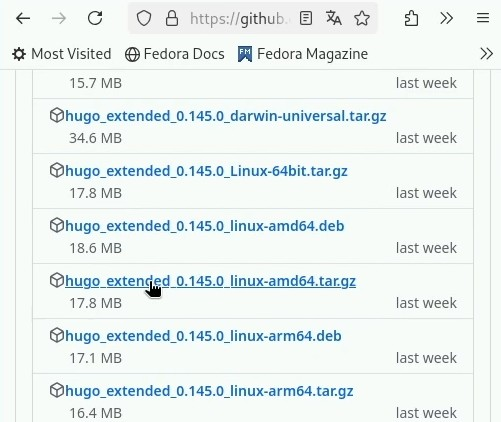{#fig:001 width=70%}

2. После загрузки файла нам необходимо разархивировать файл с помощью следующей команды: (рис. [-@fig:002])
  - tar -xvf (название скаченного файла) (название нового файла)
  В моём случае новый файл будет называться hugo.
  
3. Далее мы переносим новый файл в /usr/local/bin: (рис. [-@fig:002])
  - sudo mv /usr/local/bin (в данном случае перенос осуществляется только с помощью супер-пользователя)
  И проверяем наличие файла с помощью ls.

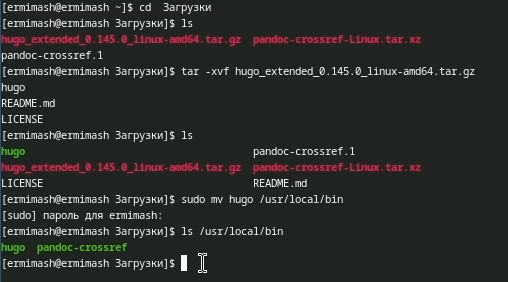{#fig:002 width=70%}

4. Нам необходимо добавить на наш аккаунт git репозиторий, который указан в технической реализации проекта. Я назвала его Blog. (рис. [-@fig:003])

{#fig:003 width=70%}

5. Далее мы переходим в каталог work, в который нам неоходимо клонировать данные из нашего нового репозитория. Воспользуемся слудеющими командами: (рис. [-@fig:004])
  - cd work (переходим в каталог)
  - git clone --recursive (SSH нашего репозитория)
  
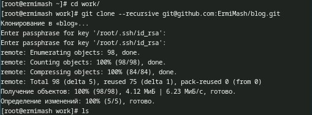{#fig:004 width=70%}

6. После добавления всех файлов мы переходим в каталог blog, который появился после клонирования файлов. 
Теперь мы можем запустить наш сервер, с помощью которого наш сайт начнёт работать. Воспользуемся следующими командами: (рис. [-@fig:005])
  - cd blog (переходим в каталог)
  - hugo server (запускаем сервер)
  
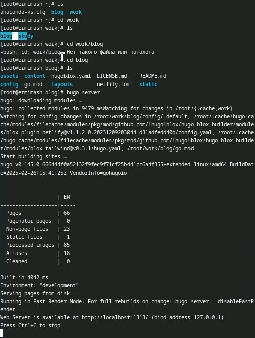{#fig:005 width=70%}

Переходим по ссылке, которая появилась в терминале, и проверяем работу нашего сайта. Всё работает, на сайте видна информация, указанная в репозитории. (рис. [-@fig:006])

{#fig:006 width=70%}

7. Далее мы создаем новый пустой репозиторий. 
Его необходимо назвать следующим образром: ник_git.github.io - это параметр URLs сайта. (рис. [-@fig:007])

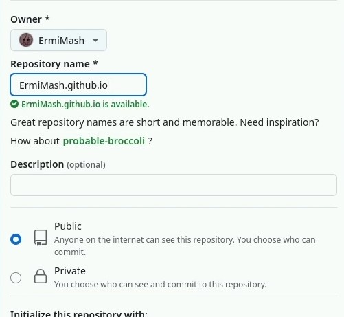{#fig:007 width=70%}

8. После создания нового репозитория нам необходимо клонировать его данные в наш каталог work. Воспользуем следующими командами: (рис. [-@fig:008])
  - cd .. (возвращаемся в каталог work)
  - git clone --recursive (SSH нашего нового репозитория)
И проверяем наличие нового каталога с помощью ls.

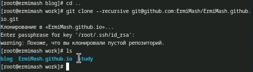{#fig:008 width=70%}

Переходи в новый каталог и переключаемся на ветку "main". После этого создаём текстовый файл README.md. Воспользуемся следующими командами: (рис. [-@fig:009])
  - cd ErmiMash.github.io 
  - git checkout -b main
  - touch README.md
  
Так как мы создали новый файл - нам необходимо обновить информацию на GitHub: (рис. [-@fig:010])
  - git add .
  - git commit -am "Create README.md"
  
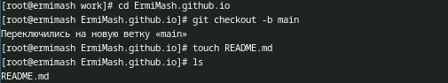{#fig:009 width=70%}

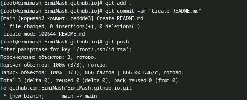{#fig:010 width=70%}

9. Нам необходимо указать пустой репозиторий как саб-модуль для нашего сервера - это необходимо для нашего удобства: (рис. [-@fig:011])
  - git submodule -b main (SSH пустого репозитория)
  
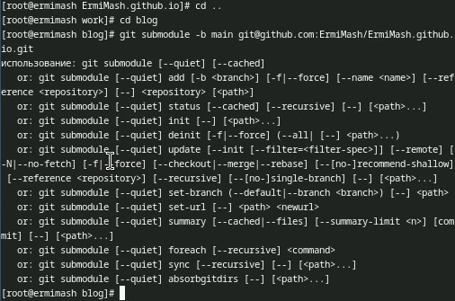{#fig:011 width=70%}

Повторно запускаем наш сервер, чтобы проверить работоспособность. (рис. [-@fig:012])

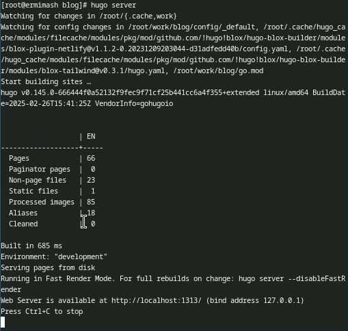{#fig:012 width=70%}

10. После проделанной работы нам необходимо загрузить всю информацию на сервер git. Делаем это с помощью следующих команд: (рис. [-@fig:013]), (рис. [-@fig:014])
  - git add .
  - git commit -am "added site" 
  - git push origin main
  
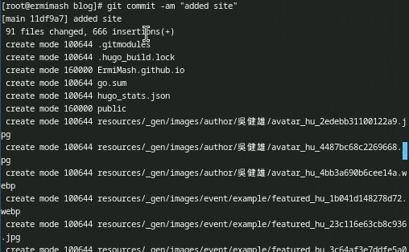{#fig:013 width=70%}

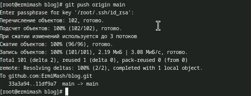{#fig:014 width=70%}

# Выводы

В рамках данного этапа индивидуального проекта разместили на Github pages заготовки для персонального сайта.

# Список литературы{.unnumbered}

::: {#refs}
:::
